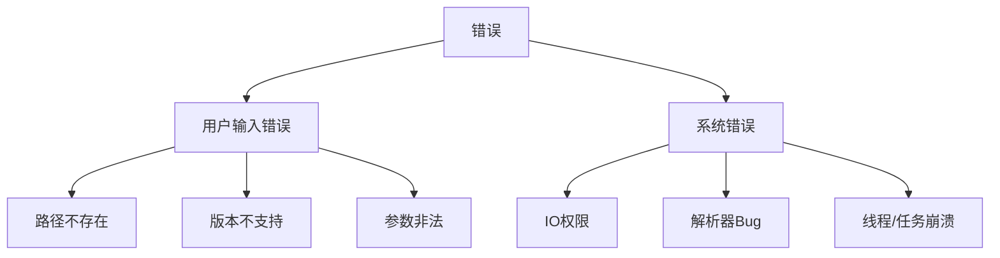
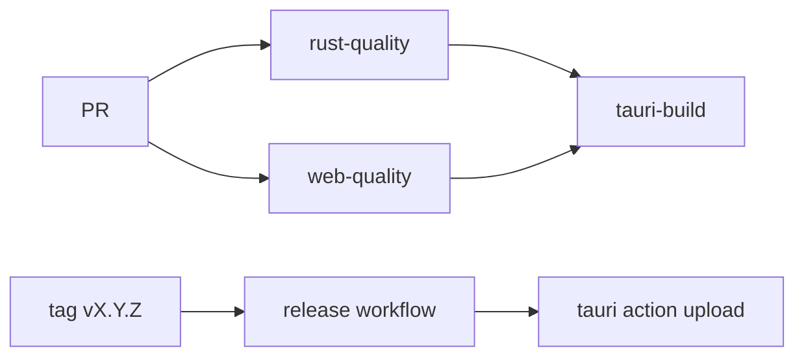

# 维护者手册（Agent）

## 1. 目标与边界

- 目标：将 Java 版本的解析/生成/迁移能力，迁移到 Rust 核心并由 Tauri UI 承载。
- 强约束：UI 不得包含格式解析逻辑。
- 强约束：未知字段必须保留原始字节和偏移信息，不允许“推断后丢失原文”。

## 2. 证据驱动原则

每条结论必须可追溯到以下任一来源：

- 源码文件 + 方法 + 行号。
- 真实样本文件 + 偏移 + 原始字节。

禁止：

- 仅凭 JSON 表层值做最终语义结论。
- 没有二进制对照时把“推测”写成“事实”。

## 3. 不变量（当前已验证）

### 3.1 WAZ 结构不变量

- 每个 phase 固定遍历 72 个 `unitQuantity`（`WazParser.java:87`）。
- `SkillInfoObject.readInfo` 先读 `startFrame/endFrame`，并记录 `offset`（`SkillInfoObject.java:79`）。

### 3.2 InfoCollection 序列化不变量

- 固定顺序：`int1 -> typeList -> paramList -> intList3 -> intList4 -> int2`（`BsdxInfoCollection.java:60`）。
- 每段 list 均由 `count + payload` 组成。

### 3.3 CEventChange 不变量

- `flag` 决定 `list1` 元素数量（`CEventChange.java:50`）。
- `list2` 固定读取 1 个 collection（`CEventChange.java:67`）。

### 3.4 Term 链路不变量

- `Term.grp` 每组是 `groupName/groupCodeName + itemCount + item[]`（`TermGrpParser.java:24`）。
- `param2 >= 0` 可作为下一组索引；`param2 < 0` 为终止/叶子语义（真实样本验证）。

## 4. 编码规范

- 注释必须写在代码行上方，不写行尾注释。
- 对 I/O、路径、覆盖写入必须显式返回错误上下文。
- 每个格式 crate 必须提供：
  - `parse_bytes`
  - `generate_bytes`
  - `binary_diff`

## 5. 错误分级



落地要求：

- 用户错误：可读提示，不回溯恐慌。
- 系统错误：日志记录 + 可定位上下文（文件、偏移、阶段）。

## 6. 写盘与安全

- 统一通过 `nexas_core::atomic_write::atomic_write`。
- 默认行为：`tmp -> fsync -> rename`。
- 可配置行为：保留 `.bak`。
- CLI 危险覆盖操作必须显式 `--force`，UI 对应 `force=true`。
- `TODO`：补充统一路径规范化（`canonicalize`）与输出根白名单，避免路径遍历写入。

## 7. 测试策略

### 7.1 Golden Files

- 所有格式必须有最小样本。
- 每个样本必须跑：
  - parse
  - generate
  - binary diff

### 7.2 语义回归（重点）

- `Term.grp + BsdxInfoCollection` 组合必须包含真实链路样例：
  - 示例：`int1=0, typeList=[2,7,17]`。

### 7.3 任务系统

- `start_task/cancel_task/get_task_status` 命令已补齐单元测试（`apps/nexas-ui/src-tauri/src/commands.rs`）。
- 后续仍需补集成测试（启动真实 Tauri runtime 的端到端测试）。

## 8. 交付流程


## 9. 维护清单

每次里程碑提交时必须更新：

- `docs/project-deep-dive/readme.md`
- `docs/project-deep-dive/flow.md`
- `docs/project-deep-dive/agent.md`
- `docs/project-deep-dive/skills.md`

## 10. 当前 TODO

- 已确认：`ProgramMaterial.grp` 三段数组的顶层绑定关系已落文档并有真实数据测试校验；详见 `src/main/java/com/giga/nexas/dto/bsdx/grp/groupmap/ProgramMaterialGrp.notes.md` 与 `src/test/java/com/giga/nexas/bsdx/TestProgramMaterialRelations.java`。
- `TODO`：将 `int2` 语义从“统计推断”提升为“行为验证”。
- `TODO`：补齐 `mek/spm/pac/waz` 的语义级解析逻辑（当前已具备无损 opaque round-trip）。
- `TODO`：补齐 Tauri command 集成测试（真实窗口生命周期 + 任务事件总线）。

## 11. M1 验收基准（已执行）

### 11.1 功能验收命令

```powershell
cargo test -p nexas-format-grp
cargo run -p nexas-cli -- resolve-term tests/golden/grp/term.grp tests/golden/waz/makoto_ceventchange_list1_0x2e7.json tests/golden/waz/resolve_0x2e7.json
cargo run -p nexas-cli -- inspect-collection D:\Code\NeXAS_DX\src\main\resources\game\bsdx\waz\makoto.waz --offset 743 tests/golden/waz/inspect_0x2e7.json
```

### 11.2 工程质量命令

```powershell
cargo fmt --all
cargo check --workspace
cargo clippy --workspace --all-targets --no-deps
```

### 11.3 通过标准

- `resolve_0x2e7.json` 中必须出现：
  - `semantic=OBJECT1.TOUCH.GROUND`
  - `terminal_param2=-3`
- `inspect_0x2e7.json` 中必须出现：
  - `consumed=44`
  - `words[1].i32_le=3`（`typeList.count`）
  - `words[10].i32_le=1`（`int2`）

## 12. 维护动作约束

- 变更任何解析器时，必须同步更新对应 golden 样本或说明不变原因。
- 若引入“语义推断”，必须在 `skills.md` 标注 `verified` 或 `inferred`。
- 每个里程碑至少保留一个“真实 offset + 原始 bytes + 解析值”的可复现样例。

## 13. M2/M3 验收基准（已执行）

### 13.1 功能验收命令

```powershell
cargo test -p nexas-format-waz
cargo run -p nexas-cli -- inspect-ceventchange D:\Code\NeXAS_DX\src\main\resources\game\bsdx\waz\makoto.waz --offset 731 --term-grp D:\Code\NeXAS_DX\src\main\resources\game\bsdx\grp\term.grp tests/golden/waz/inspect_ceventchange_0x2db.json
cargo run -p nexas-cli -- waz-int2-report D:\Code\NeXAS_DX\src\main\resources\wazBsdxJson --waz-dir D:\Code\NeXAS_DX\src\main\resources\game\bsdx\waz --term-grp D:\Code\NeXAS_DX\src\main\resources\game\bsdx\grp\term.grp --verify-limit 6 tests/golden/waz/waz_int2_report.json
```

### 13.2 通过标准

- `inspect_ceventchange_0x2db.json`：
  - `consumed=92`
  - `collection_slices[0].semantic=OBJECT1.TOUCH.GROUND`
  - `collection_slices[0].collection.int2=1`
- `waz_int2_report.json`：
  - `total_collections=59449`
  - `int2_counts.1=300`
  - `verified_samples[*].matches=true`（抽样范围内）

## 14. CI/CD 约束

CI 文件：

- `/.github/workflows/ci.yml`
- `/.github/workflows/release.yml`

要求：

- 所有 PR 必须通过 `rust-quality + web-quality + tauri-build`。
- 发布标签采用 `vX.Y.Z`（semver），由 `release.yml` 触发跨平台打包上传。
- 任何影响解析稳定性的改动，必须先更新 golden 样本再合并。



## 15. Java 同步约束

当 Java 仓库出现资源或文档更新时，先执行：

```powershell
cargo run -p nexas-cli -- java-diff-report D:\Code\NeXAS_DX tests/golden/java/java_diff_report.json
```

必须同步：

- `docs/project-deep-dive/*.md`（Tauri 与 Java 两边同版本）
- `src/main/java/com/giga/nexas/dto/bsdx/BsdxInfoCollection.notes.md`（Java 侧）

验收口径：

- 状态扫描报告中 `git_tracked_changes` 是否为空需明确记录。
- `resource_json_dirs` 计数变更必须回填到 `readme.md`。

## 16. 五格式无损验收基准

验收命令：

```powershell
cargo test --workspace

cargo run -p nexas-cli -- parse grp tests/golden/grp/term.grp tests/golden/regression/term.grp.ir.json
cargo run -p nexas-cli -- generate grp tests/golden/regression/term.grp.ir.json tests/golden/regression/term.grp.roundtrip
cargo run -p nexas-cli -- diff tests/golden/grp/term.grp tests/golden/regression/term.grp.roundtrip

cargo run -p nexas-cli -- parse waz tests/golden/waz/makoto.waz tests/golden/regression/makoto.waz.ir.json
cargo run -p nexas-cli -- generate waz tests/golden/regression/makoto.waz.ir.json tests/golden/regression/makoto.waz.roundtrip
cargo run -p nexas-cli -- diff tests/golden/waz/makoto.waz tests/golden/regression/makoto.waz.roundtrip

cargo run -p nexas-cli -- parse mek tests/golden/mek/Makoto.mek tests/golden/regression/Makoto.mek.ir.json
cargo run -p nexas-cli -- generate mek tests/golden/regression/Makoto.mek.ir.json tests/golden/regression/Makoto.mek.roundtrip
cargo run -p nexas-cli -- diff tests/golden/mek/Makoto.mek tests/golden/regression/Makoto.mek.roundtrip

cargo run -p nexas-cli -- parse spm tests/golden/spm/01.spm tests/golden/regression/01.spm.ir.json
cargo run -p nexas-cli -- generate spm tests/golden/regression/01.spm.ir.json tests/golden/regression/01.spm.roundtrip
cargo run -p nexas-cli -- diff tests/golden/spm/01.spm tests/golden/regression/01.spm.roundtrip

cargo run -p nexas-cli -- parse pac tests/golden/pac/seed.pacNew tests/golden/regression/seed.pac.ir.json
cargo run -p nexas-cli -- generate pac tests/golden/regression/seed.pac.ir.json tests/golden/regression/seed.pac.roundtrip
cargo run -p nexas-cli -- diff tests/golden/pac/seed.pacNew tests/golden/regression/seed.pac.roundtrip

cargo test -p nexas-cli regression_roundtrip_golden_matrix
cargo test -p nexas-cli regression_roundtrip_bsdx_smoke_if_java_repo_present
set NEXAS_JAVA_ROOT=D:\Code\NeXAS_DX
cargo test -p nexas-cli regression_roundtrip_bsdx_full_if_java_repo_present -- --ignored --nocapture
```

通过标准：

- 所有单元测试通过。
- 五个 `diff` 命令全部输出 `byte_diff=0`。
- `nexas-cli` 的 `golden/smoke/full` 回归测试全部通过。
- `grp` 解析对异常计数输入不崩溃（回退 `opaque_binary` 路径）。

## 17. DX_re 同步约束

- `segroup` 与 `CEventSe` 必须联动维护：
  - 映射键：`seFileName`
  - 追加组：BSDX `segroup[11]`
  - 字节重写位：`CEventSe.byteDataList` 前 8 字节（小端 `i32 group + i32 seq`）
- 禁止仅复制 `CEventSe` 原始 bytes 而不重写索引，否则会出现音效缺失或错位。
- 变更后必须至少执行：
  - `mvn -q test`
  - `mvn -q "-Dtest=com.giga.nexas.transfer.bhe2bsdx.converter.SeGroupIndexMapperTest" test`
  - `cargo test --workspace`
