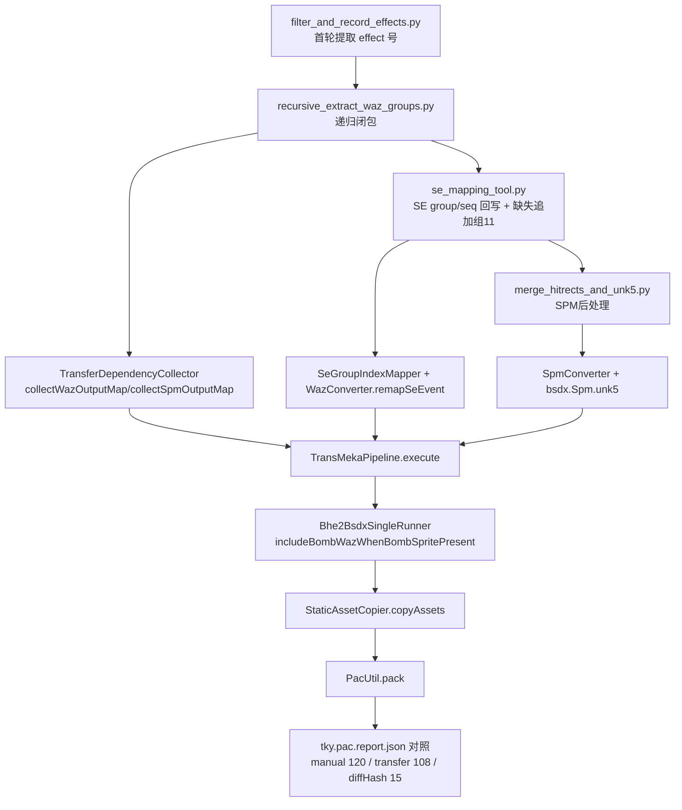

# DX_re 脚本与手工修正数据对照结论（Java 迁移链）

更新时间：2026-02-14

## 1. 本次核验范围（已实际读取）

### 1.1 朋友侧（DX_re）
- `D:\Code\DX_re\一体化bhe移植bsdx方案.txt`
- `D:\Code\DX_re\filter_and_record_effects.py`
- `D:\Code\DX_re\recursive_extract_waz_groups.py`
- `D:\Code\DX_re\se_mapping_tool.py`
- `D:\Code\DX_re\merge_hitrects_and_unk5.py`
- `D:\Code\DX_re\extract_missing_se_files.py`

### 1.2 Java 迁移链与测试
- `src/main/java/com/giga/nexas/transfer/bhe2bsdx/converter/TransferDependencyCollector.java`
- `src/main/java/com/giga/nexas/transfer/bhe2bsdx/converter/SeGroupIndexMapper.java`
- `src/main/java/com/giga/nexas/transfer/bhe2bsdx/converter/WazConverter.java`
- `src/main/java/com/giga/nexas/transfer/bhe2bsdx/converter/TransMekaPipeline.java`
- `src/main/java/com/giga/nexas/transfer/bhe2bsdx/converter/StaticAssetCopier.java`
- `src/main/java/com/giga/nexas/transfer/bhe2bsdx/converter/WazSequenceSanitizer.java`
- `src/main/java/com/giga/nexas/transfer/bhe2bsdx/Bhe2BsdxSingleRunner.java`
- `src/test/java/com/giga/nexas/transfer/bhe2bsdx/converter/SeGroupIndexMapperTest.java`
- `src/test/java/com/giga/nexas/transfer/bhe2bsdx/converter/TransferDependencyCollectorTest.java`
- `src/test/java/com/giga/nexas/transfer/bhe2bsdx/converter/SeGroupRealDataValidationTest.java`
- `src/test/java/com/giga/nexas/transfer/bhe2bsdx/converter/SpriteMappingRealDataTest.java`
- `src/test/java/com/giga/nexas/bhe2bsdx/TransferTest.java`

### 1.3 手工修正包与对照数据
- `src/main/resources/tky.pac`
- `src/main/java/com/giga/nexas/transfer/bhe2bsdx/tky.pac.unpack.list.txt`
- `src/main/java/com/giga/nexas/transfer/bhe2bsdx/tky.pac.report.json`
- `src/main/resources/testBhe/tsukuyomi`（当前 Java 输出样本）

## 2. 朋友脚本链路（事实拆解）

### 2.1 首轮 effect 序号提取
证据：`D:\Code\DX_re\filter_and_record_effects.py:13`、`D:\Code\DX_re\filter_and_record_effects.py:16`、`D:\Code\DX_re\filter_and_record_effects.py:23`、`D:\Code\DX_re\filter_and_record_effects.py:40`

结论：
- 从 `effect.bsdx.waz.extracted.json` 读取 `skillList`。
- 仅提取 `unitDescription` 含 `エフェクト`，且 `ceventEffectUnitList` 内 `description == エフェクト番号` 的对象。
- 抽取字段是 `wazFileNo/wazSequenceNo`，写出 `effect_number_records_0.json`。

### 2.2 递归 effect 闭包
证据：`D:\Code\DX_re\recursive_extract_waz_groups.py:17`、`D:\Code\DX_re\recursive_extract_waz_groups.py:91`、`D:\Code\DX_re\recursive_extract_waz_groups.py:109`、`D:\Code\DX_re\recursive_extract_waz_groups.py:119`、`D:\Code\DX_re\recursive_extract_waz_groups.py:245`、`D:\Code\DX_re\recursive_extract_waz_groups.py:264`、`D:\Code\DX_re\recursive_extract_waz_groups.py:280`

结论：
- 输入种子：`unique_effect_numbers.json`。
- 固定 fileNo 映射：`0..7 -> effect/tama01..bomb`。
- 扫描模式包含两类：
  - unit 直挂 `ceventEffectUnitList`
  - `skillInfoObjectList` 内嵌 `ceventEffectUnitList`
- 递归上限 `max_iterations = 10`。
- 产物：`*.recursive.json`、`unique_effect_numbers.recursive.json`、统计与日志。

### 2.3 SE 索引重映射 + 缺失追加组
证据：`D:\Code\DX_re\se_mapping_tool.py:97`、`D:\Code\DX_re\se_mapping_tool.py:133`、`D:\Code\DX_re\se_mapping_tool.py:224`、`D:\Code\DX_re\se_mapping_tool.py:266`、`D:\Code\DX_re\se_mapping_tool.py:440`、`D:\Code\DX_re\se_mapping_tool.py:446`

结论：
- 从 `byteDataList` 前 8 字节读 `(group,seq)`（小端 int32）。
- 在源 `segroup` 找 `seFileName`，再到目标 `segroup` 反查 `(group,seq)`。
- 回写 `byteDataList[0:8]`。
- 目标不存在时，追加到 `missing_group_index=11`。

### 2.4 SPM 手工后处理脚本
证据：`D:\Code\DX_re\merge_hitrects_and_unk5.py:87`、`D:\Code\DX_re\merge_hitrects_and_unk5.py:154`、`D:\Code\DX_re\merge_hitrects_and_unk5.py:166`、`D:\Code\DX_re\merge_hitrects_and_unk5.py:182`

结论：
- 将旧 hitRects 转为 `{unk0, hitRect{left,top,right,bottom}, unk1, unk2}`。
- 对 `chipData`：若有 `option` 且无 `unk5`，补 `unk5=0`。

## 3. Java 对应落点（逐条映射）

| 朋友脚本能力 | Java 落点 | 对齐情况 |
|---|---|---|
| effect 递归闭包 | `src/main/java/com/giga/nexas/transfer/bhe2bsdx/converter/TransferDependencyCollector.java:42`、`src/main/java/com/giga/nexas/transfer/bhe2bsdx/converter/TransferDependencyCollector.java:155`、`src/main/java/com/giga/nexas/transfer/bhe2bsdx/converter/TransferDependencyCollector.java:226`、`src/main/java/com/giga/nexas/transfer/bhe2bsdx/converter/TransferDependencyCollector.java:231` | 已落地。通过 `visitInfo` 递归穿透 `CEventEffect`，捕获 `CEventWazaSelect`。 |
| SE group/seq 前 8 字节重写 | `src/main/java/com/giga/nexas/transfer/bhe2bsdx/converter/SeGroupIndexMapper.java:29`、`src/main/java/com/giga/nexas/transfer/bhe2bsdx/converter/SeGroupIndexMapper.java:208`、`src/main/java/com/giga/nexas/transfer/bhe2bsdx/converter/WazConverter.java:290`、`src/main/java/com/giga/nexas/transfer/bhe2bsdx/converter/WazConverter.java:308` | 已落地。按 `(group,seq)` 映射回写。 |
| 缺失 SE 追加到组 11 | `src/main/java/com/giga/nexas/transfer/bhe2bsdx/converter/SeGroupIndexMapper.java:20`、`src/main/java/com/giga/nexas/transfer/bhe2bsdx/converter/SeGroupIndexMapper.java:110`、`src/main/java/com/giga/nexas/transfer/bhe2bsdx/converter/SeGroupIndexMapper.java:140` | 已落地。默认 `appendGroupIndex=11`。 |
| 迁移主链接入 | `src/main/java/com/giga/nexas/transfer/bhe2bsdx/converter/TransMekaPipeline.java:145`、`src/main/java/com/giga/nexas/transfer/bhe2bsdx/converter/TransMekaPipeline.java:156`、`src/main/java/com/giga/nexas/transfer/bhe2bsdx/converter/TransMekaPipeline.java:157` | 已落地。SE 映射 + WAZ 序号 sanitize 在主链执行。 |
| Bomb 依赖补入 | `src/main/java/com/giga/nexas/transfer/bhe2bsdx/Bhe2BsdxSingleRunner.java:245`、`src/main/java/com/giga/nexas/transfer/bhe2bsdx/Bhe2BsdxSingleRunner.java:358` | 已落地。`bomb.spm` 存在且 `bomb.waz` 缺失时自动补。 |
| 静态资源收敛复制 | `src/main/java/com/giga/nexas/transfer/bhe2bsdx/converter/StaticAssetCopier.java:29`、`src/main/java/com/giga/nexas/transfer/bhe2bsdx/converter/StaticAssetCopier.java:116`、`src/main/java/com/giga/nexas/transfer/bhe2bsdx/converter/StaticAssetCopier.java:253` | 已落地。按 SPM/GRP 引用集复制资源。 |
| SPM hitRect/unk 处理 | `src/main/java/com/giga/nexas/transfer/bhe2bsdx/converter/SpmConverter.java:99`、`src/main/java/com/giga/nexas/transfer/bhe2bsdx/converter/SpmConverter.java:102`、`src/main/java/com/giga/nexas/dto/bsdx/spm/Spm.java:43` | 部分等价。hitRect 已走 `transHitbox`，BSDX `unk5` 为结构字段；与朋友 GUI 后处理思路一致但实现路径不同。 |

## 4. 手工修正包（tky.pac）与当前迁移输出对照

证据：`src/main/java/com/giga/nexas/transfer/bhe2bsdx/tky.pac.report.json:6`、`src/main/java/com/giga/nexas/transfer/bhe2bsdx/tky.pac.report.json:17`、`src/main/java/com/giga/nexas/transfer/bhe2bsdx/tky.pac.report.json:27`、`src/main/java/com/giga/nexas/transfer/bhe2bsdx/tky.pac.report.json:44`、`src/main/java/com/giga/nexas/transfer/bhe2bsdx/tky.pac.report.json:49`、`src/main/java/com/giga/nexas/transfer/bhe2bsdx/tky.pac.report.json:50`、`src/main/java/com/giga/nexas/transfer/bhe2bsdx/tky.pac.report.json:51`、`src/main/java/com/giga/nexas/transfer/bhe2bsdx/tky.pac.report.json:52`

当前统计：
- 手工包解包：120
- Java 输出：108
- onlyInTky：15
- onlyInTransfer：3
- common：105
- sameHash：90
- diffHash：15

`onlyInTky`（15 项）中：
- 7 个是 OGG：`b6_hit03.ogg`、`door_largemetal_open10.ogg`、`gun_ammoout_scifi1.ogg`、`magic_glow1.ogg`、`menu_magic02.ogg`、`RE_Iron04b.ogg`、`zoom_sniperscope_in.ogg`
- 8 个是 PNG：`bomb_011_0001.png`、`bomb_066_0001.png`、`mark_etc014_0001.png`、`pic_134_0001.png`、`pic_142_0001.png`、`tama_123_0001.png`、`tama_energy021_0001.png`、`tama_energy034_0001.png`

额外核验（本机实际路径）：
- 上述 15 项在 `D:\BDY\bsdx_bhe\bhe_resources` 中全部存在。
- 7 个 OGG 在 `D:\Code\DX_re\se` 中存在。
- `D:\Code\DX_re\未找到的SE文件` 与当前 `testBhe/tsukuyomi` 音频集合交集为 0（说明该目录是“脚本运行时缺失补丁池”，不是当前 tsukuyomi 产物直接来源）。

## 5. 朋友文本方案与当前状态

证据：`D:\Code\DX_re\一体化bhe移植bsdx方案.txt:6`、`D:\Code\DX_re\一体化bhe移植bsdx方案.txt:10`、`D:\Code\DX_re\一体化bhe移植bsdx方案.txt:15`

对应结论：
- 方案中指出 effect 递归提取脚本早期“攻击特效覆盖不足”（朋友原文）。
- Java 当前闭包是对象树递归，不依赖 `unitDescription` 文本匹配，理论覆盖面高于脚本文本筛选（以 `CEventWazaSelect` 实际节点为准）。
- 方案中提到 Term 需要人工修；该部分目前仍应以 `Term.grp + BsdxInfoCollection` 结构化链路为主，不应混入硬编码机体特例。

## 6. 已做实测（本次）

执行命令：
```powershell
mvn -q "-Dtest=com.giga.nexas.transfer.bhe2bsdx.converter.SeGroupIndexMapperTest,com.giga.nexas.transfer.bhe2bsdx.converter.TransferDependencyCollectorTest" test
mvn -q "-Dtest=com.giga.nexas.transfer.bhe2bsdx.converter.SeGroupRealDataValidationTest,com.giga.nexas.transfer.bhe2bsdx.converter.SpriteMappingRealDataTest" test
```

关键结果：
- 通过。
- 日志出现 `segroup mapping appended 644 missing items into BSDX group 11`（真实数据集）。
- `SeGroupRealDataValidationTest` 输出：
  - `checkedPairsInSeGroup=1526`
  - `changedPairsInSeGroup=1526`
  - `checkedBlocks=7599`
  - `changedBlocks=7599`
  - `skippedUnknownPairs=0`

## 7. 当前缺口（明确）

1. `DX_re` 根目录未保留脚本产出 JSON/日志（当前仅有脚本与方案文本），无法直接复算朋友当时的中间态集合。  
   证据：`D:\Code\DX_re` 根目录仅见 `*.py` 与 `一体化bhe移植bsdx方案.txt`。
2. `tky.pac` 与当前输出仍有 `diffHash=15`。这属于“同名文件二进制差异”，需继续逐文件字段级比对，不应直接视为失败或成功。
3. `onlyInTky=15` 虽然资源文件都可在本机静态资源根定位到，但是否应进入输出仍由“引用闭包 + 打包策略”决定，需要再做引用源头核对。

## 8. 建议的后续执行顺序（只给可执行项）

1. 先对 `onlyInTky` 的 15 项做“引用来源定位”（来自哪一个 SPM imageData / SeGroup / BatVoice）。
2. 对 `differentHashFiles` 的 15 项做字段级 diff（优先 `SeGroup.grp`、`wazagroup.grp`、`nanoha.waz`、`Bomb.waz`）。
3. 把“可解释差异”与“不可解释差异”分开记录，再决定是否调整迁移规则。

## 9. 对照流程图



## 10. 2026-02-14 收敛更新（本轮）

### 10.1 代码侧新增/调整

- `src/main/java/com/giga/nexas/transfer/bhe2bsdx/Bhe2BsdxSingleRunner.java`
  - 静态资源拷贝输入从“仅转换结果 SPM”改为“实际输出闭包 `outputSpm`”。
- `src/main/java/com/giga/nexas/transfer/bhe2bsdx/converter/StaticAssetCopier.java`
  - 新增重载接口：支持按 `spmKey -> actionGroupNumber 集合`进行可选过滤（当前主流程默认未启用该过滤，保留为后续优化入口）。
- `src/main/java/com/giga/nexas/transfer/bhe2bsdx/converter/TransferDependencyCollector.java`
  - 新增 `collectSpmActionGroups(...)`，用于从 WAZ 递归树提取 `CEventSprite` 的 `actionGroupNumber`。
- `src/test/java/com/giga/nexas/transfer/bhe2bsdx/converter/StaticAssetCopierTest.java`
  - 新增 action-group 过滤单测。
- `src/test/java/com/giga/nexas/transfer/bhe2bsdx/converter/TkyManualGapReferenceAuditTest.java`
  - 审计报告新增 `existsInTransferOutput` 字段；
  - “必修缺口”判定改为：`referencedByRuntime && !existsInTransferOutput`。

### 10.2 本轮实测命令

```powershell
mvn -q "-Dtest=com.giga.nexas.transfer.bhe2bsdx.converter.*Test" test
mvn -q "-Dtest=com.giga.nexas.bhe2bsdx.TransferTest#testBatchRunner" "-Dtransfer.sources=tsukuyomi" test
mvn -q "-Dtest=com.giga.nexas.transfer.bhe2bsdx.converter.TkyManualGapReferenceAuditTest" test
```

### 10.3 当前对照结果（基于最新输出目录）

- 目录对照（`target/tky_pac_analysis/tky` vs `src/main/resources/testBhe/tsukuyomi`）：
  - `manual=120`
  - `transfer=361`
  - `onlyInManual=13`
  - `onlyInTransfer=254`
  - `common=107`
  - `sameHash=92`
  - `diffHash=15`
- 审计报告（`target/tky_manual_gap_reference_audit.json`）：
  - `mustFixCount=0`
  - `extraManualCount=14`

### 10.4 结论（当前可执行口径）

1. “运行时刚性缺口”已从审计口径归零（`mustFixCount=0`）。  
2. 代价是静态资源集明显膨胀（`transfer=361`），目前策略偏“保守补齐”。  
3. 下一步要优化的不是“补不补”，而是“如何在不漏资源前提下做更精确收敛”：
   - 以 `CEventSprite.actionGroupNumber/actionNumber` 为主线，补齐到 `SPM -> page -> imageData` 的细粒度映射；
   - 对比 `tky.pac` 的 13 个 `onlyInManual` 项，逐项确认是否真正运行时必需。
