# 端到端流程与证据图（Flow）

## 1. Java 现有迁移主链（事实图）

证据起点：`src/test/java/com/giga/nexas/bhe2bsdx/TransferTest.java:43`。

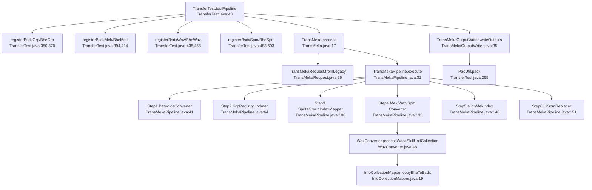

## 2. `BsdxInfoCollection` 二进制结构

来源：`src/main/java/com/giga/nexas/dto/bsdx/BsdxInfoCollection.java:60`。

```mermaid
flowchart LR
  A[int1] --> B[count(typeList)] --> C[typeList*count]
  C --> D[count(paramList)] --> E[paramList*count]
  E --> F[count(intList3)] --> G[intList3*count]
  G --> H[count(intList4)] --> I[intList4*count]
  I --> J[int2]
```

## 3. `Term.grp` 链式索引规则（真实样本）

来源：真实二进制 `src/main/resources/game/bsdx/grp/term.grp`，按 `TermGrpParser` 结构读取。

### 3.1 关键组（真实）

- `group[0] code=PARENT`
  - `item[2] desc=OBJECT1 param2=7`
- `group[7] code=OBJECT1`
  - `item[7] desc=TOUCH param2=15`
- `group[15] code=TOUCH`
  - `item[17] desc=GROUND param2=-3`

### 3.2 链式样例（真实）

输入 collection：

- `int1=0`
- `typeList=[2,7,17]`

解析结果：

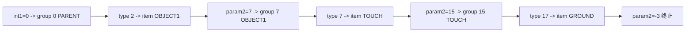

结论：`int1` 是起始组索引，`typeList` 在当前组内选项跳转，`param2` 决定是否进入下一组（>=0）或终止（<0）。

## 4. `int2` 语义现状（真实统计）

统计范围：`src/main/resources/wazBsdxJson/*.json`。

- 总 collection：`59449`
- `int2=0`：`59149`
- `int2=1`：`300`

关键事实：

- `int2=1` **只** 出现在 `bsdxInfoCollectionList1`。
- 且其宿主对象固定为 `ownerTypeId=34`、`ownerSlot=71`。
- 对应 Java 类型是 `CEventChange`（见 `SkillInfoObject.java:54`）。

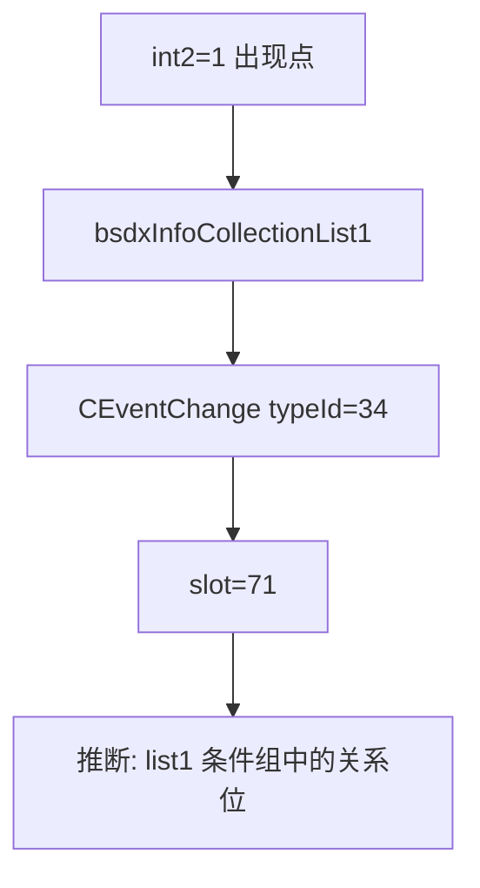

当前结论分级：

- `verified`：出现范围与宿主类型固定。
- `inferred`：语义可能是关系运算符/连接符（与 `flag` 的组合相关）。

## 5. 二进制偏移对照（真实）

样本：`src/main/resources/game/bsdx/waz/makoto.waz`。

对象1：`offset=731 (0x2DB)`，来自 `Makoto.waz.json` 的 `typeId=34` 记录。

| 字段 | 偏移 | 原始字节(LE) | 解析值 |
|---|---:|---|---:|
| startFrame | 0x2DB | `00 00 00 00` | 0 |
| endFrame | 0x2DF | `87 00 00 00` | 135 |
| flag | 0x2E3 | `01 00 00 00` | 1 |
| list1[0].int1 | 0x2E7 | `00 00 00 00` | 0 |
| list1[0].typeCount | 0x2EB | `03 00 00 00` | 3 |
| list1[0].types | 0x2EF..0x2F7 | `02 00 00 00 / 07 00 00 00 / 11 00 00 00` | 2,7,17 |
| list1[0].int2 | 0x30F | `01 00 00 00` | 1 |
| list2[0].int1 | 0x313 | `10 00 00 00` | 16 |
| list2[0].types | 0x31B..0x31F | `00 00 00 00 / 00 00 00 00` | 0,0 |
| list2[0].int2 | 0x32F | `00 00 00 00` | 0 |

对象2：`offset=1439 (0x59F)` 同类型对象。

- list1[0] 相同主链，但 `int2=0`。
- list2[0] 为 `int1=16, types=[0,1], param=[0], int2=0`。

## 6. 新架构运行流

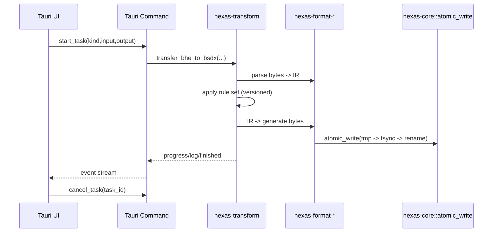

## 7. 当前缺口

- `TODO(证据不足)`：`ProgramMaterial.grp.array1/array2/array3` 的业务语义尚未在 Java 业务层找到直接消费点。
- `TODO(证据不足)`：`int2` 在 `CEventChange` 内的具体运算语义（AND/OR/NOT）需结合运行时行为或更多反汇编证据。

## 8. 已落地 CLI 流程（真实执行）

### 8.1 `resolve-term`（Term 路径解码）

命令：

```powershell
cargo run -p nexas-cli -- resolve-term tests/golden/grp/term.grp tests/golden/waz/makoto_ceventchange_list1_0x2e7.json tests/golden/waz/resolve_0x2e7.json
```

输入：

- `tests/golden/grp/term.grp`
- `tests/golden/waz/makoto_ceventchange_list1_0x2e7.json`

输出：

- `tests/golden/waz/resolve_0x2e7.json`
- 关键字段：`semantic=OBJECT1.TOUCH.GROUND`，`terminal_param2=-3`

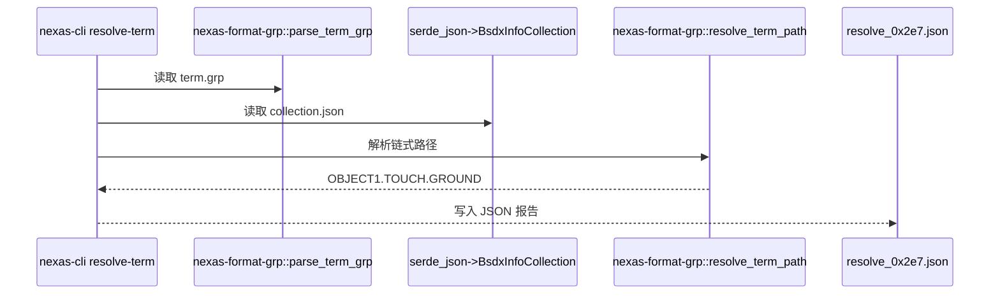

### 8.2 `inspect-collection`（二进制并排解释）

命令：

```powershell
cargo run -p nexas-cli -- inspect-collection D:\Code\NeXAS_DX\src\main\resources\game\bsdx\waz\makoto.waz --offset 743 tests/golden/waz/inspect_0x2e7.json
```

输入：

- 原始文件：`D:\Code\NeXAS_DX\src\main\resources\game\bsdx\waz\makoto.waz`
- 偏移：`743 (0x2E7)`

输出：

- `tests/golden/waz/inspect_0x2e7.json`
- 同时给出 `i32_le / f32_le / i16x2_le / set_bits`

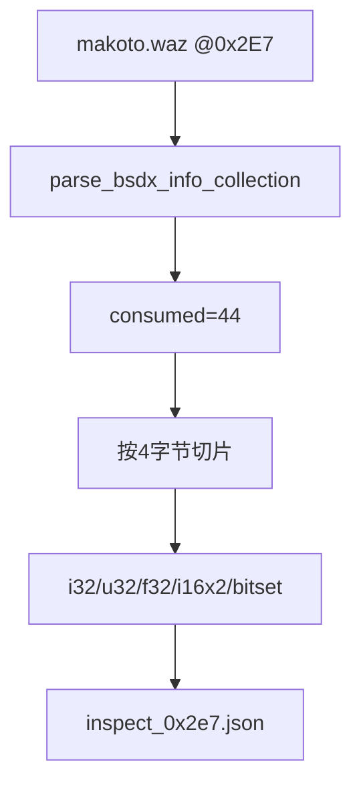

### 8.3 round-trip 验证

命令：

```powershell
cargo run -p nexas-cli -- parse grp tests/golden/grp/term.grp tests/golden/grp/term.parsed.json
cargo run -p nexas-cli -- generate grp tests/golden/grp/term.parsed.json tests/golden/grp/term.roundtrip.grp
```

结论：

- `tests/golden/grp/term.grp` 与 `tests/golden/grp/term.roundtrip.grp` 二进制逐字节一致。

## 9. CEventChange 二进制对象边界（真实）

依据 Java 读取顺序：

- `src/main/java/com/giga/nexas/dto/bsdx/waz/wazfactory/wazinfoclass/obj/CEventChange.java:42`
- `src/main/java/com/giga/nexas/dto/bsdx/waz/wazfactory/wazinfoclass/obj/CEventChange.java:50`
- `src/main/java/com/giga/nexas/dto/bsdx/waz/wazfactory/wazinfoclass/obj/CEventChange.java:69`

真实样本：

- `makoto.waz` `offset=0x2DB` 对象长度 `92` 字节。
- `makoto.waz` `offset=0x59F` 对象长度 `96` 字节。

注意：

- JSON 中下一个 `SkillInfoUnknown.offset` 比对象结束多 `4` 字节。
- 这 `4` 字节是 `count2`（unknown 数量），由 `WazParser` 在 unit 内统一读取：
  - `src/main/java/com/giga/nexas/dto/bsdx/waz/parser/WazParser.java:103`

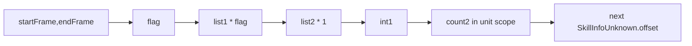

## 10. 新增命令流程

### 10.1 `inspect-ceventchange`

命令：

```powershell
cargo run -p nexas-cli -- inspect-ceventchange D:\Code\NeXAS_DX\src\main\resources\game\bsdx\waz\makoto.waz --offset 731 --term-grp D:\Code\NeXAS_DX\src\main\resources\game\bsdx\grp\term.grp tests/golden/waz/inspect_ceventchange_0x2db.json
```

落点：

- `crates/nexas-cli/src/main.rs:327`
- `crates/nexas-cli/src/main.rs:510`
- `crates/nexas-cli/src/main.rs:553`

输出：

- `tests/golden/waz/inspect_ceventchange_0x2db.json`

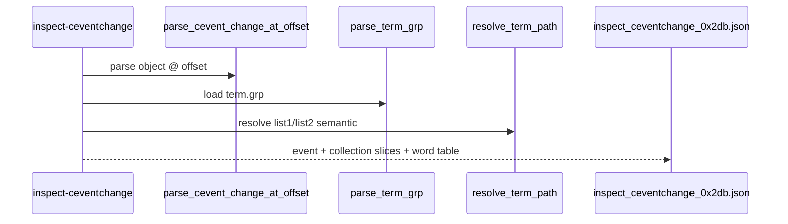

### 10.2 `waz-int2-report`

命令：

```powershell
cargo run -p nexas-cli -- waz-int2-report D:\Code\NeXAS_DX\src\main\resources\wazBsdxJson --waz-dir D:\Code\NeXAS_DX\src\main\resources\game\bsdx\waz --term-grp D:\Code\NeXAS_DX\src\main\resources\game\bsdx\grp\term.grp --verify-limit 6 tests/golden/waz/waz_int2_report.json
```

落点：

- `crates/nexas-cli/src/main.rs:363`
- `crates/nexas-cli/src/main.rs:583`
- `crates/nexas-cli/src/main.rs:727`

输出：

- `tests/golden/waz/waz_int2_report.json`
- 关键统计：
  - `total_collections=59449`
  - `int2=1 => 300`
  - `int2=1` 出现主桶：`type=34,slot=71,list=bsdxInfoCollectionList1`

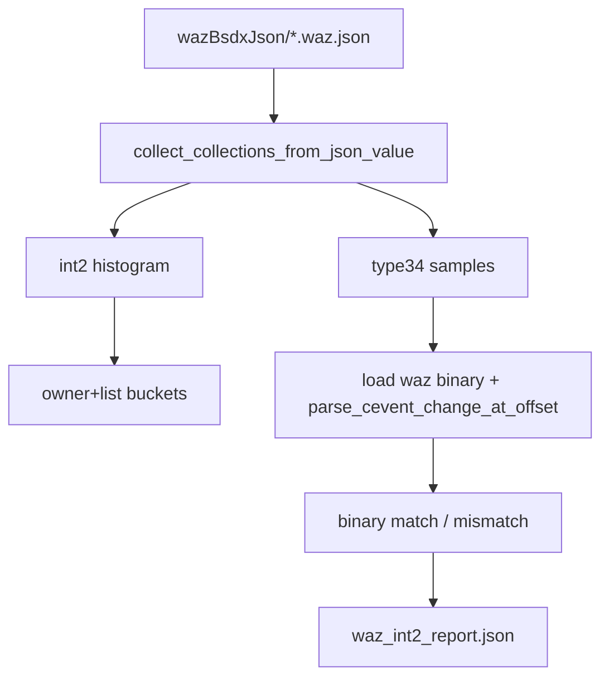

## 11. Java 增量差分流程（本轮新增）

命令：

```powershell
cargo run -p nexas-cli -- java-diff-report D:\Code\NeXAS_DX tests/golden/java/java_diff_report.json
```

落点：

- `crates/nexas-cli/src/main.rs:95`
- `crates/nexas-cli/src/main.rs:868`
- `crates/nexas-cli/src/main.rs:957`

输出：

- `tests/golden/java/java_diff_report.json`

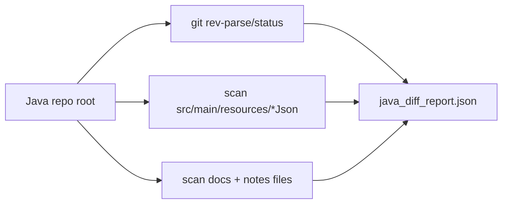

本轮报告事实：

- `git_head=b0e323b`
- `git_tracked_changes=[]`
- `resource_json_total_files=3235`

## 12. 五格式无损回归流程（本轮新增）

目标：对 `grp/waz/mek/spm/pac` 执行统一的 `parse -> generate -> diff`，且 `byte_diff=0`。

真实样本：

- `tests/golden/grp/term.grp`
- `tests/golden/waz/makoto.waz`
- `tests/golden/mek/Makoto.mek`
- `tests/golden/spm/01.spm`
- `tests/golden/pac/seed.pacNew`

PAC 样本来源：

- 由 `D:\Code\NeXAS_DX\src\main\resources\exe\NexasPack.exe` 对 `tests/golden/pac/seed` 目录打包生成。

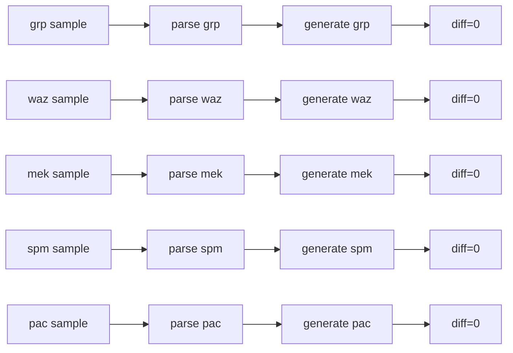

验收命令：

```powershell
cargo run -p nexas-cli -- parse grp tests/golden/grp/term.grp tests/golden/regression/term.grp.ir.json
cargo run -p nexas-cli -- generate grp tests/golden/regression/term.grp.ir.json tests/golden/regression/term.grp.roundtrip
cargo run -p nexas-cli -- diff tests/golden/grp/term.grp tests/golden/regression/term.grp.roundtrip

cargo run -p nexas-cli -- parse waz tests/golden/waz/makoto.waz tests/golden/regression/makoto.waz.ir.json
cargo run -p nexas-cli -- generate waz tests/golden/regression/makoto.waz.ir.json tests/golden/regression/makoto.waz.roundtrip
cargo run -p nexas-cli -- diff tests/golden/waz/makoto.waz tests/golden/regression/makoto.waz.roundtrip

cargo run -p nexas-cli -- parse mek tests/golden/mek/Makoto.mek tests/golden/regression/Makoto.mek.ir.json
cargo run -p nexas-cli -- generate mek tests/golden/regression/Makoto.mek.ir.json tests/golden/regression/Makoto.mek.roundtrip
cargo run -p nexas-cli -- diff tests/golden/mek/Makoto.mek tests/golden/regression/Makoto.mek.roundtrip

cargo run -p nexas-cli -- parse spm tests/golden/spm/01.spm tests/golden/regression/01.spm.ir.json
cargo run -p nexas-cli -- generate spm tests/golden/regression/01.spm.ir.json tests/golden/regression/01.spm.roundtrip
cargo run -p nexas-cli -- diff tests/golden/spm/01.spm tests/golden/regression/01.spm.roundtrip

cargo run -p nexas-cli -- parse pac tests/golden/pac/seed.pacNew tests/golden/regression/seed.pac.ir.json
cargo run -p nexas-cli -- generate pac tests/golden/regression/seed.pac.ir.json tests/golden/regression/seed.pac.roundtrip
cargo run -p nexas-cli -- diff tests/golden/pac/seed.pacNew tests/golden/regression/seed.pac.roundtrip
```

本轮执行结果：五次 `diff` 均输出 `byte_diff=0`。
