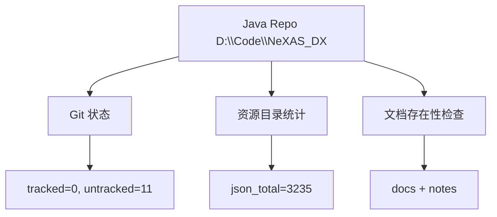

# Java 仓库同步状态（2026-02-10）

## 1. 执行命令

```powershell
cargo run -p nexas-cli -- java-diff-report D:\Code\NeXAS_DX tests/golden/java/java_diff_report.json --force
```

输出文件：

- `tests/golden/java/java_diff_report.json`

## 2. 核心状态

- Java 仓库 `HEAD`：`b0e323b`
- `git_tracked_changes`：`0`
- `git_untracked_changes`：`11`（目录级）

未跟踪路径集中在：

- `docs/`
- `src/main/java/com/giga/nexas/dto/bsdx/BsdxInfoCollection.notes.md`
- `src/main/resources/*Json/`

## 3. 资源目录统计（真实计数）

| 目录 | 文件数 |
|---|---:|
| `datBsdxJson` | 67 |
| `grpBheJson` | 8 |
| `grpBsdxJson` | 8 |
| `mekBheJson` | 95 |
| `mekBsdxJson` | 105 |
| `spmBheJson` | 748 |
| `spmBsdxJson` | 1989 |
| `wazBheJson` | 103 |
| `wazBsdxJson` | 112 |
| **合计** | **3235** |



## 4. 同步结论

- Java 核心源码未出现 tracked 变更，当前迁移代码可继续沿用。
- 资源目录规模持续扩大，`java-diff-report` 命令用于固定口径的状态扫描。
- 与迁移链相关的 `segroup` 映射逻辑已在 Java 与 Tauri 两侧保持一致：

  - Java：`src/main/java/com/giga/nexas/transfer/bhe2bsdx/converter/SeGroupIndexMapper.java`
  - Java：`src/main/java/com/giga/nexas/transfer/bhe2bsdx/converter/WazConverter.java`
  - Rust：`crates/nexas-transform/src/lib.rs`
