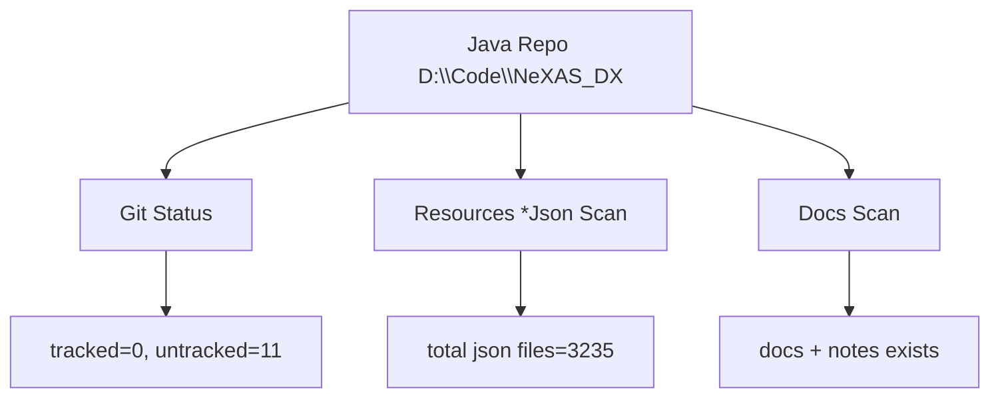

# Java 更新差分报告（2026-02-10）

## 执行命令

```powershell
cargo run -p nexas-cli -- java-diff-report D:\Code\NeXAS_DX tests/golden/java/java_diff_report.json
```

报告文件：

- `tests/golden/java/java_diff_report.json`

## 差分结论

- Java 仓库 HEAD：`b0e323b`
- `git_tracked_changes`：`0` 条
- `git_untracked_changes`：`11` 条（目录级）

核心未跟踪路径：

- `docs/`
- `src/main/java/com/giga/nexas/dto/bsdx/BsdxInfoCollection.notes.md`
- `src/main/resources/*Json/`（9 个目录）

## 资源快照（真实计数）

| 目录 | 文件数 |
|---|---:|
| `datBsdxJson` | 67 |
| `grpBheJson` | 8 |
| `grpBsdxJson` | 8 |
| `mekBheJson` | 95 |
| `mekBsdxJson` | 105 |
| `spmBheJson` | 748 |
| `spmBsdxJson` | 1989 |
| `wazBheJson` | 103 |
| `wazBsdxJson` | 112 |
| **总计** | **3235** |



## 对 Tauri 侧影响

- Java 核心源码未出现 tracked 改动，现有解析逻辑无需因源码变更而重写。
- 生成资源和文档规模扩大，已新增 `java-diff-report` 命令用于持续比对。
- Tauri 文档已同步更新：
  - `docs/project-deep-dive/readme.md`
  - `docs/project-deep-dive/flow.md`
  - `docs/project-deep-dive/agent.md`
  - `docs/project-deep-dive/skills.md`
