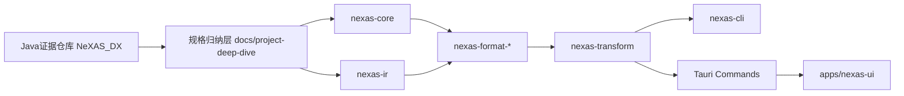
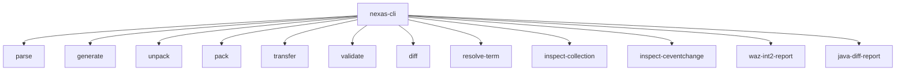
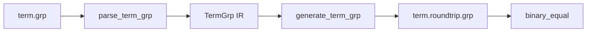
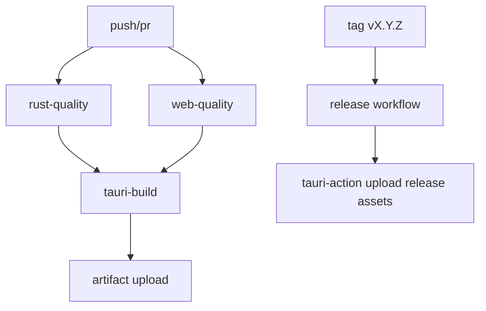
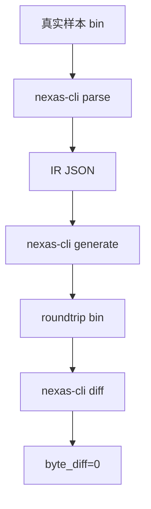

# NeXAS DX 重构总览（Rust + Tauri）

## 文档定位
本文件是 `D:\Code\NeXAS_DX_Tauri` 的总设计说明，目标是把 `D:\Code\NeXAS_DX` 的 Java 工程迁移为可长期演进的 Rust + Tauri 工程。

## 可追溯证据范围
以下结论均可回溯到原仓库的真实文件与方法。

- 迁移主入口来自 `src/test/java/com/giga/nexas/bhe2bsdx/TransferTest.java:43` 的 `testPipeline()`。
- 主流程编排来自 `src/test/java/com/giga/nexas/bhe2bsdx/steps/TransMekaPipeline.java:31` 的 `execute(...)`。
- `BsdxInfoCollection` 的二进制读写结构来自 `src/main/java/com/giga/nexas/dto/bsdx/BsdxInfoCollection.java:60` 与 `src/main/java/com/giga/nexas/dto/bsdx/BsdxInfoCollection.java:87`。
- `Term.grp` 结构来自 `src/main/java/com/giga/nexas/dto/bsdx/grp/parser/impl/TermGrpParser.java:24`。
- `ProgramMaterial.grp` 结构来自 `src/main/java/com/giga/nexas/dto/bsdx/grp/parser/impl/ProgramMaterialGrpParser.java:24`。
- `CEventChange` 的 list 读写规则来自 `src/main/java/com/giga/nexas/dto/bsdx/waz/wazfactory/wazinfoclass/obj/CEventChange.java:50`。
- WAZ 固定 72 单元解析来自 `src/main/java/com/giga/nexas/dto/bsdx/waz/parser/WazParser.java:87`。
- 真实样本来自：
  - `src/main/resources/game/bsdx/grp/term.grp`
  - `src/main/resources/game/bsdx/waz/makoto.waz`
  - `src/main/resources/wazBsdxJson/Makoto.waz.json`
  - `src/main/resources/grpBsdxJson/ProgramMaterial.grp.json`

## 新仓库结构（已落盘）

```text
D:\Code\NeXAS_DX_Tauri
├─ Cargo.toml
├─ crates
│  ├─ nexas-core
│  ├─ nexas-ir
│  ├─ nexas-format-waz
│  ├─ nexas-format-mek
│  ├─ nexas-format-spm
│  ├─ nexas-format-grp
│  ├─ nexas-format-pac
│  ├─ nexas-transform
│  └─ nexas-cli
├─ apps
│  └─ nexas-ui
│     ├─ package.json
│     ├─ src
│     └─ src-tauri
├─ tests
│  └─ golden
└─ docs
   └─ project-deep-dive
      ├─ readme.md
      ├─ flow.md
      ├─ agent.md
      ├─ skills.md
      └─ roundtrip-acceptance.md
```

## 架构目标

- CLI-first：所有核心能力先做成 CLI，再接入 UI。
- Core/UI 解耦：UI 不处理任何二进制解析细节。
- 无损 IR：未知字段保留原始 span + bytes。
- 回归可验收：每个格式具备 `parse -> generate -> binary_diff` 入口。
- 高可用：原子写、任务取消、进度事件、错误分级。



## 组件职责

| 组件 | 职责 | 当前状态 |
|---|---|---|
| `nexas-core` | endian/错误/原子写/cancel token | 已建骨架 |
| `nexas-ir` | 统一 IR + unknown bytes 保留模型 | 已建骨架 |
| `nexas-format-grp` | Term 与 collection 解析/生成/diff | 已实现真实解析与 golden |
| `nexas-format-waz` | WAZ 事件解析/生成/diff | 已实现 `CEventChange` 真实解析与 golden |
| `nexas-format-mek/spm/pac` | 其余格式 parse/generate/diff | 已实现无损 opaque round-trip + golden |
| `nexas-transform` | BHE -> BSDX 流水线与规则层 | 已建骨架 |
| `nexas-cli` | parse/generate/unpack/pack/transfer/validate/diff/report | 已实现多命令与原子写 |
| `apps/nexas-ui` | 任务队列、进度、日志、取消 | 已建骨架 |

## CLI 命令定义



- `parse --format <waz|mek|spm|grp|pac> <input> <output>`
- `generate --format <waz|mek|spm|grp|pac> <input-ir> <output-bin>`
- `unpack <input-pac> <output-dir>`
- `pack <input-dir> <output-pac>`
- `transfer <bhe-root> <bsdx-root> <output-root>`
- `validate <left> <right>`
- `diff <left> <right>`
- `resolve-term <term.grp> <collection.json> [output.json]`
- `inspect-collection <input.bin> --offset <n> [output.json]`
- `inspect-ceventchange <input.waz> --offset <n> [--term-grp <term.grp>] [output.json]`
- `waz-int2-report <wazBsdxJsonDir> [--waz-dir <wazDir>] [--term-grp <term.grp>] [--verify-limit <n>] [output.json]`
- `java-diff-report <javaRoot> [output.json]`

## 里程碑计划与验收命令

| Milestone | 目标 | 验收命令 | 当前进度 |
|---|---|---|---|
| M1 | `nexas-core` + `nexas-format-grp` 最小闭环 | `cargo test -p nexas-format-grp` | 已完成 |
| M2 | `Term.grp` 链式解码 + `BsdxInfoCollection` IR 映射 | `cargo run -p nexas-cli -- resolve-term ...` | 已完成 |
| M3 | `waz` 关键事件 + `CEventChange` 收敛 | `cargo test -p nexas-format-waz` | 已完成核心子集 |
| M4 | 全格式无损回归（含 `mek/spm/pac`） | `cargo test --workspace` | 已完成（round-trip） |
| M5 | Tauri UI 任务队列/取消/日志/进度 | `pnpm -C apps/nexas-ui tauri:dev` | 已有骨架 |
| M6 | CI 多平台构建发布 | `cargo test --workspace && pnpm -C apps/nexas-ui build` | 已落地 workflow |

## 风险清单

| 风险 | 证据来源 | 应对策略 |
|---|---|---|
| `Term.grp` JSON 非严格合法 | `src/main/resources/grpBsdxJson/Term.grp.json` | 以原始二进制 `term.grp` 为准做解码器 |
| `int2` 语义不明 | `BsdxInfoCollection` 与 WAZ样本统计 | 先按结构保真，语义分层标记 `verified / inferred` |
| BHE/BSDX 类型号差异 | `SkillInfoObject` 两端 typeId 映射 | 保留双版本映射表并做 golden case |
| 大文件性能 | `resources` 7000+ 文件规模 | 流式读写 + 并发 + 可取消 |
| 覆盖风险 | 输出写盘阶段 | 原子写 + `.bak` + `--force` |

## 实时维护约定

- 每次更新 docs 必须附“证据索引”节。
- 每次改动一个里程碑，都要同步更新本目录四份文档。
- 若发现结论无法从源码/样本复核，直接标记 `TODO(证据不足)`。

## 当前实现状态（本轮）

- 已完成：`workspace`、`core/ir/format/transform/cli/ui` 骨架。
- 已完成：`grp/waz/mek/spm/pac` 五格式 `parse -> generate -> binary_diff=0` 回归链路。
- 已完成：Tauri commands `start_task/cancel_task/get_task_status` 与 `progress/log/finished/error` 事件通道。
- 已完成：Java 关键流程与 `Term/BsdxInfoCollection` 事实级证据归档（详见 `flow.md` 与 `skills.md`）。

## M1 已落地能力（2026-02-10）

### 代码落地点

- `crates/nexas-format-grp/src/lib.rs:71`
  - `parse_term_grp`：按 Java `TermGrpParser` 等价读取 group/item/cstring/int32。
- `crates/nexas-format-grp/src/lib.rs:127`
  - `generate_term_grp`：按相同字段顺序回写，支持 binary round-trip。
- `crates/nexas-format-grp/src/lib.rs:157`
  - `parse_bsdx_info_collection`：按 `int1 -> list1..list4 -> int2` 顺序读取。
- `crates/nexas-format-grp/src/lib.rs:200`
  - `resolve_term_path`：将 `int1 + typeList` 解码为 `Term` 链路与语义路径。
- `crates/nexas-cli/src/main.rs:281`
  - `resolve-term` 子命令：输入 `term.grp + collection.json` 输出解码结果。
- `crates/nexas-cli/src/main.rs:295`
  - `inspect-collection` 子命令：输入原始二进制+offset 输出字段和字解释。

### 真实样本与 golden

- `tests/golden/grp/term.grp`
  - 来源：`D:\Code\NeXAS_DX\src\main\resources\game\bsdx\grp\term.grp`。
- `tests/golden/waz/makoto_ceventchange_list1_0x2e7.bin`
  - 来源：`D:\Code\NeXAS_DX\src\main\resources\game\bsdx\waz\makoto.waz` 的 offset `0x2E7`，长度 `44` 字节。
- `tests/golden/waz/makoto_ceventchange_list1_0x2e7.json`
  - 来源：同 offset 对应的 collection 结构化值。
- `tests/golden/waz/resolve_0x2e7.json`
  - `resolve-term` 实际输出，语义为 `OBJECT1.TOUCH.GROUND`。
- `tests/golden/waz/inspect_0x2e7.json`
  - `inspect-collection` 实际输出，含 i32/f32/i16x2/bitmask 并排解释。

### 已验证命令

```powershell
cargo test -p nexas-format-grp
cargo run -p nexas-cli -- parse grp tests/golden/grp/term.grp tests/golden/grp/term.parsed.json
cargo run -p nexas-cli -- generate grp tests/golden/grp/term.parsed.json tests/golden/grp/term.roundtrip.grp
cargo run -p nexas-cli -- resolve-term tests/golden/grp/term.grp tests/golden/waz/makoto_ceventchange_list1_0x2e7.json tests/golden/waz/resolve_0x2e7.json
cargo run -p nexas-cli -- inspect-collection D:\Code\NeXAS_DX\src\main\resources\game\bsdx\waz\makoto.waz --offset 743 tests/golden/waz/inspect_0x2e7.json
```

binary round-trip 结果：

- `tests/golden/grp/term.grp` 与 `tests/golden/grp/term.roundtrip.grp` 逐字节相等。



### 对照到 Java 证据

- Term 结构依据：
  - `src/main/java/com/giga/nexas/dto/bsdx/grp/parser/impl/TermGrpParser.java:21`
  - `src/main/java/com/giga/nexas/dto/bsdx/grp/parser/impl/TermGrpParser.java:24`
  - `src/main/java/com/giga/nexas/dto/bsdx/grp/parser/impl/TermGrpParser.java:30`
- Collection 结构依据：
  - `src/main/java/com/giga/nexas/dto/bsdx/BsdxInfoCollection.java:60`
  - `src/main/java/com/giga/nexas/dto/bsdx/BsdxInfoCollection.java:87`
- CEventChange list 读取依据：
  - `src/main/java/com/giga/nexas/dto/bsdx/waz/wazfactory/wazinfoclass/obj/CEventChange.java:50`
  - `src/main/java/com/giga/nexas/dto/bsdx/waz/wazfactory/wazinfoclass/obj/CEventChange.java:69`

## M2/M3 已落地能力（2026-02-10）

### WAZ `CEventChange` 真实二进制解析

- `crates/nexas-format-waz/src/lib.rs:28`
  - `parse_cevent_change_at_offset`：按 `startFrame/endFrame/flag/list1/list2/int1` 读取。
- `crates/nexas-format-waz/src/lib.rs:87`
  - `generate_cevent_change`：按同顺序回写并校验 `flag == list1.len`。
- `crates/nexas-format-waz/src/lib.rs:192`
  - `parse_cevent_change_real_case_0x2db`：真实样本断言（`int2=1`）。
- `crates/nexas-format-waz/src/lib.rs:215`
  - `parse_cevent_change_real_case_0x59f`：真实样本断言（`int2=0`）。

### CLI 能力扩展与原子写

- `crates/nexas-cli/src/main.rs:79`
  - `inspect-ceventchange`：输出对象字段、collection 切片、Term 语义和字级解释。
- `crates/nexas-cli/src/main.rs:87`
  - `waz-int2-report`：批量统计 `int2`，并用真实二进制做抽样核对。
- `crates/nexas-cli/src/main.rs:472`
  - 所有 JSON/二进制输出统一通过 `atomic_write(..., keep_backup=true)`。

### 真实产物（本仓库）

- `tests/golden/waz/inspect_ceventchange_0x2db.json`
  - `makoto.waz@0x2DB` 对象报告。
- `tests/golden/waz/waz_int2_report.json`
  - `wazBsdxJson` 全量统计：`59449` 条 collection、`int2=1` 为 `300`。
- `tests/golden/waz/makoto.waz`
  - 回归测试使用的真实样本二进制。
- `tests/golden/java/java_diff_report.json`
  - Java 仓库差分报告（git 状态 + 资源目录统计 + 文档清单）。

### CI/CD 已落地配置

- `/.github/workflows/ci.yml:1`
  - `windows/macos/linux` 三平台执行：`fmt + clippy + test + web build + typecheck + tauri build`。
- `/.github/workflows/release.yml:1`
  - `v*.*.*` 标签触发 Tauri release 上传。



### Java 更新差分（本轮）

差分命令：

```powershell
cargo run -p nexas-cli -- java-diff-report D:\Code\NeXAS_DX tests/golden/java/java_diff_report.json
```

关键结论：

- Java 仓库 `git head = b0e323b`，`tracked changes = 0`。
- 新增未跟踪目录集中在 `docs/project-deep-dive` 与 `src/main/resources/*Json`。
- JSON 资源总量：`3235` 文件。

目录计数：

- `datBsdxJson=67`
- `grpBheJson=8`
- `grpBsdxJson=8`
- `mekBheJson=95`
- `mekBsdxJson=105`
- `spmBheJson=748`
- `spmBsdxJson=1989`
- `wazBheJson=103`
- `wazBsdxJson=112`

## M4 已落地能力（2026-02-10）

目标：对 `grp/waz/mek/spm/pac` 提供统一的无损验收能力。

### 代码落地点

- `crates/nexas-format-mek/src/lib.rs:5`
  - `parse_bytes/generate_bytes` 改为 `opaque_binary` 保真读写。
- `crates/nexas-format-spm/src/lib.rs:5`
  - `parse_bytes/generate_bytes` 改为 `opaque_binary` 保真读写。
- `crates/nexas-format-pac/src/lib.rs:5`
  - `parse_bytes/generate_bytes` 改为 `opaque_binary` 保真读写。
- `crates/nexas-format-waz/src/lib.rs:259`
  - 新增 `parse_generate_roundtrip_waz_opaque_full_file` 测试。

### 真实样本与来源

- `tests/golden/mek/Makoto.mek`
  - 来源：`D:\Code\NeXAS_DX\src\main\resources\game\bsdx\mek\Makoto.mek`
- `tests/golden/spm/01.spm`
  - 来源：`D:\Code\NeXAS_DX\src\main\resources\game\bsdx\spm\01.spm`
- `tests/golden/waz/makoto.waz`
  - 来源：`D:\Code\NeXAS_DX\src\main\resources\game\bsdx\waz\Makoto.waz`
- `tests/golden/grp/term.grp`
  - 来源：`D:\Code\NeXAS_DX\src\main\resources\game\bsdx\grp\term.grp`
- `tests/golden/pac/seed.pacNew`
  - 来源：用 `D:\Code\NeXAS_DX\src\main\resources\exe\NexasPack.exe` 对 `tests/golden/pac/seed/` 目录现场打包生成。

### 验收命令（CLI 级）

```powershell
cargo run -p nexas-cli -- parse grp tests/golden/grp/term.grp tests/golden/regression/term.grp.ir.json
cargo run -p nexas-cli -- generate grp tests/golden/regression/term.grp.ir.json tests/golden/regression/term.grp.roundtrip
cargo run -p nexas-cli -- diff tests/golden/grp/term.grp tests/golden/regression/term.grp.roundtrip

cargo run -p nexas-cli -- parse waz tests/golden/waz/makoto.waz tests/golden/regression/makoto.waz.ir.json
cargo run -p nexas-cli -- generate waz tests/golden/regression/makoto.waz.ir.json tests/golden/regression/makoto.waz.roundtrip
cargo run -p nexas-cli -- diff tests/golden/waz/makoto.waz tests/golden/regression/makoto.waz.roundtrip

cargo run -p nexas-cli -- parse mek tests/golden/mek/Makoto.mek tests/golden/regression/Makoto.mek.ir.json
cargo run -p nexas-cli -- generate mek tests/golden/regression/Makoto.mek.ir.json tests/golden/regression/Makoto.mek.roundtrip
cargo run -p nexas-cli -- diff tests/golden/mek/Makoto.mek tests/golden/regression/Makoto.mek.roundtrip

cargo run -p nexas-cli -- parse spm tests/golden/spm/01.spm tests/golden/regression/01.spm.ir.json
cargo run -p nexas-cli -- generate spm tests/golden/regression/01.spm.ir.json tests/golden/regression/01.spm.roundtrip
cargo run -p nexas-cli -- diff tests/golden/spm/01.spm tests/golden/regression/01.spm.roundtrip

cargo run -p nexas-cli -- parse pac tests/golden/pac/seed.pacNew tests/golden/regression/seed.pac.ir.json
cargo run -p nexas-cli -- generate pac tests/golden/regression/seed.pac.ir.json tests/golden/regression/seed.pac.roundtrip
cargo run -p nexas-cli -- diff tests/golden/pac/seed.pacNew tests/golden/regression/seed.pac.roundtrip
```

本轮实际执行结果：五次 `diff` 全部输出 `byte_diff=0`。


