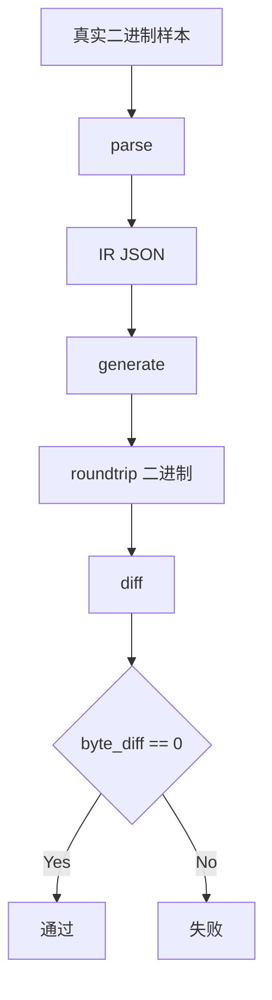

# 五格式无损回归验收报告（2026-02-10）

## 1. 验收目标

对 `grp/waz/mek/spm/pac` 统一执行：

1. `parse`：二进制 -> IR(JSON)
2. `generate`：IR(JSON) -> 二进制
3. `diff`：原始二进制 vs 生成二进制

通过标准：`byte_diff=0`。

## 2. 真实样本清单（可追溯）

| 格式 | 测试样本 | 来源 |
|---|---|---|
| GRP | `tests/golden/grp/term.grp` | `D:\Code\NeXAS_DX\src\main\resources\game\bsdx\grp\term.grp` |
| WAZ | `tests/golden/waz/makoto.waz` | `D:\Code\NeXAS_DX\src\main\resources\game\bsdx\waz\Makoto.waz` |
| MEK | `tests/golden/mek/Makoto.mek` | `D:\Code\NeXAS_DX\src\main\resources\game\bsdx\mek\Makoto.mek` |
| SPM | `tests/golden/spm/01.spm` | `D:\Code\NeXAS_DX\src\main\resources\game\bsdx\spm\01.spm` |
| PAC | `tests/golden/pac/seed.pacNew` | 使用 `D:\Code\NeXAS_DX\src\main\resources\exe\NexasPack.exe` 对 `tests/golden/pac/seed/` 现场打包生成 |

## 3. 运行命令（已执行）

```powershell
cargo test --workspace

cargo run -p nexas-cli -- parse grp tests/golden/grp/term.grp tests/golden/regression/term.grp.ir.json
cargo run -p nexas-cli -- generate grp tests/golden/regression/term.grp.ir.json tests/golden/regression/term.grp.roundtrip
cargo run -p nexas-cli -- diff tests/golden/grp/term.grp tests/golden/regression/term.grp.roundtrip

cargo run -p nexas-cli -- parse waz tests/golden/waz/makoto.waz tests/golden/regression/makoto.waz.ir.json
cargo run -p nexas-cli -- generate waz tests/golden/regression/makoto.waz.ir.json tests/golden/regression/makoto.waz.roundtrip
cargo run -p nexas-cli -- diff tests/golden/waz/makoto.waz tests/golden/regression/makoto.waz.roundtrip

cargo run -p nexas-cli -- parse mek tests/golden/mek/Makoto.mek tests/golden/regression/Makoto.mek.ir.json
cargo run -p nexas-cli -- generate mek tests/golden/regression/Makoto.mek.ir.json tests/golden/regression/Makoto.mek.roundtrip
cargo run -p nexas-cli -- diff tests/golden/mek/Makoto.mek tests/golden/regression/Makoto.mek.roundtrip

cargo run -p nexas-cli -- parse spm tests/golden/spm/01.spm tests/golden/regression/01.spm.ir.json
cargo run -p nexas-cli -- generate spm tests/golden/regression/01.spm.ir.json tests/golden/regression/01.spm.roundtrip
cargo run -p nexas-cli -- diff tests/golden/spm/01.spm tests/golden/regression/01.spm.roundtrip

cargo run -p nexas-cli -- parse pac tests/golden/pac/seed.pacNew tests/golden/regression/seed.pac.ir.json
cargo run -p nexas-cli -- generate pac tests/golden/regression/seed.pac.ir.json tests/golden/regression/seed.pac.roundtrip
cargo run -p nexas-cli -- diff tests/golden/pac/seed.pacNew tests/golden/regression/seed.pac.roundtrip
```

## 4. 结果

- `cargo test --workspace`：通过。
- 五个 `diff` 命令输出均为 `byte_diff=0`。



## 5. 当前能力边界

- 已完成：五格式无损 round-trip 回归。
- 未完成：`mek/spm/pac/waz` 语义级结构化解析（当前使用 `opaque_binary` 无损保真）。

