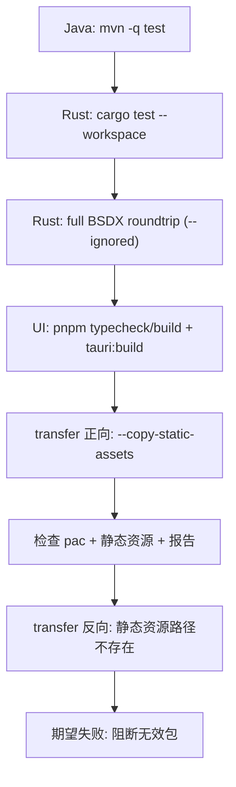

# 五格式无损回归验收报告（2026-02-11）

## 1. 验收目标

统一验证 `grp/waz/mek/spm/pac` 五种格式的回归链路：

1. `parse`：二进制 -> IR(JSON)
2. `generate`：IR(JSON) -> 二进制
3. `diff`：原始二进制 vs 生成二进制

验收标准：`byte_diff=0`。

额外验收目标：

1. `BHE -> BSDX transfer` 主链可跑通。
2. 静态资源复制策略可验证，且缺失资源时必须失败，不能生成无效包。
3. Tauri UI 可编译、可打包。

## 2. 真实样本与来源

| 格式 | 样本 | 来源 |
|---|---|---|
| GRP | `tests/golden/grp/term.grp` | `D:\Code\NeXAS_DX\src\main\resources\game\bsdx\grp\term.grp` |
| WAZ | `tests/golden/waz/makoto.waz` | `D:\Code\NeXAS_DX\src\main\resources\game\bsdx\waz\Makoto.waz` |
| MEK | `tests/golden/mek/Makoto.mek` | `D:\Code\NeXAS_DX\src\main\resources\game\bsdx\mek\Makoto.mek` |
| SPM | `tests/golden/spm/01.spm` | `D:\Code\NeXAS_DX\src\main\resources\game\bsdx\spm\01.spm` |
| PAC | `tests/golden/pac/seed.pacNew` | 基于 `tests/golden/pac/seed/` 打包产物 |

Java 真实资源全量统计（用于 full regression）：

1. `src/main/resources/game/bsdx/waz`：112 文件
2. `src/main/resources/game/bsdx/mek`：105 文件
3. `src/main/resources/game/bsdx/spm`：1989 文件
4. `src/main/resources/game/bsdx/grp`：8 文件

## 3. 验收命令（本次已执行）

```powershell
# Java 全量测试
mvn -q test

# Rust 工作区测试（NeXAS_DX_Tauri 仓库）
cargo test --workspace

# Rust 全量 BSDX 回归（ignored）
cargo test -p nexas-cli regression_roundtrip_bsdx_full_if_java_repo_present -- --ignored --nocapture

# 前端与打包
pnpm -C apps/nexas-ui typecheck
pnpm -C apps/nexas-ui build
pnpm -C apps/nexas-ui tauri:build -- --debug
pnpm -C apps/nexas-ui tauri:build

# transfer 正向验证（含静态资源复制）
cargo run -p nexas-cli -- transfer D:\Code\NeXAS_DX D:\Code\NeXAS_DX D:\Code\NeXAS_DX_Tauri\target\transfer_out_assets_check --static-asset-root D:\Code\NeXAS_DX\src\main\resources\game\bhe --copy-static-assets --force

# transfer 反向验证（静态资源路径不存在，必须失败）
cargo run -p nexas-cli -- transfer D:\Code\NeXAS_DX D:\Code\NeXAS_DX D:\Code\NeXAS_DX_Tauri\target\transfer_out_missing_static --static-asset-root D:\Code\NeXAS_DX\__not_exist_static__ --copy-static-assets --force
```

## 4. 本次结果

1. `mvn -q test`：通过。
2. `cargo test --workspace`：通过。
3. `cargo test -p nexas-cli regression_roundtrip_bsdx_full_if_java_repo_present -- --ignored --nocapture`：通过。
4. `pnpm -C apps/nexas-ui typecheck`：通过。
5. `pnpm -C apps/nexas-ui build`：通过。
6. `pnpm -C apps/nexas-ui tauri:build -- --debug`：通过，产物位于：
   `target/debug/bundle/msi/NeXAS UI_0.1.0_x64_en-US.msi`
   `target/debug/bundle/nsis/NeXAS UI_0.1.0_x64-setup.exe`
7. `pnpm -C apps/nexas-ui tauri:build`：通过，产物位于：
   `target/release/bundle/msi/NeXAS UI_0.1.0_x64_en-US.msi`
   `target/release/bundle/nsis/NeXAS UI_0.1.0_x64-setup.exe`
8. transfer 正向验证：通过，`target/transfer_out_assets_check` 下生成 20 个 `Update3_*.pac`。
9. transfer 反向验证：按预期失败，错误为：
   `copy_static_assets=true but static asset root not found: ...`

## 5. 静态资源有效性核验

正向 transfer 产物目录示例（真实输出）：

1. `target/transfer_out_assets_check/freja/C_FREJA.png`
2. `target/transfer_out_assets_check/freja/M_Freja.png`
3. `target/transfer_out_assets_check/freja/mekagroup.grp`
4. `target/transfer_out_assets_check/freja/nanoha.mek`
5. `target/transfer_out_assets_check/freja/nanoha.waz`

关联报告（真实输出）：

1. `target/transfer_out_assets_check/transfer_path_policy.report.json`
2. `target/transfer_out_assets_check/segroup_mapping.report.json`
3. `target/transfer_out_assets_check/java_transfer_exec.report.json`

其中 `transfer_path_policy.report.json` 记录：

1. `static_asset_root_effective`
2. `static_asset_root_source`
3. `copy_static_assets`
4. `enable_java_pipeline`

## 6. 验收流程图



## 7. 边界说明

1. 当前五格式回归以无损 `opaque` 策略为主，适用于“解析后立即生成回原始二进制”的可靠性目标。
2. `spm` 的部分语义元数据在原始资源中存在历史问题，不影响当前无损回归口径（二进制回写一致性）。

## 8. 2026-02-11 复核记录（本轮执行）

本轮在本机实际执行并通过：

1. `mvn -q test`
2. `cargo test --workspace`
3. `cargo test --workspace -- --ignored --nocapture`
4. `pnpm -C apps/nexas-ui typecheck`
5. `pnpm -C apps/nexas-ui build`
6. `pnpm -C apps/nexas-ui tauri:build -- --debug`
7. `pnpm -C apps/nexas-ui tauri:build`

本轮可验收产物：

1. `target/debug/bundle/msi/NeXAS UI_0.1.0_x64_en-US.msi`
2. `target/debug/bundle/nsis/NeXAS UI_0.1.0_x64-setup.exe`
3. `target/release/bundle/msi/NeXAS UI_0.1.0_x64_en-US.msi`
4. `target/release/bundle/nsis/NeXAS UI_0.1.0_x64-setup.exe`

说明：`spm` 个别语义元数据存在历史问题，但当前验收口径为 parse/generate 二进制回写一致性，该口径本轮保持通过。
