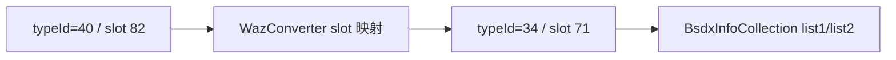
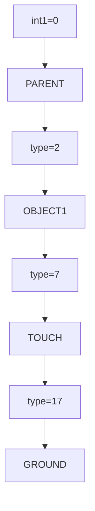
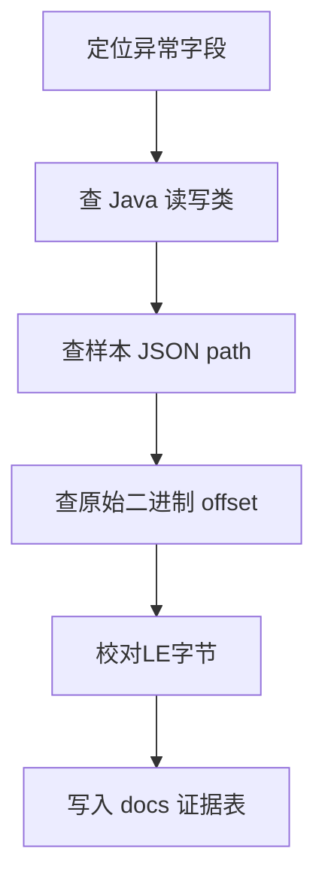
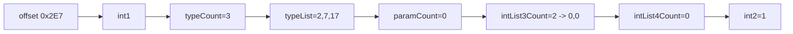

# 项目知识库（Skills）

## 1. 格式词典

| 缩写 | 说明 | Java 证据 |
|---|---|---|
| WAZ | 技能事件脚本 | `src/main/java/com/giga/nexas/dto/bsdx/waz/parser/WazParser.java` |
| MEK | 机体主数据 | `src/test/java/com/giga/nexas/bhe2bsdx/steps/MekConverter.java` |
| SPM | 精灵/动画资源 | `src/test/java/com/giga/nexas/bhe2bsdx/steps/SpmConverter.java` |
| GRP | 分组与字典配置 | `src/main/java/com/giga/nexas/dto/bsdx/grp/parser/GrpParser.java` |
| PAC | 打包容器 | `TransferTest.java:265` 调用 `PacUtil.pack` |

## 2. BHE/BSDX 类型映射要点

来源：`SkillInfoObject` 的 `@JsonSubTypes`。

- BSDX `typeId=34` 对应 `CEventChange`。
- BHE `typeId=40` 对应 `CEventChange`。
- BHE 有 83 槽，BSDX 有 72 槽（`WazConverter.java:19` 注释与代码）。

## 3. `Term.grp` 术语树技能

### 3.1 解析规则

- 起点：`int1`。
- 路径边：`typeList[i]` 选择当前组内 item。
- 下一组：item 的 `param2`。
- 终止条件：`param2 < 0`。

### 3.2 真实语义拼装案例

样本来源：

- `src/main/resources/wazBsdxJson/Makoto.waz.json`
  - 路径：`$.skillList[0].phasesInfo[0].skillUnitCollection[3].skillInfoObjectList[0].bsdxInfoCollectionList1[0]`
  - 值：`int1=0, typeList=[2,7,17], int2=1`

结合真实 `term.grp`：

- `group[0]/PARENT item[2] -> OBJECT1`
- `group[7]/OBJECT1 item[7] -> TOUCH`
- `group[15]/TOUCH item[17] -> GROUND`

拼接语义（当前阶段）：

- `PARENT.OBJECT1.TOUCH.GROUND`

## 4. `int2` 语义现状

### 4.1 已验证事实

- 扫描 `wazBsdxJson`：`int2=1` 共 300 条，`int2=0` 共 59149 条。
- `int2=1` 仅出现在：
  - `listName = bsdxInfoCollectionList1`
  - `ownerTypeId = 34`
  - `ownerSlot = 71`

### 4.2 当前推断

- `inferred`：`int2` 是关系位（类似条件连接符），常用于 `CEventChange` 的 list1 条件链。
- `not verified`：尚不能断言其严格含义是 AND / OR / NOT 中哪一种。

## 5. 二进制逆向校对口径

### 5.1 必做流程

1. 从 JSON 记录里拿 `offset`。
2. 回到原始二进制按结构逐字段读取。
3. 校对 LE 字节与反序列化值。
4. 记录到文档（偏移、hex、int值、语义路径）。

### 5.2 已完成对照

样本：`makoto.waz`。

- `offset 0x2DB`：`CEventChange(flag=1)`，list1 的 `int2=1`。
- `offset 0x59F`：同类对象，list1 的 `int2=0`。

## 6. 常见陷阱

- `Term.grp.json` 可能不是严格 JSON，不能作为唯一真相源。
- 仅看 `int32` 会丢失位语义，疑难字段必须回到原始 bytes。
- BHE/BSDX 类型号与槽位并不等价，不能直接复制。
- 迁移时如果忽略 `InfoCollectionMapper`，会导致集合字段丢失。

## 7. 实操速查

## 8. 待补知识点

- `TODO`：`ProgramMaterial.grp` 的 `array1/array2/array3` 与具体事件字段绑定关系。
- `TODO`：`intList3/intList4` 在不同 `int1` 类型下的单位与范围定义。

## 9. M1 实操样例索引（可复现）

### 9.1 Term 链路解码样例

- 输入文件：
  - `tests/golden/grp/term.grp`
  - `tests/golden/waz/makoto_ceventchange_list1_0x2e7.json`
- 命令：
  - `cargo run -p nexas-cli -- resolve-term tests/golden/grp/term.grp tests/golden/waz/makoto_ceventchange_list1_0x2e7.json tests/golden/waz/resolve_0x2e7.json`
- 输出文件：
  - `tests/golden/waz/resolve_0x2e7.json`
- 输出关键值：
  - `semantic=OBJECT1.TOUCH.GROUND`
  - `steps[0..2] = OBJECT1 -> TOUCH -> GROUND`

### 9.2 原始字节对照样例

- 输入文件：`D:\Code\NeXAS_DX\src\main\resources\game\bsdx\waz\makoto.waz`
- 偏移：`743 (0x2E7)`
- 命令：
  - `cargo run -p nexas-cli -- inspect-collection D:\Code\NeXAS_DX\src\main\resources\game\bsdx\waz\makoto.waz --offset 743 tests/golden/waz/inspect_0x2e7.json`
- 输出文件：`tests/golden/waz/inspect_0x2e7.json`
- 核验点：
  - `words[1].bytes_hex=03000000` 对应 `typeList.count=3`
  - `words[2..4].i32_le=2,7,17` 对应 `typeList`
  - `words[10].bytes_hex=01000000` 对应 `int2=1`

## 10. 语义结论分级（实时维护）

- `verified`
  - `int1` 是 Term 起始 group index。
  - `typeList` 是每层 item index。
  - `param2 < 0` 为终止跳转。
- `inferred`
  - `int2` 可能是条件关系位。
  - 需要更多对象行为证据确认 AND/OR/NOT 含义。

## 11. 新命令速查（M2/M3）

### 11.1 inspect-ceventchange

- 命令：
  - `cargo run -p nexas-cli -- inspect-ceventchange <waz> --offset <ownerOffset> --term-grp <term.grp> <output.json>`
- 作用：
  - 从真实二进制偏移解码 `CEventChange`。
  - 同时输出 list1/list2 的 collection 切片偏移和语义。
- 代码：
  - `crates/nexas-cli/src/main.rs:327`
  - `crates/nexas-format-waz/src/lib.rs:28`

### 11.2 waz-int2-report

- 命令：
  - `cargo run -p nexas-cli -- waz-int2-report <wazBsdxJsonDir> --waz-dir <wazDir> --term-grp <term.grp> --verify-limit 6 <output.json>`
- 作用：
  - 扫描 JSON 树收集所有 `BsdxInfoCollection`。
  - 统计 `int2` 分布。
  - 抽样回到原始 `.waz` 做二进制匹配验证。
- 代码：
  - `crates/nexas-cli/src/main.rs:363`
  - `crates/nexas-cli/src/main.rs:727`

## 12. 最新统计结论（真实输出）

来源：`tests/golden/waz/waz_int2_report.json`。

- 扫描文件数：`112`
- collection 总数：`59449`
- `int2=1`：`300`
- `int2=1` 核心桶：
  - `type=34, slot=71, list=bsdxInfoCollectionList1`

抽样验证：

- `verified_samples` 抽样结果均为 `matches=true`。
- `note=binary_match` 表示 JSON 与原始二进制对照一致。

## 13. 对照边界提醒

- `owner offset` 指向 `SkillInfoObject` 的 `startFrame`。
- `CEventChange` 对象结束后，通常紧跟 unit 内的 `count2`（4 字节），不是对象字段。
- 因此“下一个对象 offset - 当前 offset”可能比对象自身长度多 4 字节。

## 14. Java 更新差分快照技能

命令：

- `cargo run -p nexas-cli -- java-diff-report D:\Code\NeXAS_DX tests/golden/java/java_diff_report.json`

读取重点：

- `git_tracked_changes`
- `git_untracked_changes`
- `resource_json_dirs[*].file_count`
- `doc_files[*].exists`

本轮快照：

- `resource_json_total_files=3235`
- 最大目录：
  - `spmBsdxJson=1989`
  - `spmBheJson=748`
