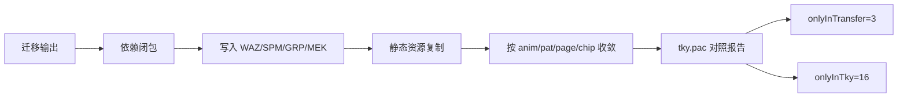

# tky.pac 实证摘要（最新）

详细版：`src/main/java/com/giga/nexas/transfer/bhe2bsdx/TKY_PAC_ANALYSIS_AND_GENERAL_FLOW.md`

数据来源：`src/main/java/com/giga/nexas/transfer/bhe2bsdx/tky.pac.report.json`

## 当前对照结果

- `unpackFileCount=120`
- `transferFileCount=107`
- `onlyInTky=16`
- `onlyInTransfer=3`
- `commonCount=104`
- `sameHashCount=90`
- `diffHashCount=14`

## 本轮收敛结论

- 静态资源复制已从“全量 imageData”收敛到“anim/pat/page/chip 引用路径”。
- 静态资源输入范围已收敛到“本次迁移结果 SPM”，不再对依赖闭包中的共享 SPM 全量补图。
- `onlyInTransfer` 从三位数降到 `3`，主要收敛目标已达成。

## 仍需继续收敛

- `onlyInTky=16` 仍包含 `Bomb.waz` 与若干音频/图片缺项。
- `diffHashCount=14` 仍需做字段级二进制对照，确认是否存在行为差异。

