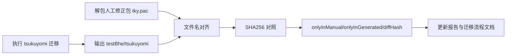

# tky.pac 实证摘要（2026-02-12）

详细版：`src/main/java/com/giga/nexas/transfer/bhe2bsdx/TKY_PAC_ANALYSIS_AND_GENERAL_FLOW.md`

## 样本与对照路径

- 人工修正包：`src/main/resources/tky.pac`
- 人工修正包解包目录：`target/tky_pac_analysis/tky`
- Java 迁移输出：`src/main/resources/testBhe/tsukuyomi`
- 差异报告：`src/main/java/com/giga/nexas/transfer/bhe2bsdx/tky.pac.report.json`

## 本次复核命令

```powershell
mvn -q test
```

## 本次实测结论

- `manualCount=120`
- `generatedCount=108`
- `onlyInManualCount=15`
- `onlyInGeneratedCount=3`
- `commonCount=105`
- `sameHashCount=90`
- `diffHashCount=15`

关键差异：

- `onlyInManual` 主要是 `ogg/png` 静态资源（15 项）
- `onlyInGenerated` 固定为 `c_tsukuyomi.spm`、`fire.spm`、`smoke.spm`
- `Bomb.waz` 已不在 `onlyInManual`，已进入 `diffHashFiles`
- `diffHashFiles` 15 项，核心包括 `Bomb.waz`、`nanoha.mek`、`nanoha.waz`、`SeGroup.grp`、`wazagroup.grp`

## 已确认的迁移流程反映点

1. 主链入口：`src/test/java/com/giga/nexas/bhe2bsdx/TransferTest.java`
2. 依赖闭包：`src/main/java/com/giga/nexas/transfer/bhe2bsdx/converter/TransferDependencyCollector.java`
3. `bomb.waz` 补入点：`src/main/java/com/giga/nexas/transfer/bhe2bsdx/Bhe2BsdxSingleRunner.java` 的 `includeBombWazWhenBombSpritePresent(...)`
4. `segroup` 映射写回：`src/main/java/com/giga/nexas/transfer/bhe2bsdx/converter/SeGroupIndexMapper.java` + `src/main/java/com/giga/nexas/transfer/bhe2bsdx/converter/WazConverter.java`
5. 静态资源收敛复制：`src/main/java/com/giga/nexas/transfer/bhe2bsdx/converter/StaticAssetCopier.java`

## 门禁流程图


