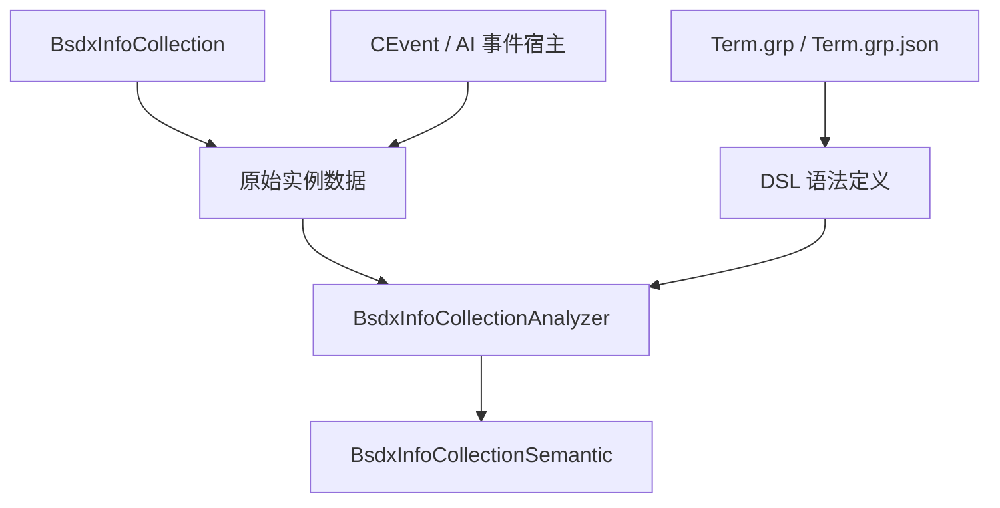
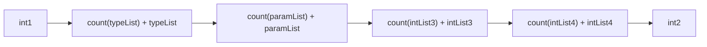
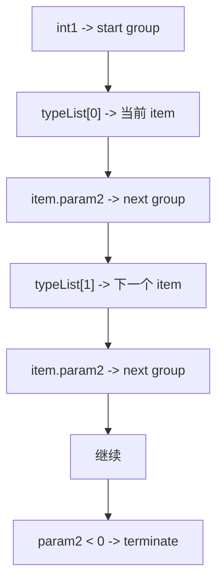
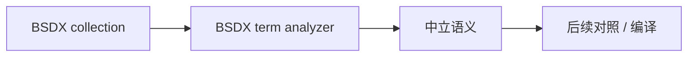
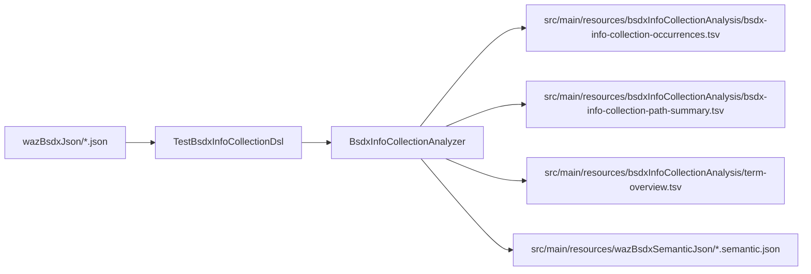

# BsdxInfoCollection 语义笔记（BSDX）

## 1. 这块到底是什么

`BsdxInfoCollection` 不是普通参数包，而是一段挂在事件对象上的 DSL 实例数据。

这块的职责应理解成：

- `Term.grp` 负责定义 DSL 语法树
- `BsdxInfoCollection` 负责记录本次实例化用了哪些语法节点
- 宿主事件对象负责决定这段 DSL 在当前上下文里表示什么用途

所以它不是：

- 简单配置表
- 固定字段对象
- 一组能直接执行的逻辑参数

## 2. 证据来源

### 2.1 项目代码

- `src/main/java/com/giga/nexas/dto/bsdx/BsdxInfoCollection.java`
- `src/main/java/com/giga/nexas/dto/bsdx/BsdxInfoCollectionAnalyzer.java`
- `src/main/java/com/giga/nexas/dto/bsdx/BsdxInfoCollectionSemantic.java`
- `src/main/java/com/giga/nexas/dto/bsdx/grp/groupmap/TermGrp.java`
- `src/main/java/com/giga/nexas/dto/bsdx/grp/parser/impl/TermGrpParser.java`

### 2.2 数据样本

- `src/main/resources/grpBsdxJson/Term.grp.json`
- `src/main/resources/wazBsdxJson`
- `src/main/resources/bsdxInfoCollectionAnalysis/bsdx-info-collection-occurrences.tsv`
- `src/main/resources/bsdxInfoCollectionAnalysis/bsdx-info-collection-path-summary.tsv`
- `src/main/resources/bsdxInfoCollectionAnalysis/term-overview.tsv`
- `src/main/resources/wazBsdxSemanticJson/*.semantic.json`

### 2.3 原始资源参考

- `src/main/resources/game/bsdx/grp/Term.grp`
- `src/main/resources/game/bsdx/waz/*.waz`

## 3. 模块职责图

这里的职责边界是：

- `BsdxInfoCollection` 只负责承载原始二进制字段。
- `BsdxInfoCollectionAnalyzer` 负责把原始字段和 term 语法树绑定起来解释。
- `BsdxInfoCollectionSemantic` 负责承载解释结果。

## 4. 二进制结构

这里的字段顺序是固定的，当前 DTO 只做这一层读写。

## 5. 主语法链如何装配

关键点：

1. `int1` 决定起始 group。
2. `typeList` 决定每一步在当前 group 中命中的 item。
3. `param2` 决定下一跳进入哪个 group。
4. `param2 < 0` 表示主语法链终止。

## 6. 字段该怎么理解

- `int1`
  - 起始语法组索引
- `typeList`
  - 主语法链的 item 索引序列
- `paramList`
  - 标量参数池
- `intList3`
  - 辅助操作数池1
- `intList4`
  - 辅助操作数池2
- `int2`
  - 关系位/模式位，当前只保留原始值，不做最终定性

## 7. 为什么不能只看索引

因为 `int1/typeList` 不是独立业务值，而是：

- 在“当前 Term.grp 语法树”里的坐标

一旦 term 定义变化，源索引就失去语义稳定性。

所以 BSDX 自身分析和后续跨引擎迁移都应该走：

也就是：

1. 先反解语义
2. 再基于语义做对照或重编译

## 8. 这次分析输出什么

当前分析器输出两套直接来自 term 的表达：

1. `termGroupCodeName / termItemName`
   - 偏人类阅读
2. `termGroupCodeName / termItemDescription`
   - 偏稳定语义锚点

这样做的原因是：

- `itemName` 更适合你和朋友看
- `itemDescription` 更适合做双引擎对照和迁移匹配

## 9. 分析产物流向

这里刻意不回写 `src/main/resources/wazBsdxJson`，
目的是保持源样本 JSON 作为“原始 DTO 视图”不被派生分析结果污染，
同时又把长期要回看的分析产物沉淀在 `resources` 下。

## 10. 当前实现边界

### 10.1 DTO 纯净

当前 `BsdxInfoCollection` 只保存原始二进制字段。

不再把下面这些东西耦合进 DTO：

- 派生语义树
- 语义步骤结构
- 展开文本
- 分析 warning

### 10.2 语义结构外置

外置类只有两个：

- `BsdxInfoCollectionSemantic`
- `BsdxInfoCollectionAnalyzer`

其中：

- `BsdxInfoCollectionSemantic` 里带一个内嵌 `Step`
- 这样既不污染 DTO，也不会把项目拆得太碎

### 10.3 sidecar 输出

分析产物写到 `src/main/resources/bsdxInfoCollectionAnalysis` 与 `src/main/resources/wazBsdxSemanticJson`，
但不回写 `src/main/resources/wazBsdxJson`。

## 11. 已确认与未完全确认

### 已确认

- `int1` 是起始 group 索引
- `typeList` 是逐步消费的 item 索引
- `param2` 是下一跳 group，负数终止
- `termItemCodeName` 不应被当成唯一语义锚点
- 主链终止后 raw `typeList` 可能保留尾部值

### 未完全确认

- `param1` 的全部模式语义
- `intList3/intList4` 在不同宿主下的精确业务角色
- `int2` 的最终逻辑意义

## 12. 当前工作口径

后续维护和迁移这块时，请统一按下面的口径理解：

`BsdxInfoCollection` 保存的是 DSL 实例，分析和迁移时真正要保留的是语义，而不是索引。`
