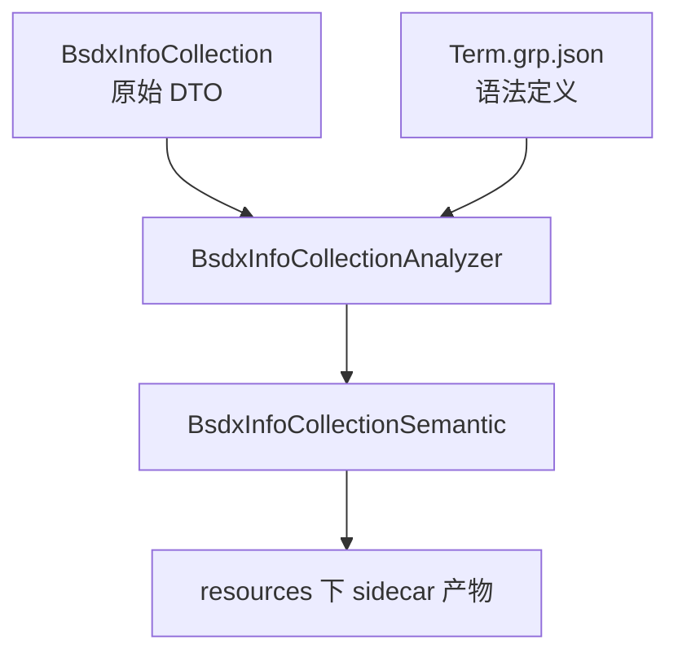
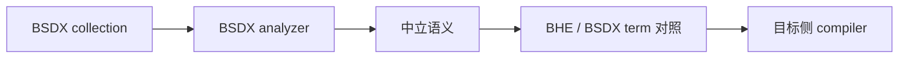
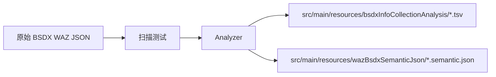

# BsdxInfoCollection Agent Guide

## 1. 目标

这份文档是给后续继续维护、逆向、迁移这块代码的人看的工作规则。

重点是：

1. 这块应该怎么放在项目结构里
2. 改这块时哪些事情能做，哪些事情不要做
3. 后续对照和迁移的正确工程顺序是什么

## 2. 当前项目风格下的定位

对这个项目，最重要的不是做一个“抽象很漂亮的独立 DSL 子系统”，而是：

- 放在现有项目结构里一眼能看懂
- 不引入全新的入口风格
- 不污染原始 DTO
- 分析结果和二进制结构分层清楚

因此当前采用的结构是：

- `BsdxInfoCollection`
  - 只做原始 DTO
- `BsdxInfoCollectionAnalyzer`
  - 做语义分析
- `BsdxInfoCollectionSemantic`
  - 做分析结果承载
- `TestBsdxInfoCollectionDsl`
  - 做批量扫描与 sidecar 输出

## 3. 当前规则

### 3.1 不要做的事

不要：

1. 再把派生语义结构塞回 `BsdxInfoCollection`
2. 直接修改 `wazBsdxJson` 的结构去带分析字段
3. 把这块拆成一大串过细的小类
4. 只看展开文本就做对照或迁移
5. 把 `int1/typeList` 当成稳定业务索引

### 3.2 应该做的事

应该：

1. 保持 DTO 纯净
2. 语义分析逻辑集中在 analyzer
3. sidecar 产物写到 `src/main/resources/` 下的专用分析目录
4. 文档用中文讲清楚模块职责
5. 先做语义对齐，再做索引级编译

## 4. 对照和迁移时的顺序

永远不要跳过中立语义层，直接做源索引到目标索引映射。

## 5. 分析输出口径

当前 sidecar 输出应始终包含：

- 原始字段快照
- `syntaxPathByName`
- `syntaxPathByDescription`
- `trailingTypeListSnapshot`
- `warnings`

这里特别强调：

- `syntaxPathByName`
  - 适合阅读
- `syntaxPathByDescription`
  - 适合迁移和对照

## 6. 后续优先级

下一阶段优先做：

1. 从 BSDX 伪代码继续闭环 `param1`
2. 分析 `intList3/intList4`
3. 对照 BHE 与 BSDX 的 term 结构
4. 再做跨引擎编译器

## 7. 一句话维护口径

`对这块的维护目标，不是让代码变得更抽象，而是让语义更清楚、对照更稳、项目整体风格不被破坏。`
