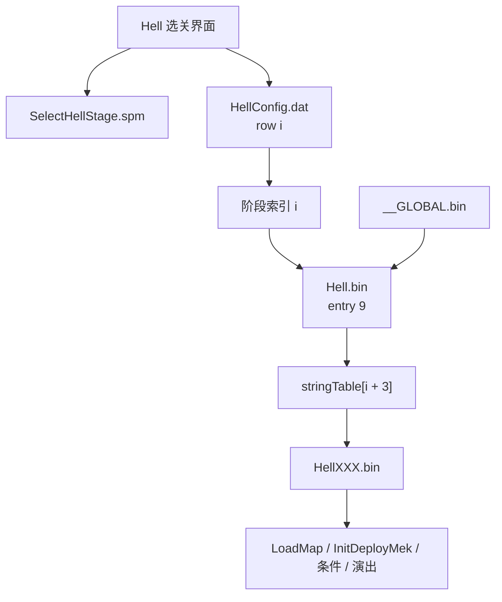
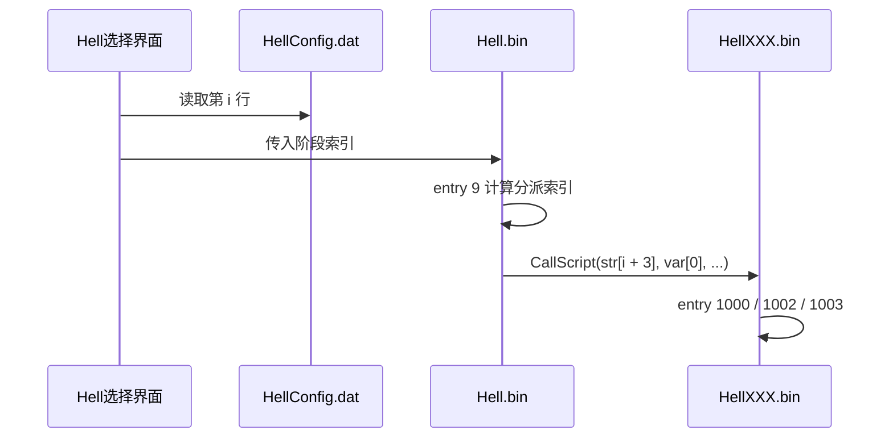

# BSDX Hell 关卡文件关联调查

## 1. 目的

这份调查只回答一个实现问题：

- Hell 关卡在 BSDX 里到底由哪些文件共同描述
- 它们的调用顺序是什么
- 目前已经可以稳定确认哪些内部字段含义
- 如果要做 Hell 关卡编辑器，最小可用的数据主链应该怎么建

这份文档不追求“一次性解释所有 call 立即数”。
当前阶段只写已经通过真实伪代码、真实 `dat.json`、真实资源文件名三方交叉确认的内容。

## 2. 证据来源

### 2.1 真实资源

- `src/main/resources/game/bsdx/bin/Hell.bin`
- `src/main/resources/game/bsdx/bin/Hell*.bin`
- `src/main/resources/game/bsdx/bin/__GLOBAL.bin`

### 2.2 反序列化数据

- `src/main/resources/datBsdxJson/HellConfig.dat.json`
- `src/main/resources/spmBsdxJson/SelectHellStage.spm.json`

### 2.3 实际导出的 lossless pseudo DSL

- `src/main/resources/tmp/bsdx-lossless-pseudo-export/Hell.bin.lossless.pseudo.txt`
- `src/main/resources/tmp/bsdx-lossless-pseudo-export/Hell.bin.string-table.txt`
- `src/main/resources/tmp/bsdx-lossless-pseudo-export/Hell100：ノイ.bin.lossless.pseudo.txt`
- `src/main/resources/tmp/bsdx-lossless-pseudo-export/Hell152：大量：レイン1.bin.lossless.pseudo.txt`
- `src/main/resources/tmp/bsdx-lossless-pseudo-export/Hell352：悪夢.bin.lossless.pseudo.txt`
- `src/main/resources/tmp/bsdx-lossless-pseudo-export/Hell451：障害物を壊せ.bin.lossless.pseudo.txt`

### 2.4 IDA 逆向记录

- `src/main/resources/ida-reverse/bsdx/export-for-ai/decompile/53D0C0.c`
- `src/main/resources/ida-reverse/bsdx/export-for-ai/decompile/77FBE0.c`
- `src/main/resources/ida-reverse/bsdx/export-for-ai/decompile/6EA2B0.c`
- `src/main/resources/ida-reverse/bsdx/export-for-ai/decompile/451C90.c`
- `src/main/resources/ida-reverse/bsdx/export-for-ai/decompile/7806F0.c`

## 3. 先给结论

当前已经可以稳定确认这条主链：

`HellConfig.dat` 第 `i` 行  
-> `Hell.bin` 的 `stringTable[i + 3]`  
-> 对应一个真实的 `HellXXX.bin` 子脚本

这不是猜测，而是已经通过下列事实对上：

1. `HellConfig.dat.json` 一共正好 `100` 行。
2. `Hell.bin` 在 `entry 9` 里按阶段索引分发，并调用 `CallScript(str[3]..str[102], var[0], ...)`。
3. `Hell.bin.string-table.txt` 里 `str[3]..str[102]` 正好是 `100` 个 Hell 子脚本文件名。
4. 多个样本已经证明：
   - `HellConfig[14]` 对应 `Hell100：ノイ`
   - `HellConfig[18]` 对应 `Hell101：クリス`
   - `HellConfig[25]` 对应 `Hell102：しずか`
   - `HellConfig[79]` 对应 `Hell352：悪夢`

换句话说，Hell 关卡不是“只改一个 bin 就完事”的模型。
至少有三层需要一起维护：

- 选关配置层：`HellConfig.dat`
- 分发表层：`Hell.bin`
- 战斗脚本层：`HellXXX.bin`

## 4. 文件关联图





## 5. 调用顺序

### 5.1 外层加载顺序

当前可确认的 Hell 模式外层顺序如下：

1. 进入 Hell 模式
2. 选关 UI 侧加载：
   - `HellConfig.dat`
   - `SelectHellStage.spm`
   - 以及一些辅助资源
3. 主脚本侧加载：
   - `Hell.bin`
   - `__GLOBAL.bin`
4. `Hell.bin` 根据阶段索引分派到某个 `HellXXX.bin`
5. `HellXXX.bin` 自己完成地图、敌人、演出和条件逻辑初始化

### 5.2 `__GLOBAL.bin` 的确切角色

`__GLOBAL.bin` 在当前 BSDX 样本里不是普通关卡脚本，而是：

- 全局符号表
- 全局默认值初始化程序

这一点已经通过真实文件拆解和 `read__GLOBAL` 逆向确认。

#### 5.2.1 当前文件的精确磁盘结构

`src/main/resources/game/bsdx/bin/__GLOBAL.bin`
按真实读取顺序拆出来是：

```text
u32 table1_count = 442
442 个 CP932 null-terminated 字符串

u32 table2_count = 0
0 个字符串

u32 table3_count = 0
0 个字符串

u32 init_code_count = 1720
1720 条 8-byte 指令
每条结构:
  u32 opcode
  s32 operand
```

这不是推测，原因是：

- 实际文件剩余字节数与 `1720 * 8` 完全一致
- 文件在这之后没有额外尾部结构

#### 5.2.2 第一张表是什么

第一张 442 项字符串表不是剧情文本，而是全局符号名。

真实内容例子：

- `LUCK_TABLE`
- `LUCK_TABLE[1]`
- `HP_NANOHA`
- `ATK_NANOHA[12]`
- `g_nqHealCnt`
- `g_nqAttackCnt`

因此这张表的性质可以直接定为：

- BSDX 脚本 VM 的全局符号名表

#### 5.2.3 后面的 1720 条指令是什么

这 1720 条初始化指令在当前文件里只出现了三种 opcode：

- `0`，出现 `860` 次
- `8`，出现 `418` 次
- `14`，出现 `442` 次

没有分支、没有剧情 call、没有关卡控制流。

所以这段内容不是剧情脚本，而是纯初始化程序。

#### 5.2.4 运行时到底怎么用它

`read__GLOBAL` 的真实顺序是：

1. 清空当前脚本 VM 环境
2. 如果全局环境还没建立，先打开 `__GLOBAL.bin`
3. 把 442 项全局符号表读进内存
4. 把 1720 条初始化指令读进内存
5. 立刻执行这 1720 条初始化指令
6. 初始化完成后，才继续去读真正要运行的业务脚本，例如 `Hell.bin`

也就是说：

- `__GLOBAL.bin` 先建立全局脚本环境
- `Hell.bin` 再运行在这个环境之上

#### 5.2.5 对 Hell 编辑器的实际意义

这条结论可以直接落到实现上：

- `__GLOBAL.bin` 不应当被当成关卡蓝本去复制
- 但它的第一张符号表可以直接拿来做伪代码显示增强
- 例如把部分 `global[index]` 或全局槽位，显示成真实符号名

所以对编辑器来说，`__GLOBAL.bin` 不是“关卡层资源”，而是：

- 脚本系统级元数据
- 伪代码显示增强的数据来源

### 5.3 `Hell.bin` 内部顺序

`Hell.bin.lossless.pseudo.txt` 中最关键的是 `entry 9`：

1. 它先取阶段索引：
   - 正常路径使用 `GetFlg(11) + 1`
   - 特殊路径使用 `GetFlg(12)`
2. 然后对 `1..100` 做分派
3. 每个分支最终都是：

```text
call CallScript(str[n], var[0], 99999, ...)
```

所以 `Hell.bin` 的角色不是直接描述每个关卡细节，而是：

- 维护 Hell 模式的总控流程
- 根据阶段索引决定调用哪个子脚本

## 6. `HellConfig.dat` 当前可确认的字段含义

`HellConfig.dat.json` 当前一行有 `23` 列。
当前已经能确认或高概率确认的列如下。

| 列号 | 当前含义 | 置信度 | 说明 |
| --- | --- | --- | --- |
| `0` | 关卡标题 | 高 | 直接适合显示在选关树里 |
| `1` | 详情展示相关 id | 低 | 不是地图 id，也不像敌机 id，暂不写死 |
| `2` | 地图 id | 高 | 能和子脚本 `LoadMap(...)` 直接对上 |
| `3..10` | 敌机体类型槽位 | 高 | 能和子脚本中的敌方 `InitDeployMek / CreateMekWithoutDeploy` 对上 |
| `11..18` | 对应敌机槽位的附加参数 | 中 | 不是简单布尔，像数量/波次/模式参数 |
| `19` | 详情资源或消息相关 id | 低 | 大量落在 `155..230`，语义未最后钉死 |
| `20` | 分类或详情类型枚举 | 中 | 只出现少量离散值 |
| `21` | 特殊标志 | 中 | 目前只看到 `0/1` |
| `22` | 关卡说明文本 | 高 | 直接适合显示在详情面板 |

### 6.1 地图 id

`row[2]` 是目前最稳定的列。
它能和子脚本 `entry 1002` 里的 `LoadMap(x, 0, 1)` 直接对上。

例如：

- `HellConfig[14][2] = 45`
  - `Hell100：ノイ.bin` 中就是 `LoadMap(45, 0, 1)`
- `HellConfig[79][2] = 70`
  - `Hell352：悪夢.bin` 中就是 `LoadMap(70, 0, 1)`
- `HellConfig[10][2] = 6`
  - `Hell451：障害物を壊せ.bin` 中就是 `LoadMap(6, 0, 1)`

### 6.2 敌机体类型槽位

`row[3]..row[10]` 当前可以看作“这个关卡会用到哪些敌机类型”。

要注意：

- 它不是完整的敌机实例表
- 它更像敌机种类集合或战斗摘要
- 真实摆放坐标、数量和出场时机仍然写在 `HellXXX.bin` 里

### 6.2.1 这些值是 `mekaIndex`，不是 `Meka.dat` 行号

`row[3]..row[10]` 里的数字，当前已经可以更精确地解释成：

- 敌机的 `mekaIndex / meka id`
- 也就是脚本里 `LoadMek / InitDeployMek / CreateMekWithoutDeploy` 直接使用的那个机体参数

如果要把这组值和 `Meka.dat` 关联，正确做法是：

- 按 `Meka.dat` 第 `0` 列去匹配
- 不要把它误当成 `Meka.dat` 的行号直接取

当前样本可直接对上的几个值如下：

- `21` -> `Meka.dat` 中“第 0 列 = 21”的那一行，当前是 row `19`
- `0` -> `Meka.dat` 中“第 0 列 = 0”的那一行，当前是 row `0`
- `26` -> `Meka.dat` 中“第 0 列 = 26”的那一行，当前是 row `23`
- `18` -> `Meka.dat` 中“第 0 列 = 18”的那一行，当前是 row `17`
- `19` -> `Meka.dat` 中“第 0 列 = 19”的那一行，当前是 row `18`
- `2` -> `Meka.dat` 中“第 0 列 = 2”的那一行，当前是 row `4`

所以从编辑器建模角度看：

- `Enemy type` 最好显示成 “`mekaIndex` + 反查到的机体名/代号”
- 不要在 UI 上把它解释成 `Meka.dat rowIndex`

### 6.3 敌机槽位附加参数

`row[11]..row[18]` 和 `row[3]..row[10]` 是一一对应的。

目前只能确认：

- 它不是纯二值
- 在单敌机关里会出现 `3`、`5`、`6` 之类的值
- 在多敌机关里常见 `1,1,1,1`

因此当前最稳妥的结论是：

- 这是一组“每个敌机槽位的附加参数”
- 很可能和数量、波次、模式或详情配置有关
- 现阶段不要在编辑器里写死成某个具体语义名

## 7. 三个以上 Hell 样本解释

### 7.1 `Hell100：ノイ.bin`

这个样本是最简单、最干净的单敌机关卡之一。

#### 配置侧

- `HellConfig[14][0] = 世界最強のヤブ医者・ノイ`
- `HellConfig[14][2] = 45`
- `HellConfig[14][3] = 21`
- `HellConfig[14][11] = 1`

#### 分发表侧

- `Hell.bin.string-table[17] = Hell100：ノイ`
- 因为 `14 + 3 = 17`

#### 脚本侧

`Hell100：ノイ.bin.lossless.pseudo.txt` 中可见：

- `entry 1000` 预加载 `LoadMek(21, ...)`
- `entry 1002` 中 `LoadMap(45, 0, 1)`
- 创建敌机 `CreateMekWithoutDeploy(..., 21, ...)`

#### 结论

这说明：

- `row[2]` 对应地图
- `row[3]` 对应主敌机 `mekaIndex`
- `row[11]` 是与这个敌机槽位绑定的附加参数

### 7.2 `Hell352：悪夢`

这个样本是多敌机、多槽位关卡，适合说明 `row[3]..row[10]` 的意义。

#### 配置侧

- `HellConfig[79][0] = 悪夢`
- `HellConfig[79][2] = 70`
- `HellConfig[79][3..6] = 0, 26, 18, 19`
- `HellConfig[79][11..14] = 1, 1, 1, 1`

#### 分发表侧

- `Hell.bin.string-table[82] = Hell352：悪夢`
- 因为 `79 + 3 = 82`

#### 脚本侧

`Hell352：悪夢.bin.lossless.pseudo.txt` 中可见：

- `LoadMap(70, 0, 1)`
- 敌方初始化：
  - `InitDeployMek(..., 2, 0, ...)`
  - `InitDeployMek(..., 2, 26, ...)`
  - `InitDeployMek(..., 2, 18, ...)`
  - `InitDeployMek(..., 2, 19, ...)`

#### 结论

这个样本强力证明：

- `row[3]..row[10]` 确实是敌机 `mekaIndex` 槽位
- `row[11]..row[18]` 是这些槽位的附加参数，而不是无关字段

### 7.3 `Hell451：障害物を壊せ.bin`

这个样本适合解释“不是所有关卡都在配置里直接列出敌机类型”。

#### 配置侧

- `HellConfig[10][0] = 障害物をすべて破壊しろ`
- `HellConfig[10][2] = 6`
- `HellConfig[10][3..10]` 全部是 `-999`
- `HellConfig[10][11..18]` 全部是 `0`

#### 分发表侧

- `Hell.bin.string-table[13] = Hell451：障害物を壊せ`
- 因为 `10 + 3 = 13`

#### 脚本侧

`Hell451：障害物を壊せ.bin.lossless.pseudo.txt` 中仍然会初始化地图和目标逻辑，
但它不是一个“配置里直接列主敌机摘要”的普通战斗关卡。

#### 结论

这类关卡说明：

- `HellConfig` 更像“选关配置 + 战斗摘要”
- 它不保证把所有战斗细节都列在配置里
- 真正的机关、障碍物、触发条件仍然在 `HellXXX.bin` 脚本里

### 7.4 `Hell152：大量：レイン1.bin`

这个样本适合解释“附加参数看起来像数量或模式值”。

#### 配置侧

- `HellConfig[5][0] = 女６人パニック状態`
- `HellConfig[5][2] = 5`
- `HellConfig[5][3] = 2`
- `HellConfig[5][11] = 6`

#### 脚本侧

`Hell152：大量：レイン1.bin.lossless.pseudo.txt` 中可以看到：

- `LoadMap(5, 0, 1)`
- 多次创建同一类敌机 `2`
- 关卡标题又明确是“大量”系

#### 结论

这类样本说明：

- `row[11]` 很可能不是开关位
- 更像“数量 / 批次 / 模式”一类的数值参数

## 8. 对编辑器实现的直接意义

### 8.1 Hell 资源树第一版怎么建

第一版完全可以按下面的结构建树：

- 节点标题：`HellConfig[i][0]`
- 节点说明：`HellConfig[i][22]`
- 节点地图：`HellConfig[i][2]`
- 节点敌机摘要：`HellConfig[i][3..10]`
- 节点脚本：`Hell.bin.stringTable[i + 3]`

如果右侧详情想比“只显示数字”更进一步，当前最稳妥的补充就是：

- 把 `HellConfig[i][3..10]` 当成敌机 `mekaIndex`
- 再按 `Meka.dat` 第 `0` 列反查机体资料
- 显示成 “`mekaIndex -> 机体名 / codename`”

也就是：

```text
HellConfig row i
-> title / description / map / enemy summary
-> script file name from Hell.bin string table
-> actual HellXXX.bin
```

### 8.2 追加关卡时至少要同步三层

如果后面要做“从已有关卡蓝本复制”：

1. 复制一行 `HellConfig.dat`
2. 在 `Hell.bin` 的字符串表和分发表中追加对应脚本路径
3. 复制一个 `HellXXX.bin` 蓝本并修改内容

如果少任何一层都会断：

- 只改 `HellXXX.bin`
  - 选关 UI 不知道这个关卡
- 只补 `HellConfig.dat`
  - `Hell.bin` 分发表没有脚本路径
- 只补 `Hell.bin`
  - 选关 UI 没有配置行

## 9. 对你后续计划的意义

你提到两个后续方向，这份调查都能直接支撑。

### 9.1 关卡预览

如果要根据伪代码和图片资源拼一个大致预览，当前最有价值的入口是：

- `LoadMap(mapId, ...)`
  - 可以去查对应地图资源
- `LoadMek / InitDeployMek / CreateMekWithoutDeploy`
  - 可以把机体类型映射成具体 `mek` 数据和图片资源
- `SetMekHealth...`
  - 可以补充敌方强度摘要

也就是说，预览最初不需要“完整执行脚本”。
可以先做一个静态预览：

- 地图
- 敌机类型
- 初始出生点
- 关键条件和目标

### 9.2 伪代码里的参数候选提示

你说的“像现代 IDE 一样，点到立即数能给候选值和含义”，当前最适合先做这几类：

- `LoadMap(mapId, ...)`
  - 提示地图 id -> 地图资源名
- `LoadMek / InitDeployMek / CreateMekWithoutDeploy`
  - 提示机体 id -> `mek` codename / display name
- `CallScript(str[n], ...)`
  - 提示当前 `str[n]` 对应哪个 `HellXXX.bin`
- Hell 配置编辑时
  - 提示 `HellConfig[i]` 当前绑定的是哪条脚本

这个方向和关卡编辑器是完全一致的，不是额外工作。
本质上都是先把“立即数 / 索引 / 文件名 / 资源实体”之间的映射表建起来。

## 10. 当前还没有完全钉死的内容

下面这些暂时不要在实现里写死成最终语义：

- `HellConfig[1]`
- `HellConfig[19]`
- `HellConfig[20]`
- `HellConfig[21]`
- `HellConfig[11]..[18]` 的精确业务名称

当前最多只能把它们标成：

- 详情展示相关字段
- 分类 / 标志字段
- 每个敌机槽位的附加参数

## 11. 最后一句实现建议

如果后面正式进入 `Hell Script Editor` 实现阶段，数据模型不要从 `HellXXX.bin` 开始建，
而应该从下面这条链开始建：

```text
HellConfig row
-> Hell.bin stringTable item
-> HellXXX.bin
```

这条链已经通过真实数据验证过，是当前最稳的主线。
