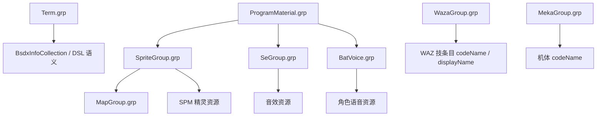

# BSDX GRP 总览笔记

## 1. 范围

当前 BSDX 侧实际存在的 `.grp` 文件有 8 个：

- `BatVoice.grp`
- `MapGroup.grp`
- `MekaGroup.grp`
- `ProgramMaterial.grp`
- `SeGroup.grp`
- `SpriteGroup.grp`
- `Term.grp`
- `WazaGroup.grp`

本文的目标不是做“猜测性说明”，而是把下面三层写清楚：

1. 每个 `.grp` 的二进制结构在项目里怎么解析
2. 当前真实数据里它有多少个顶层条目、长什么样
3. 它和其他 `.grp` / `WAZ` / `InfoCollection` 的关系是什么

## 2. 证据来源

### 2.1 项目代码

- `src/main/java/com/giga/nexas/dto/bsdx/grp/parser/impl/BatVoiceGrpParser.java`
- `src/main/java/com/giga/nexas/dto/bsdx/grp/parser/impl/MapGroupGrpParser.java`
- `src/main/java/com/giga/nexas/dto/bsdx/grp/parser/impl/MekaGroupGrpParser.java`
- `src/main/java/com/giga/nexas/dto/bsdx/grp/parser/impl/ProgramMaterialGrpParser.java`
- `src/main/java/com/giga/nexas/dto/bsdx/grp/parser/impl/SeGroupGrpParser.java`
- `src/main/java/com/giga/nexas/dto/bsdx/grp/parser/impl/SpriteGroupGrpParser.java`
- `src/main/java/com/giga/nexas/dto/bsdx/grp/parser/impl/TermGrpParser.java`
- `src/main/java/com/giga/nexas/dto/bsdx/grp/parser/impl/WazaGroupGrpParser.java`

### 2.2 真实样本

- `src/main/resources/game/bsdx/grp/BatVoice.grp`
- `src/main/resources/game/bsdx/grp/MapGroup.grp`
- `src/main/resources/game/bsdx/grp/MekaGroup.grp`
- `src/main/resources/game/bsdx/grp/ProgramMaterial.grp`
- `src/main/resources/game/bsdx/grp/SeGroup.grp`
- `src/main/resources/game/bsdx/grp/SpriteGroup.grp`
- `src/main/resources/game/bsdx/grp/Term.grp`
- `src/main/resources/game/bsdx/grp/WazaGroup.grp`

### 2.3 测试

- `src/test/java/com/giga/nexas/bsdx/TestBsdxGrpCatalog.java`
- `src/test/java/com/giga/nexas/bsdx/TestProgramMaterialRelations.java`

## 3. 总体关系图

## 4. 每个 GRP 分别是什么

### 4.1 `BatVoice.grp`

解析结构：

- 先读 `voiceTypeList`
  - 每项是 `voiceType / voiceTypeCodeName`
- 再读 `voiceList`
  - 每项是一个角色语音组
  - 组里再有 `voices`
  - 每个 voice 带 `voice / voiceCodeName / voiceFileName`

对应类与解析器：

- `BatVoiceGrp`
- `BatVoiceGrpParser`

当前真实数据：

- `voiceTypeList.size = 13`
- `voiceList.size = 30`

样例：

- `voiceTypeList[0] = DAM_S`
- `voiceTypeList[1] = DAM_L`
- `voiceTypeList[12] = REINFORCE`

- `voiceList[0] = KOU`
  - `voice[0] = AT_A01 / Kou_a0101`
- `voiceList[29] = CHRIS_NAVI`
  - `voice[0] = START01 / Chris_Navi0101`

关系：

- `ProgramMaterial.array3` 的顶层槽位与 `voiceList` 一一对应
- 当前 BSDX 实盘里 `array3` 全空，所以只确认了顶层位置绑定

### 4.2 `MapGroup.grp`

解析结构：

- 顶层 `groupList`
- 每个 group：
  - `existFlag`
  - `groupName`
  - `groupCodeName`
  - `groupResourceName`
  - `int1`
  - `items`
    - 每项固定 4 个 int
  - `array1`
  - `array2`
  - `array3`

对应类与解析器：

- `MapGroupGrp`
- `MapGroupGrpParser`

当前真实数据：

- `groupList.size = 372`

样例：

- `groupList[0] = PRACTICE03 / map_PRACTICE_L02`
- `groupList[39] = ASE_L01 / mapASSEMBLER_L01_01`
- `groupList[72] = ARK_S02 / mapARK_S01_02`

关系：

- `ProgramMaterial.array1[*].values[*]` 当前已确认是在引用 `MapGroup.groupList` 的索引
- 也就是说，`MapGroup.grp` 在这里更多是被 `ProgramMaterial` 当成“场景资源组索引空间”使用

### 4.3 `MekaGroup.grp`

解析结构：

- 顶层 `mekaList`
- 每项：
  - `existFlag`
  - `mekaName`
  - `mekaCodeName`

对应类与解析器：

- `MekaGroupGrp`
- `MekaGroupGrpParser`

当前真实数据：

- `mekaList.size = 103`

样例：

- `mekaList[0] = KOU`
- `mekaList[10] = SORA2`
- `mekaList[102] = ZAKO215A`

关系：

- 主要承担“机体 codeName 词典”
- 在迁移和资源对照时，常作为机体标识源

### 4.4 `ProgramMaterial.grp`

解析结构：

- `array1`
- `array2`
- `array3`

对应类与解析器：

- `ProgramMaterialGrp`
- `ProgramMaterialGrpParser`

当前真实数据：

- `array1.size = 138`
- `array2.size = 38`
- `array3.size = 30`

关系：

- `array1`
  - 顶层绑定 `SpriteGroup.spriteList`
  - 内层 `values[*]` 绑定 `MapGroup.groupList`
- `array2`
  - 顶层绑定 `SeGroup.seList`
  - 内层 `values[*]` 绑定同组内的 `seItems`
- `array3`
  - 顶层绑定 `BatVoice.voiceList`
  - 内层结构上应绑定同组内的 `voices`

详见：

- `src/main/java/com/giga/nexas/dto/bsdx/grp/groupmap/ProgramMaterialGrp.notes.md`

### 4.5 `SeGroup.grp`

解析结构：

- 顶层 `seList`
- 每个 group：
  - `existFlag`
  - `seType`
  - `seTypeCodeName`
  - `seItems`
- 每个 item：
  - `existFlag`
  - `seItemName`
  - `seItemCodeName`
  - `seFileName`

对应类与解析器：

- `SeGroupGrp`
- `SeGroupGrpParser`

当前真实数据：

- `seList.size = 38`

样例：

- `seList[0] = REACTION`
  - `seItems[0] = BOM01 / RE_bom01`
- `seList[36] = PROGRAM`
  - `seItems[0] = DASH01 / P_Dash01b`
  - `seItems[25] = COMBOFAILURE / P_ComboFailure`
- `seList[37] = UDAGAWA`
  - `seItems[51] = BOMB01 / U_bomb01_b`

关系：

- `ProgramMaterial.array2` 直接和它一一绑定
- `CEventSe` 的 `(group, seq)` 也直接指向这里

### 4.6 `SpriteGroup.grp`

解析结构：

- 顶层 `spriteList`
- 每项：
  - `existFlag`
  - `spriteFileName`
  - `spriteCodeName`
  - `param`

对应类与解析器：

- `SpriteGroupGrp`
- `SpriteGroupGrpParser`

当前真实数据：

- `spriteList.size = 138`

样例：

- `spriteList[0] = TAMA / Tama.spm`
- `spriteList[5] = PIC / Pic.spm`
- `spriteList[137] = COMBOINFO / ComboInfo.spm`

关系：

- `ProgramMaterial.array1` 的顶层槽位和它一一对应
- 迁移流程里也常作为 SPM / WAZ 资源对照的入口

### 4.7 `Term.grp`

解析结构：

- 顶层 `termList`
- 每个 group：
  - `termGroupName`
  - `termGroupCodeName`
  - `termItemList`
- 每个 item：
  - `termItemName`
  - `termItemCodeName`
  - `termItemDescription`
  - `param1`
  - `param2`

对应类与解析器：

- `TermGrp`
- `TermGrpParser`

当前真实数据：

- `termList.size = 30`

样例：

- `termList[0] = PARENT`
  - `item[2] = OBJECT1`
- `termList[7] = OBJECT1`
  - `item[7] = TOUCH`
- `termList[15] = TOUCH`
  - `item[17] = GROUND`

关系：

- `BsdxInfoCollection` 的 `int1 + typeList + param2` 链就是在这里解释
- 这是 BSDX DSL 的术语树定义文件

### 4.8 `WazaGroup.grp`

解析结构：

- 顶层 `wazaList`
- 每项：
  - `existFlag`
  - `wazaName`
  - `wazaCodeName`
  - `wazaDisplayName`
  - `param`

对应类与解析器：

- `WazaGroupGrp`
- `WazaGroupGrpParser`

当前真实数据：

- `wazaList.size = 110`

样例：

- `wazaList[0] = EFFECT / Effect`
- `wazaList[109] = ZAKO215A / Zako215a`

关系：

- 是“技 / 条目”的 codeName 与 displayName 词典
- 与 `WAZ` 和迁移流程中的技能标识对照密切相关

## 5. 当前已经确认的跨文件关系

### 已确认

- `ProgramMaterial.array1.size == SpriteGroup.spriteList.size`
- `ProgramMaterial.array2.size == SeGroup.seList.size`
- `ProgramMaterial.array3.size == BatVoice.voiceList.size`
- `ProgramMaterial.array1[*].values[*]` 指向 `MapGroup.groupList`
- `ProgramMaterial.array2[*].values[*]` 指向对应 `SeGroup` 组内的 `seItems`
- `Term.grp` 是 `BsdxInfoCollection` 的 DSL 语法树

### 仍需进一步补证据

- `MapGroup` 自身三段 `array1/array2/array3` 的完整业务语义
- `ProgramMaterial.array3[*].values[*]` 在 BSDX 实盘里的非空正例
- `MekaGroup` / `WazaGroup` 在所有运行时场景里的消费细节

## 6. 当前维护口径

后续维护 BSDX 资源时，请统一按下面的口径理解：

1. `.grp` 不是互相独立的平面表。
2. `ProgramMaterial.grp` 至少和 `SpriteGroup.grp`、`SeGroup.grp`、`BatVoice.grp` 存在顶层位置绑定。
3. `SeGroup.grp` 和 `Term.grp` 都不是只供查看的词典，而是会被运行时直接按索引引用。
4. 任何顶层数量变更、插入、重排，都必须先检查有没有跨文件索引表同步更新。
