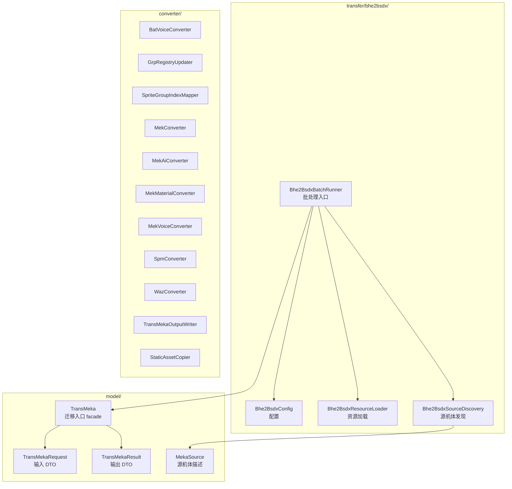
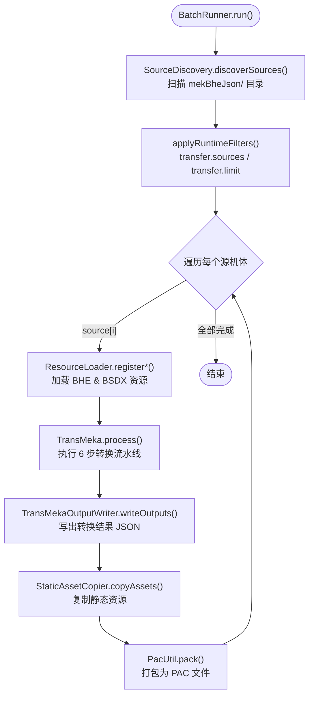
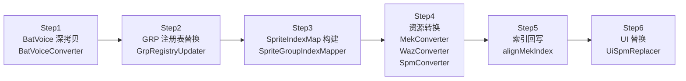

# BHE → BSDX 批量移植工具

## 1. 概述

将 Baldr Heart EXE (BHE) 角色资源批量移植到 Baldr Sky DiveX (BSDX)。自动嗅探 `mekBheJson/` 目录下所有有效源机体，逐个转换并打包为独立 PAC 文件。

核心流程：读取 BHE 侧的 MEK / WAZ / SPM / GRP 资源，经过索引重映射与格式转换后，写入 BSDX 侧对应结构，最终打包为可直接加载的 PAC 补丁包。

---

## 2. 快速开始

### 通过 main() 直接运行

```java
Bhe2BsdxBatchRunner.main();
```

### 通过 Maven 运行

```bash
mvn exec:java -Dexec.mainClass="com.giga.nexas.transfer.bhe2bsdx.Bhe2BsdxBatchRunner"
```

### 过滤指定源机体

```bash
mvn exec:java \
  -Dexec.mainClass="com.giga.nexas.transfer.bhe2bsdx.Bhe2BsdxBatchRunner" \
  -Dtransfer.sources=misaki,sora
```

### 限制转换数量

```bash
mvn exec:java \
  -Dexec.mainClass="com.giga.nexas.transfer.bhe2bsdx.Bhe2BsdxBatchRunner" \
  -Dtransfer.limit=3
```

---

## 3. 项目结构



---

## 4. 批处理流程



---

## 5. 单机体转换 6 步流程



### 各步骤说明

| 步骤 | 类 | 说明 |
|------|-----|------|
| Step1 | `BatVoiceConverter` | 将 BHE 侧 BatVoiceGroup 深拷贝到 BSDX 侧目标槽位 |
| Step2 | `GrpRegistryUpdater` | 替换 BSDX 侧 MekaGroup / WazaGroup / SpriteGroup 注册表条目 |
| Step3 | `SpriteGroupIndexMapper` | 构建 BHE→BSDX 的 SpriteGroup 索引映射表 |
| Step4 | `MekConverter` / `WazConverter` / `SpmConverter` | 执行 MEK、WAZ、SPM 三类资源的格式转换 |
| Step5 | `alignMekIndex` | 将转换后的 MEK 中 wazFileSequence / spmFileSequence 回写为 BSDX 侧索引 |
| Step6 | `UiSpmReplacer` | 替换选机画面等 UI 用 SPM 资源 |

---

## 6. 文件关系


### 索引关系说明

- `MekaGroup.grp` 中每个条目的 `mekaName` 对应一个 mek 文件
- `WazaGroup.grp` 中每个条目的 `wazaName` 对应一个 waz 文件
- `SpriteGroup.grp` 中每个条目的 `spriteName` 对应一个 spm 文件
- mek 内部的 `wazFileSequence` 指向 WazaGroup 中的索引位置
- mek 内部的 `spmFileSequence` 指向 SpriteGroup 中的索引位置
- waz 内部的 `CEventSprite` 引用 SpriteGroup 中的索引位置

---

## 7. WAZ 槽位映射 (83 → 72)

BHE 的 WAZ 共有 83 个槽位，BSDX 仅有 72 个。转换时需要丢弃 11 个槽位，并对特殊槽位做字段映射。

```mermaid
flowchart TB
    subgraph BHE ["BHE WAZ (83 槽位)"]
        direction LR
        BH0["0~22"]
        BH23["23"]
        BH24["24~34"]
        BH35["35"]
        BH36["36"]
        BH37["37"]
        BH38["38"]
        BH39["39"]
        BH40["40"]
        BH41["41~42"]
        BH43["43"]
        BH44["44~51"]
        BH52["52"]
        BH53["53~61"]
        BH62["62"]
        BH63["63~65"]
        BH66["66"]
        BH67["67"]
        BH68["68"]
        BH69["69"]
        BH70["70~82"]
    end

    subgraph BSDX ["BSDX WAZ (72 槽位)"]
        direction LR
        BS0["0~22"]
        BS23["23~33"]
        BS34["34"]
        BS35["35 ← slot37"]
        BS36["36"]
        BS37["37~38"]
        BS39["39~47"]
        BS48["48~56"]
        BS57["57~59"]
        BS60["60~71"]
    end

    BH23 -.-x|"丢弃"| X1["X"]
    BH35 -.-x|"丢弃"| X2["X"]
    BH38 -.-x|"丢弃"| X3["X"]
    BH40 -.-x|"丢弃"| X4["X"]
    BH43 -.-x|"丢弃"| X5["X"]
    BH52 -.-x|"丢弃"| X6["X"]
    BH62 -.-x|"丢弃"| X7["X"]
    BH66 -.-x|"丢弃"| X8["X"]
    BH67 -.-x|"丢弃"| X9["X"]
    BH68 -.-x|"丢弃"| X10["X"]
    BH69 -.-x|"丢弃"| X11["X"]

    BH37 -->|"特殊映射<br/>CEventFreeParam → CEventVal"| BS35

    style BH23 fill:#f66,color:#fff
    style BH35 fill:#f66,color:#fff
    style BH38 fill:#f66,color:#fff
    style BH40 fill:#f66,color:#fff
    style BH43 fill:#f66,color:#fff
    style BH52 fill:#f66,color:#fff
    style BH62 fill:#f66,color:#fff
    style BH66 fill:#f66,color:#fff
    style BH67 fill:#f66,color:#fff
    style BH68 fill:#f66,color:#fff
    style BH69 fill:#f66,color:#fff
    style BH37 fill:#fc0,color:#000
    style BS35 fill:#fc0,color:#000
```



### 丢弃槽位（红色）

| BHE 槽位 | 说明 |
|-----------|------|
| 23 | BHE 新增槽位，BSDX 不存在 |
| 35 | BHE 新增槽位，BSDX 不存在 |
| 38 | BHE 新增槽位，BSDX 不存在 |
| 40 | BHE 新增槽位，BSDX 不存在 |
| 43 | BHE 新增槽位，BSDX 不存在 |
| 52 | BHE 新增槽位，BSDX 不存在 |
| 62 | BHE 新增槽位，BSDX 不存在 |
| 66~69 | BHE 新增槽位，BSDX 不存在 |

### 特殊映射（黄色）

| BHE 槽位 | BSDX 槽位 | 字段映射 |
|-----------|-----------|----------|
| 37 | 35 | `CEventFreeParam` → `CEventVal`（需补充 `startFrame` / `endFrame`） |

---

## 8. 配置项说明

`Bhe2BsdxConfig` 中所有可配置字段：

| 字段 | 类型 | 默认值 | 说明 |
|------|------|--------|------|
| `outputBaseDir` | `Path` | `src/main/resources/testBhe` | 转换结果输出根目录，每个源机体在此下创建子目录 |
| `staticAssetRoot` | `Path` | `D:\BDY\bsdx_bhe\bhe_resources` | BHE 静态资源来源目录（图片、音频等） |
| `copyStaticAssets` | `boolean` | `true` | 是否复制静态资源到输出目录 |
| `bheMekJsonDir` | `Path` | `src/main/resources/mekBheJson` | BHE MEK JSON 目录，用于自动发现源机体 |
| `bsdxGrpDir` | `Path` | `src/main/resources/game/bsdx/grp` | BSDX GRP 基线目录 |
| `bheGrpDir` | `Path` | `src/main/resources/game/bhe/grp` | BHE GRP 基线目录 |
| `bsdxMekDir` | `Path` | `src/main/resources/game/bsdx/mek` | BSDX MEK 基线目录 |
| `bheMekDir` | `Path` | `src/main/resources/game/bhe/mek` | BHE MEK 基线目录 |
| `bsdxWazDir` | `Path` | `src/main/resources/game/bsdx/waz` | BSDX WAZ 基线目录 |
| `bheWazDir` | `Path` | `src/main/resources/game/bhe/waz` | BHE WAZ 基线目录 |
| `bsdxSpmDir` | `Path` | `src/main/resources/game/bsdx/spm` | BSDX SPM 基线目录 |
| `bheSpmDir` | `Path` | `src/main/resources/game/bhe/spm` | BHE SPM 基线目录 |
| `bsdxDatDir` | `Path` | `src/main/resources/game/bsdx/dat` | BSDX DAT 基线目录 |
| `targetKey` | `String` | `nanoha` | 替换目标的文件名 key |
| `targetCodeName` | `String` | `NANOHA` | 替换目标的 GRP codeName |
| `keepTargetKey` | `boolean` | `true` | 是否保留目标槽位的原始 key/codeName（true = 游戏内仍显示为 Nanoha） |
| `pacCompressMode` | `String` | `4` | PAC 压缩模式（"4" = 默认压缩） |
| `charset` | `String` | `windows-31j` | 二进制文件编码 |

---

## 9. 代码位置

| 模块 | 文件 | 关键方法 |
|------|------|----------|
| 批处理入口 | `Bhe2BsdxBatchRunner` | `main()` / `run()` |
| 配置 | `Bhe2BsdxConfig` | `defaults()` / `builder()` |
| 资源加载 | `Bhe2BsdxResourceLoader` | `registerBheGrp()` / `registerBsdxGrp()` |
| 源机体发现 | `Bhe2BsdxSourceDiscovery` | `discoverSources()` / `applyRuntimeFilters()` |
| 迁移入口 | `model/TransMeka` | `process()` |
| 输入 DTO | `model/TransMekaRequest` | `fromLegacy()` |
| 输出 DTO | `model/TransMekaResult` | `getMekaGroupIndex()` 等 |
| 源机体描述 | `model/MekaSource` | `getBaseKey()` / `getCodeName()` |
| BatVoice 转换 | `converter/BatVoiceConverter` | `convert()` |
| GRP 注册表更新 | `converter/GrpRegistryUpdater` | `update()` |
| 精灵索引映射 | `converter/SpriteGroupIndexMapper` | `buildIndexMap()` |
| MEK 转换 | `converter/MekConverter` | `convert()` |
| MEK AI 转换 | `converter/MekAiConverter` | `convert()` |
| MEK 素材转换 | `converter/MekMaterialConverter` | `convert()` |
| MEK 语音转换 | `converter/MekVoiceConverter` | `convert()` |
| SPM 转换 | `converter/SpmConverter` | `convert()` |
| WAZ 转换 | `converter/WazConverter` | `convert()` |
| 输出写盘 | `converter/TransMekaOutputWriter` | `writeOutputs()` |
| 静态资源复制 | `converter/StaticAssetCopier` | `copyAssets()` |

所有文件位于包路径：`com.giga.nexas.transfer.bhe2bsdx`

---

## 10. 已修复问题

| # | 问题描述 | 修复方式 |
|---|----------|----------|
| 1 | `WazConverter` slot37 buffer 条件写反 | 修正条件判断逻辑，确保 slot37 正确进入特殊映射分支 |
| 2 | `MekMaterialConverter` `CLEAR_MATERIAL_GROUPS=true` | 设置清除标志为 true，避免 BHE 侧素材组残留到 BSDX |
| 3 | `MekVoiceConverter` `CLEAR_VOICE_TABLES=true` | 设置清除标志为 true，避免 BHE 侧语音表残留到 BSDX |
| 4 | `MekMaterialConverter` spriteIndexMap 误用 | 修正索引映射表的引用，使用正确的 BHE→BSDX 映射 |
| 5 | 12 个 `trans*` 方法中 `BeanUtil.copyProperties` 覆盖 `typeId` | 在 `copyProperties` 之后重新设置 `typeId`，防止源对象的 typeId 覆盖目标 |
| 6 | `WazConverter` slot37→35 转换时 `CEventVal` 字段为 null | 增加 null 检查，当 `CEventVal` 为 null 时创建默认实例 |
| 7 | `CEventEffect` 中 `CEventFreeParam` → `CEventVal` 缺少 `startFrame` / `endFrame` | 从源 `CEventFreeParam` 中提取并填充 `startFrame` / `endFrame` 到目标 `CEventVal` |
| 8 | `GrpRegistryUpdater` sprite 文件名未被替换 | 修复注册表更新逻辑，确保 SpriteGroup 条目中的文件名同步替换 |

---

## 11. 待解决

- **wazagroup.param**：BHE 与 BSDX 中同名参数的数值含义不一致，当前直接拷贝可能导致武装行为异常
- **segroup**：已接入 `seFileName` 驱动的索引映射（BHE -> BSDX），并在目标组 `index=11` 自动追加缺失项；`WAZ.CEventSe.byteDataList` 的前 8 字节 `(group,seq)` 会同步重写
- **skillInfoUnknownList**：WAZ 槽位映射中部分技能信息槽位被丢弃，可能影响技能描述显示
