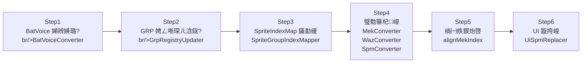

# BHE 鈫?BSDX 鎵归噺绉绘宸ュ叿

## 1. 姒傝堪

灏?Baldr Heart EXE (BHE) 瑙掕壊璧勬簮鎵归噺绉绘鍒?Baldr Sky DiveX (BSDX)銆傝嚜鍔ㄥ梾鎺?`mekBheJson/` 鐩綍涓嬫墍鏈夋湁鏁堟簮鏈轰綋锛岄€愪釜杞崲骞舵墦鍖呬负鐙珛 PAC 鏂囦欢銆?

鏍稿績娴佺▼锛氳鍙?BHE 渚х殑 MEK / WAZ / SPM / GRP 璧勬簮锛岀粡杩囩储寮曢噸鏄犲皠涓庢牸寮忚浆鎹㈠悗锛屽啓鍏?BSDX 渚у搴旂粨鏋勶紝鏈€缁堟墦鍖呬负鍙洿鎺ュ姞杞界殑 PAC 琛ヤ竵鍖呫€?

---

## 2. 蹇€熷紑濮?

### 閫氳繃 main() 鐩存帴杩愯

```java
Bhe2BsdxBatchRunner.main();
```

### 閫氳繃 Maven 杩愯

```bash
mvn exec:java -Dexec.mainClass="com.giga.nexas.transfer.bhe2bsdx.Bhe2BsdxBatchRunner"
```

### 杩囨护鎸囧畾婧愭満浣?

```bash
mvn exec:java \
  -Dexec.mainClass="com.giga.nexas.transfer.bhe2bsdx.Bhe2BsdxBatchRunner" \
  -Dtransfer.sources=misaki,sora
```

### 闄愬埗杞崲鏁伴噺

```bash
mvn exec:java \
  -Dexec.mainClass="com.giga.nexas.transfer.bhe2bsdx.Bhe2BsdxBatchRunner" \
  -Dtransfer.limit=3
```

---

## 3. 椤圭洰缁撴瀯

```mermaid
flowchart TB
    subgraph "transfer/bhe2bsdx/"
        A["Bhe2BsdxBatchRunner<br/>鎵瑰鐞嗗叆鍙?]
        B["Bhe2BsdxConfig<br/>閰嶇疆"]
        C["Bhe2BsdxResourceLoader<br/>璧勬簮鍔犺浇"]
        D["Bhe2BsdxSourceDiscovery<br/>婧愭満浣撳彂鐜?]
    end

    subgraph "converter/"
        E["BatVoiceConverter"]
        F["GrpRegistryUpdater"]
        G["SpriteGroupIndexMapper"]
        H["MekConverter"]
        I["MekAiConverter"]
        J["MekMaterialConverter"]
        K["MekVoiceConverter"]
        L["SpmConverter"]
        M["WazConverter"]
        N["TransMekaOutputWriter"]
        O["StaticAssetCopier"]
    end

    subgraph "model/"
        P["TransMeka<br/>杩佺Щ鍏ュ彛 facade"]
        Q["TransMekaRequest<br/>杈撳叆 DTO"]
        R["TransMekaResult<br/>杈撳嚭 DTO"]
        S["MekaSource<br/>婧愭満浣撴弿杩?]
    end

    A --> B
    A --> C
    A --> D
    A --> P
    P --> Q
    P --> R
    D --> S
```

---

## 4. 鎵瑰鐞嗘祦绋?

```mermaid
flowchart TB
    Start(["BatchRunner.run()"]) --> Discover["SourceDiscovery.discoverSources()<br/>鎵弿 mekBheJson/ 鐩綍"]
    Discover --> Filter["applyRuntimeFilters()<br/>transfer.sources / transfer.limit"]
    Filter --> Loop{"閬嶅巻姣忎釜婧愭満浣?}
    Loop -->|"source[i]"| Load["ResourceLoader.register*()<br/>鍔犺浇 BHE & BSDX 璧勬簮"]
    Load --> Process["TransMeka.process()<br/>鎵ц 6 姝ヨ浆鎹㈡祦姘寸嚎"]
    Process --> Write["TransMekaOutputWriter.writeOutputs()<br/>鍐欏嚭杞崲缁撴灉 JSON"]
    Write --> Copy["StaticAssetCopier.copyAssets()<br/>澶嶅埗闈欐€佽祫婧?]
    Copy --> Pack["PacUtil.pack()<br/>鎵撳寘涓?PAC 鏂囦欢"]
    Pack --> Loop
    Loop -->|"鍏ㄩ儴瀹屾垚"| Done(["缁撴潫"])
```

---

## 5. 鍗曟満浣撹浆鎹?6 姝ユ祦绋?



### 鍚勬楠よ鏄?

| 姝ラ | 绫?| 璇存槑 |
|------|-----|------|
| Step1 | `BatVoiceConverter` | 灏?BHE 渚?BatVoiceGroup 娣辨嫹璐濆埌 BSDX 渚х洰鏍囨Ы浣?|
| Step2 | `GrpRegistryUpdater` | 鏇挎崲 BSDX 渚?MekaGroup / WazaGroup / SpriteGroup 娉ㄥ唽琛ㄦ潯鐩?|
| Step3 | `SpriteGroupIndexMapper` | 鏋勫缓 BHE鈫払SDX 鐨?SpriteGroup 绱㈠紩鏄犲皠琛?|
| Step4 | `MekConverter` / `WazConverter` / `SpmConverter` | 鎵ц MEK銆乄AZ銆丼PM 涓夌被璧勬簮鐨勬牸寮忚浆鎹?|
| Step5 | `alignMekIndex` | 灏嗚浆鎹㈠悗鐨?MEK 涓?wazFileSequence / spmFileSequence 鍥炲啓涓?BSDX 渚х储寮?|
| Step6 | `UiSpmReplacer` | 鏇挎崲閫夋満鐢婚潰绛?UI 鐢?SPM 璧勬簮 |

---

## 6. 鏂囦欢鍏崇郴

```mermaid
flowchart LR
    MG["MekaGroup.grp<br/>鏈轰綋娉ㄥ唽琛?]
    WG["WazaGroup.grp<br/>姝﹁娉ㄥ唽琛?]
    SG["SpriteGroup.grp<br/>绮剧伒娉ㄥ唽琛?]

    MEK["mek 鏂囦欢<br/>鏈轰綋鏁版嵁"]
    WAZ["waz 鏂囦欢<br/>姝﹁鏁版嵁"]
    SPM["spm 鏂囦欢<br/>绮剧伒鏁版嵁"]

    MG -->|"mekaName 鈫?mek 鏂囦欢鍚?| MEK
    WG -->|"wazaName 鈫?waz 鏂囦欢鍚?| WAZ
    SG -->|"spriteName 鈫?spm 鏂囦欢鍚?| SPM

    MEK -->|"wazFileSequence<br/>鈫?WazaGroup 绱㈠紩"| WG
    MEK -->|"spmFileSequence<br/>鈫?SpriteGroup 绱㈠紩"| SG
    WAZ -->|"CEventSprite<br/>鈫?SpriteGroup 绱㈠紩"| SG
```

### 绱㈠紩鍏崇郴璇存槑

- `MekaGroup.grp` 涓瘡涓潯鐩殑 `mekaName` 瀵瑰簲涓€涓?mek 鏂囦欢
- `WazaGroup.grp` 涓瘡涓潯鐩殑 `wazaName` 瀵瑰簲涓€涓?waz 鏂囦欢
- `SpriteGroup.grp` 涓瘡涓潯鐩殑 `spriteName` 瀵瑰簲涓€涓?spm 鏂囦欢
- mek 鍐呴儴鐨?`wazFileSequence` 鎸囧悜 WazaGroup 涓殑绱㈠紩浣嶇疆
- mek 鍐呴儴鐨?`spmFileSequence` 鎸囧悜 SpriteGroup 涓殑绱㈠紩浣嶇疆
- waz 鍐呴儴鐨?`CEventSprite` 寮曠敤 SpriteGroup 涓殑绱㈠紩浣嶇疆

---

## 7. WAZ 妲戒綅鏄犲皠 (83 鈫?72)

BHE 鐨?WAZ 鍏辨湁 83 涓Ы浣嶏紝BSDX 浠呮湁 72 涓€傝浆鎹㈡椂闇€瑕佷涪寮?11 涓Ы浣嶏紝骞跺鐗规畩妲戒綅鍋氬瓧娈垫槧灏勩€?

```mermaid
flowchart TB
    subgraph BHE ["BHE WAZ (83 妲戒綅)"]
        direction LR
        BH0["0~22"]
        BH23["23"]
        BH24["24~34"]
        BH35["35"]
        BH36["36"]
        BH37["37"]
        BH38["38"]
        BH39["39"]
        BH40["40"]
        BH41["41~42"]
        BH43["43"]
        BH44["44~51"]
        BH52["52"]
        BH53["53~61"]
        BH62["62"]
        BH63["63~65"]
        BH66["66"]
        BH67["67"]
        BH68["68"]
        BH69["69"]
        BH70["70~82"]
    end

    subgraph BSDX ["BSDX WAZ (72 妲戒綅)"]
        direction LR
        BS0["0~22"]
        BS23["23~33"]
        BS34["34"]
        BS35["35 鈫?slot37"]
        BS36["36"]
        BS37["37~38"]
        BS39["39~47"]
        BS48["48~56"]
        BS57["57~59"]
        BS60["60~71"]
    end

    BH23 -.-x|"涓㈠純"| X1["X"]
    BH35 -.-x|"涓㈠純"| X2["X"]
    BH38 -.-x|"涓㈠純"| X3["X"]
    BH40 -.-x|"涓㈠純"| X4["X"]
    BH43 -.-x|"涓㈠純"| X5["X"]
    BH52 -.-x|"涓㈠純"| X6["X"]
    BH62 -.-x|"涓㈠純"| X7["X"]
    BH66 -.-x|"涓㈠純"| X8["X"]
    BH67 -.-x|"涓㈠純"| X9["X"]
    BH68 -.-x|"涓㈠純"| X10["X"]
    BH69 -.-x|"涓㈠純"| X11["X"]

    BH37 -->|"鐗规畩鏄犲皠<br/>CEventFreeParam 鈫?CEventVal"| BS35

    style BH23 fill:#f66,color:#fff
    style BH35 fill:#f66,color:#fff
    style BH38 fill:#f66,color:#fff
    style BH40 fill:#f66,color:#fff
    style BH43 fill:#f66,color:#fff
    style BH52 fill:#f66,color:#fff
    style BH62 fill:#f66,color:#fff
    style BH66 fill:#f66,color:#fff
    style BH67 fill:#f66,color:#fff
    style BH68 fill:#f66,color:#fff
    style BH69 fill:#f66,color:#fff
    style BH37 fill:#fc0,color:#000
    style BS35 fill:#fc0,color:#000
```



### 涓㈠純妲戒綅锛堢孩鑹诧級

| BHE 妲戒綅 | 璇存槑 |
|-----------|------|
| 23 | BHE 鏂板妲戒綅锛孊SDX 涓嶅瓨鍦?|
| 35 | BHE 鏂板妲戒綅锛孊SDX 涓嶅瓨鍦?|
| 38 | BHE 鏂板妲戒綅锛孊SDX 涓嶅瓨鍦?|
| 40 | BHE 鏂板妲戒綅锛孊SDX 涓嶅瓨鍦?|
| 43 | BHE 鏂板妲戒綅锛孊SDX 涓嶅瓨鍦?|
| 52 | BHE 鏂板妲戒綅锛孊SDX 涓嶅瓨鍦?|
| 62 | BHE 鏂板妲戒綅锛孊SDX 涓嶅瓨鍦?|
| 66~69 | BHE 鏂板妲戒綅锛孊SDX 涓嶅瓨鍦?|

### 鐗规畩鏄犲皠锛堥粍鑹诧級

| BHE 妲戒綅 | BSDX 妲戒綅 | 瀛楁鏄犲皠 |
|-----------|-----------|----------|
| 37 | 35 | `CEventFreeParam` 鈫?`CEventVal`锛堥渶琛ュ厖 `startFrame` / `endFrame`锛?|

---

## 8. 閰嶇疆椤硅鏄?

`Bhe2BsdxConfig` 涓墍鏈夊彲閰嶇疆瀛楁锛?

| 瀛楁 | 绫诲瀷 | 榛樿鍊?| 璇存槑 |
|------|------|--------|------|
| `outputBaseDir` | `Path` | `src/main/resources/testBhe` | 杞崲缁撴灉杈撳嚭鏍圭洰褰曪紝姣忎釜婧愭満浣撳湪姝や笅鍒涘缓瀛愮洰褰?|
| `staticAssetRoot` | `Path` | `D:\BDY\bsdx_bhe\bhe_resources` | BHE 闈欐€佽祫婧愭潵婧愮洰褰曪紙鍥剧墖銆侀煶棰戠瓑锛?|
| `copyStaticAssets` | `boolean` | `true` | 鏄惁澶嶅埗闈欐€佽祫婧愬埌杈撳嚭鐩綍 |
| `bheMekJsonDir` | `Path` | `src/main/resources/mekBheJson` | BHE MEK JSON 鐩綍锛岀敤浜庤嚜鍔ㄥ彂鐜版簮鏈轰綋 |
| `bsdxGrpDir` | `Path` | `src/main/resources/game/bsdx/grp` | BSDX GRP 鍩虹嚎鐩綍 |
| `bheGrpDir` | `Path` | `src/main/resources/game/bhe/grp` | BHE GRP 鍩虹嚎鐩綍 |
| `bsdxMekDir` | `Path` | `src/main/resources/game/bsdx/mek` | BSDX MEK 鍩虹嚎鐩綍 |
| `bheMekDir` | `Path` | `src/main/resources/game/bhe/mek` | BHE MEK 鍩虹嚎鐩綍 |
| `bsdxWazDir` | `Path` | `src/main/resources/game/bsdx/waz` | BSDX WAZ 鍩虹嚎鐩綍 |
| `bheWazDir` | `Path` | `src/main/resources/game/bhe/waz` | BHE WAZ 鍩虹嚎鐩綍 |
| `bsdxSpmDir` | `Path` | `src/main/resources/game/bsdx/spm` | BSDX SPM 鍩虹嚎鐩綍 |
| `bheSpmDir` | `Path` | `src/main/resources/game/bhe/spm` | BHE SPM 鍩虹嚎鐩綍 |
| `bsdxDatDir` | `Path` | `src/main/resources/game/bsdx/dat` | BSDX DAT 鍩虹嚎鐩綍 |
| `targetKey` | `String` | `nanoha` | 鏇挎崲鐩爣鐨勬枃浠跺悕 key |
| `targetCodeName` | `String` | `NANOHA` | 鏇挎崲鐩爣鐨?GRP codeName |
| `keepTargetKey` | `boolean` | `true` | 鏄惁淇濈暀鐩爣妲戒綅鐨勫師濮?key/codeName锛坱rue = 娓告垙鍐呬粛鏄剧ず涓?Nanoha锛?|
| `pacCompressMode` | `String` | `4` | PAC 鍘嬬缉妯″紡锛?4" = 榛樿鍘嬬缉锛?|
| `charset` | `String` | `windows-31j` | 浜岃繘鍒舵枃浠剁紪鐮?|

---

## 9. 浠ｇ爜浣嶇疆

| 妯″潡 | 鏂囦欢 | 鍏抽敭鏂规硶 |
|------|------|----------|
| 鎵瑰鐞嗗叆鍙?| `Bhe2BsdxBatchRunner` | `main()` / `run()` |
| 閰嶇疆 | `Bhe2BsdxConfig` | `defaults()` / `builder()` |
| 璧勬簮鍔犺浇 | `Bhe2BsdxResourceLoader` | `registerBheGrp()` / `registerBsdxGrp()` |
| 婧愭満浣撳彂鐜?| `Bhe2BsdxSourceDiscovery` | `discoverSources()` / `applyRuntimeFilters()` |
| 杩佺Щ鍏ュ彛 | `model/TransMeka` | `process()` |
| 杈撳叆 DTO | `model/TransMekaRequest` | `fromLegacy()` |
| 杈撳嚭 DTO | `model/TransMekaResult` | `getMekaGroupIndex()` 绛?|
| 婧愭満浣撴弿杩?| `model/MekaSource` | `getBaseKey()` / `getCodeName()` |
| BatVoice 杞崲 | `converter/BatVoiceConverter` | `convert()` |
| GRP 娉ㄥ唽琛ㄦ洿鏂?| `converter/GrpRegistryUpdater` | `update()` |
| 绮剧伒绱㈠紩鏄犲皠 | `converter/SpriteGroupIndexMapper` | `buildIndexMap()` |
| MEK 杞崲 | `converter/MekConverter` | `convert()` |
| MEK AI 杞崲 | `converter/MekAiConverter` | `convert()` |
| MEK 绱犳潗杞崲 | `converter/MekMaterialConverter` | `convert()` |
| MEK 璇煶杞崲 | `converter/MekVoiceConverter` | `convert()` |
| SPM 杞崲 | `converter/SpmConverter` | `convert()` |
| WAZ 杞崲 | `converter/WazConverter` | `convert()` |
| 杈撳嚭鍐欑洏 | `converter/TransMekaOutputWriter` | `writeOutputs()` |
| 闈欐€佽祫婧愬鍒?| `converter/StaticAssetCopier` | `copyAssets()` |

鎵€鏈夋枃浠朵綅浜庡寘璺緞锛歚com.giga.nexas.transfer.bhe2bsdx`

---

## 10. 宸蹭慨澶嶉棶棰?

| # | 闂鎻忚堪 | 淇鏂瑰紡 |
|---|----------|----------|
| 1 | `WazConverter` slot37 buffer 鏉′欢鍐欏弽 | 淇鏉′欢鍒ゆ柇閫昏緫锛岀‘淇?slot37 姝ｇ‘杩涘叆鐗规畩鏄犲皠鍒嗘敮 |
| 2 | `MekMaterialConverter` `CLEAR_MATERIAL_GROUPS=true` | 璁剧疆娓呴櫎鏍囧織涓?true锛岄伩鍏?BHE 渚х礌鏉愮粍娈嬬暀鍒?BSDX |
| 3 | `MekVoiceConverter` `CLEAR_VOICE_TABLES=true` | 璁剧疆娓呴櫎鏍囧織涓?true锛岄伩鍏?BHE 渚ц闊宠〃娈嬬暀鍒?BSDX |
| 4 | `MekMaterialConverter` spriteIndexMap 璇敤 | 淇绱㈠紩鏄犲皠琛ㄧ殑寮曠敤锛屼娇鐢ㄦ纭殑 BHE鈫払SDX 鏄犲皠 |
| 5 | 12 涓?`trans*` 鏂规硶涓?`BeanUtil.copyProperties` 瑕嗙洊 `typeId` | 鍦?`copyProperties` 涔嬪悗閲嶆柊璁剧疆 `typeId`锛岄槻姝㈡簮瀵硅薄鐨?typeId 瑕嗙洊鐩爣 |
| 6 | `WazConverter` slot37鈫?5 杞崲鏃?`CEventVal` 瀛楁涓?null | 澧炲姞 null 妫€鏌ワ紝褰?`CEventVal` 涓?null 鏃跺垱寤洪粯璁ゅ疄渚?|
| 7 | `CEventEffect` 涓?`CEventFreeParam` 鈫?`CEventVal` 缂哄皯 `startFrame` / `endFrame` | 浠庢簮 `CEventFreeParam` 涓彁鍙栧苟濉厖 `startFrame` / `endFrame` 鍒扮洰鏍?`CEventVal` |
| 8 | `GrpRegistryUpdater` sprite 鏂囦欢鍚嶆湭琚浛鎹?| 淇娉ㄥ唽琛ㄦ洿鏂伴€昏緫锛岀‘淇?SpriteGroup 鏉＄洰涓殑鏂囦欢鍚嶅悓姝ユ浛鎹?|

---

## 11. 寰呰В鍐?

- **wazagroup.param**锛欱HE 涓?BSDX 涓悓鍚嶅弬鏁扮殑鏁板€煎惈涔変笉涓€鑷达紝褰撳墠鐩存帴鎷疯礉鍙兘瀵艰嚧姝﹁琛屼负寮傚父
- **segroup**锛氬凡鎺ュ叆 `seFileName` 椹卞姩鐨勭储寮曟槧灏勶紙BHE -> BSDX锛夛紝骞跺湪鐩爣缁?`index=11` 鑷姩杩藉姞缂哄け椤癸紱`WAZ.CEventSe.byteDataList` 鐨勫墠 8 瀛楄妭 `(group,seq)` 浼氬悓姝ラ噸鍐?- **skillInfoUnknownList**锛歐AZ 妲戒綅鏄犲皠涓儴鍒嗘妧鑳戒俊鎭Ы浣嶈涓㈠純锛屽彲鑳藉奖鍝嶆妧鑳芥弿杩版樉绀?

---

## 12. 真实样本回归（segroup + CEventSe）

新增真实样本测试：

- `src/test/java/com/giga/nexas/transfer/bhe2bsdx/converter/SeGroupRealDataValidationTest.java`

覆盖范围：

- 输入样本：
  - `src/main/resources/game/bhe/grp/segroup.grp`
  - `src/main/resources/game/bsdx/grp/segroup.grp`
  - `src/main/resources/game/bhe/waz/*.waz`
- 验证规则：
  - `SeGroupIndexMapper` 生成的映射表必须非空，且存在追加项到 BSDX `group[11]`。
  - 对真实 `CEventSe.byteDataList` 的每个 16-byte block，重写前 8 字节 `(group,seq)` 后，目标项 `seFileName` 必须与源项一致（忽略大小写）。

执行命令：

```bash
mvn -q "-Dtest=com.giga.nexas.transfer.bhe2bsdx.converter.SeGroupIndexMapperTest,com.giga.nexas.transfer.bhe2bsdx.converter.SeGroupRealDataValidationTest" test
```

