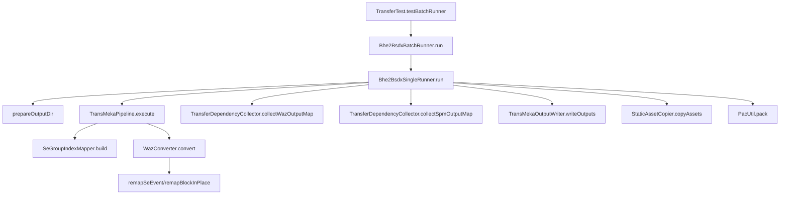
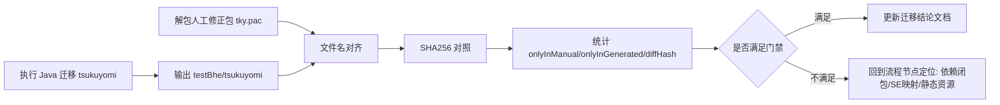

# tky.pac 实证总结与迁移流程落地（2026-02-12）

## 1. 复核目标

本文件用于确认两件事：

1. Java 迁移主流程是否按预期执行，并且可追溯到具体代码位置。
2. 你的人工修正包与当前迁移产物的真实差异是什么，并把差异反映到迁移流程门禁中。

---

## 2. 样本与路径

- 人工修正包：`src/main/resources/tky.pac`
- 人工修正包解包目录：`target/tky_pac_analysis/tky`
- Java 当前迁移输出：`src/main/resources/testBhe/tsukuyomi`
- 差异报告：`src/main/java/com/giga/nexas/transfer/bhe2bsdx/tky.pac.report.json`

---

## 3. Java 迁移主链（事实锚点）

入口与调度：

- `src/test/java/com/giga/nexas/bhe2bsdx/TransferTest.java:61`
  - `testBatchRunner()`
- `src/test/java/com/giga/nexas/bhe2bsdx/TransferTest.java:63`
  - `new Bhe2BsdxBatchRunner(config).run()`
- `src/main/java/com/giga/nexas/transfer/bhe2bsdx/Bhe2BsdxBatchRunner.java:23`
  - `run()`
- `src/main/java/com/giga/nexas/transfer/bhe2bsdx/Bhe2BsdxBatchRunner.java:41`
  - `singleRunner.run(source)`

单机体迁移主链：

- `src/main/java/com/giga/nexas/transfer/bhe2bsdx/Bhe2BsdxSingleRunner.java:37`
  - `run(MekaSource source)`
- `src/main/java/com/giga/nexas/transfer/bhe2bsdx/Bhe2BsdxSingleRunner.java:56`
  - `prepareOutputDir(...)`
- `src/main/java/com/giga/nexas/transfer/bhe2bsdx/converter/TransMekaPipeline.java:35`
  - `execute(...)`
- `src/main/java/com/giga/nexas/transfer/bhe2bsdx/converter/TransMekaPipeline.java:145`
  - `seGroupIndexMapper.build(...)`
- `src/main/java/com/giga/nexas/transfer/bhe2bsdx/converter/TransMekaPipeline.java:157`
  - `wazConverter.convert(..., seGroupMap)`
- `src/main/java/com/giga/nexas/transfer/bhe2bsdx/converter/WazConverter.java:290`
  - `remapSeEvent(...)`
- `src/main/java/com/giga/nexas/transfer/bhe2bsdx/converter/WazConverter.java:308`
  - `seGroupMap.remapBlockInPlace(...)`
- `src/main/java/com/giga/nexas/transfer/bhe2bsdx/Bhe2BsdxSingleRunner.java:209`
  - `dependencyCollector.collectWazOutputMap(...)`
- `src/main/java/com/giga/nexas/transfer/bhe2bsdx/Bhe2BsdxSingleRunner.java:216`
  - `dependencyCollector.collectSpmOutputMap(...)`
- `src/main/java/com/giga/nexas/transfer/bhe2bsdx/Bhe2BsdxSingleRunner.java:247`
  - `outputWriter.writeOutputs(...)`
- `src/main/java/com/giga/nexas/transfer/bhe2bsdx/Bhe2BsdxSingleRunner.java:271`
  - `assetCopier.copyAssets(...)`
- `src/main/java/com/giga/nexas/transfer/bhe2bsdx/Bhe2BsdxSingleRunner.java:274`
  - `PacUtil.pack(...)`

依赖闭包与静态资源收敛：

- `src/main/java/com/giga/nexas/transfer/bhe2bsdx/converter/TransferDependencyCollector.java:42`
  - `collectWazOutputMap(...)`
- `src/main/java/com/giga/nexas/transfer/bhe2bsdx/converter/TransferDependencyCollector.java:50`
  - `collectSpmOutputMap(...)`
- `src/main/java/com/giga/nexas/transfer/bhe2bsdx/converter/TransferDependencyCollector.java:115`
  - `ArrayDeque` + `visitedRefs` 依赖闭包
- `src/main/java/com/giga/nexas/transfer/bhe2bsdx/converter/StaticAssetCopier.java:29`
  - `copyAssets(...)`
- `src/main/java/com/giga/nexas/transfer/bhe2bsdx/converter/StaticAssetCopier.java:161`
  - `collectReferencedImageNo(...)`
- `src/main/java/com/giga/nexas/transfer/bhe2bsdx/converter/StaticAssetCopier.java:187`
  - `collectReferencedPageNo(...)`



---

## 4. 本次复核命令与结果

### 4.1 Java 测试复核

执行命令：

```powershell
mvn -q "-Dtest=com.giga.nexas.bhe2bsdx.TransferTest#testBatchRunner,com.giga.nexas.transfer.bhe2bsdx.converter.TransferDependencyCollectorTest,com.giga.nexas.transfer.bhe2bsdx.converter.StaticAssetCopierTest,com.giga.nexas.transfer.bhe2bsdx.converter.SeGroupRealDataValidationTest" "-Dtransfer.sources=tsukuyomi" test
```

关键结果（日志实测）：

- 仅迁移 `tsukuyomi`，批处理成功 `Success: 1, Failed: 0, Total: 1`
- `segroup mapping appended 644 missing items into BSDX group 11`
- 输出计数：`grp=5, mek=1, waz=4, spm=15`
- 静态资源复制：`总计=372, 复制=82, 缺失=290`
- `SeGroupRealDataValidationTest` 结果：
  - `checkedPairsInSeGroup=1526`
  - `changedPairsInSeGroup=1526`
  - `checkedBlocks=7599`
  - `changedBlocks=7599`
  - `skippedUnknownPairs=0`

### 4.2 人工修正包 vs 迁移输出差异复核

执行命令（独立 hash 计算，不依赖现有 report）：

```powershell
$manual='d:\Code\NeXAS_DX\target\tky_pac_analysis\tky'
$gen='d:\Code\NeXAS_DX\src\main\resources\testBhe\tsukuyomi'
# 递归文件名对齐 + SHA256 对照
```

实测统计：

- `manualCount=120`
- `generatedCount=107`
- `onlyInManualCount=16`
- `onlyInGeneratedCount=3`
- `commonCount=104`
- `sameHashCount=90`
- `diffHashCount=14`

差异清单：

- `onlyInManual`（16）：
  - `Bomb.waz`
  - `b6_hit03.ogg`
  - `door_largemetal_open10.ogg`
  - `gun_ammoout_scifi1.ogg`
  - `magic_glow1.ogg`
  - `menu_magic02.ogg`
  - `RE_Iron04b.ogg`
  - `zoom_sniperscope_in.ogg`
  - `bomb_011_0001.png`
  - `bomb_066_0001.png`
  - `mark_etc014_0001.png`
  - `pic_134_0001.png`
  - `pic_142_0001.png`
  - `tama_123_0001.png`
  - `tama_energy021_0001.png`
  - `tama_energy034_0001.png`
- `onlyInGenerated`（3）：
  - `c_tsukuyomi.spm`
  - `fire.spm`
  - `smoke.spm`
- `diffHashFiles`（14）：
  - `nanoha.mek`
  - `nanoha.waz`
  - `Effect.waz`
  - `SeGroup.grp`
  - `wazagroup.grp`
  - `bomb.spm`
  - `C_zako_021a.spm`
  - `link.spm`
  - `mark.spm`
  - `pic.spm`
  - `tama.spm`
  - `Tama03.waz`
  - `Tama05.waz`
  - `zako_021a.spm`

---

## 5. 追加与修正点（已反映到迁移流程）

### 5.1 已落地并生效

1. 输出文件从“主文件直写”调整为“依赖闭包输出”。
2. `segroup` 映射在主链接入，并写回 `CEventSe.byteDataList` 前 8 字节（group/seq）。
3. 静态资源从“全量 imageData”收敛到 `anim -> pat -> page -> chip.imageNo` 引用链，越界时 fallback。
4. 每次迁移前清理输出目录，防止历史文件污染本轮差异。

### 5.2 已确认但仍未完全闭环

1. 人工修正包中的 `Bomb.waz` 与多项 `ogg/png` 仍未进入当前迁移输出。
2. `diffHashCount=14` 仍需要按文件粒度继续做字段级二进制对照，区分“语义等价差异”和“运行行为差异”。

---

## 6. 迁移流程门禁（已写入执行口径）



门禁规则（当前）：

1. `onlyInGenerated` 仅允许预期文件：`c_tsukuyomi.spm`、`fire.spm`、`smoke.spm`。
2. `onlyInManual` 和 `diffHashFiles` 变化时，必须追加一条“来源定位说明”（对应到主链节点或外部资源缺失）。
3. 更新 `tky.pac.report.json` 时，必须同步更新本文件与 `docs/project-deep-dive/tky-pac-analysis.md`。

---

## 7. 同步文件

- `src/main/java/com/giga/nexas/transfer/bhe2bsdx/tky.pac.report.json`
- `docs/project-deep-dive/tky-pac-analysis.md`
- `docs/project-deep-dive/flow.md`
- `D:\Code\NeXAS_DX_Tauri\docs/project-deep-dive/tky-pac-analysis.md`

