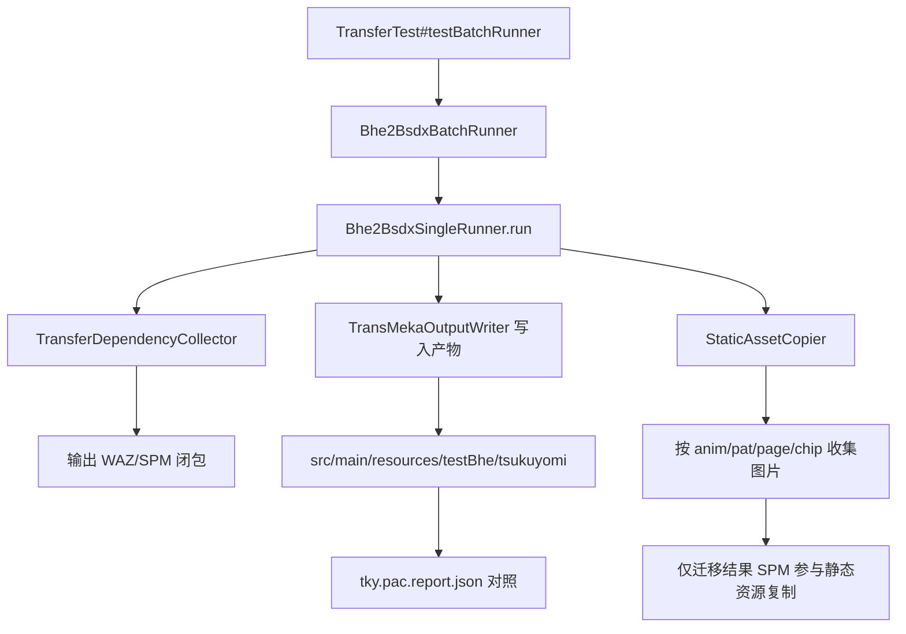

# tky.pac 实证总结与收敛状态（BHE -> BSDX）

## 1. 基线与最新结果

数据来源：

- `src/main/resources/tky.pac`
- `src/main/resources/testBhe/tsukuyomi`
- `src/main/java/com/giga/nexas/transfer/bhe2bsdx/tky.pac.report.json`

最新统计（2026-02-12 00:29:33）：

- `unpackFileCount=120`
- `transferFileCount=107`
- `onlyInTky=16`
- `onlyInTransfer=3`
- `commonCount=104`
- `sameHashCount=90`
- `diffHashCount=14`

## 2. 本轮已落地收敛项

### 2.1 依赖闭包输出

- `src/main/java/com/giga/nexas/transfer/bhe2bsdx/converter/TransferDependencyCollector.java`
- 入口方法：
  - `collectWazOutputMap(...)`
  - `collectSpmOutputMap(...)`
- 规则：
  - `CEventWazaSelect(wazFileNo, wazSequenceNo)` 做递归闭包。
  - `CEventSprite(spmFileSequence)` 推导 SPM 依赖集合。

### 2.2 主流程接线与目录清理

- `src/main/java/com/giga/nexas/transfer/bhe2bsdx/Bhe2BsdxSingleRunner.java`
- 已接入 `TransferDependencyCollector`。
- `prepareOutputDir(...)` 在每次运行前清理旧产物，避免历史文件混入。

### 2.3 静态资源复制收敛

- `src/main/java/com/giga/nexas/transfer/bhe2bsdx/converter/StaticAssetCopier.java`
- `src/test/java/com/giga/nexas/bhe2bsdx/steps/StaticAssetCopier.java`
- SPM 图片收集从“全量 `imageData`”改为：
  - `anim -> pat.pageNo -> page.chip.imageNo`
  - 异常索引时回退到全量，避免漏拷贝。
- `Bhe2BsdxSingleRunner` 的静态资源输入从 `outputSpm` 改为“本次迁移结果 SPM 集合”，不再对依赖闭包内的共享 SPM 全量补图。

### 2.4 新增测试

- `src/test/java/com/giga/nexas/transfer/bhe2bsdx/converter/StaticAssetCopierTest.java`
  - `copyAssets_shouldCopyOnlyReferencedImages`
  - `copyAssets_shouldFallbackToFullImageListWhenImageNoOutOfRange`

## 3. 对照图（真实流程）



## 4. 当前剩余差异（实证）

### 4.1 `onlyInTransfer=3`

仅剩：

- `c_tsukuyomi.spm`
- `fire.spm`
- `smoke.spm`

### 4.2 `onlyInTky=16`

缺项为：

- `Bomb.waz`
- `b6_hit03.ogg`
- `bomb_011_0001.png`
- `bomb_066_0001.png`
- `door_largemetal_open10.ogg`
- `gun_ammoout_scifi1.ogg`
- `magic_glow1.ogg`
- `mark_etc014_0001.png`
- `menu_magic02.ogg`
- `pic_134_0001.png`
- `pic_142_0001.png`
- `RE_Iron04b.ogg`
- `tama_123_0001.png`
- `tama_energy021_0001.png`
- `tama_energy034_0001.png`
- `zoom_sniperscope_in.ogg`

### 4.3 `diffHashCount=14`

哈希差异集中在：

- `nanoha.mek`
- `nanoha.waz`
- `effect.waz`
- `tama03.waz`
- `tama05.waz`
- `zako_021a.spm`
- `c_zako_021a.spm`
- `bomb.spm`
- `mark.spm`
- `pic.spm`
- `link.spm`
- `tama.spm`
- `wazagroup.grp`
- `segroup.grp`

## 5. 下一步收敛计划

1. 针对 `Bomb.waz` 做引用链回放，核对是否存在未覆盖的 `wazFileNo=7` 路径（包括嵌套对象和序号修正规则后的链路）。
2. 对 `onlyInTky` 的音频和图片建立“来源归类”：`batvoice/segroup/spm image` 三类，明确由哪一层负责补齐。
3. 针对 `diffHashCount=14` 做字段级二进制对照，区分“语义等价差异”和“会影响运行时行为的差异”。

## 6. 复现命令

```powershell
# 1) 迁移主链路（tsukuyomi）
mvn -q "-Dtest=com.giga.nexas.bhe2bsdx.TransferTest#testBatchRunner" "-Dtransfer.sources=tsukuyomi" test

# 2) 关键转换与收敛测试
mvn -q "-Dtest=com.giga.nexas.transfer.bhe2bsdx.converter.TransferDependencyCollectorTest,com.giga.nexas.transfer.bhe2bsdx.converter.StaticAssetCopierTest,com.giga.nexas.transfer.bhe2bsdx.converter.SpriteMappingRealDataTest,com.giga.nexas.transfer.bhe2bsdx.converter.SeGroupRealDataValidationTest" test
```
