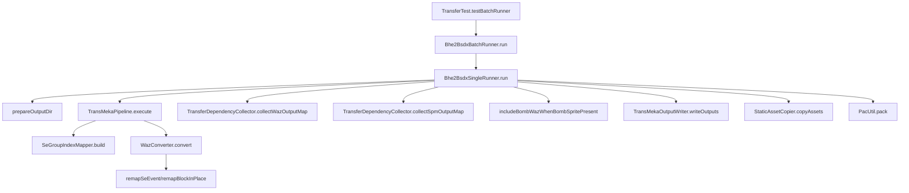
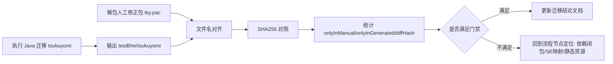

# tky.pac 实证总结与迁移流程落地（2026-02-12）

## 1. 复核目标

本文件用于确认两件事：

1. Java 迁移主流程是否按预期执行，并且可追溯到具体代码位置。
2. 人工修正包与当前迁移产物的真实差异，并把差异反映到迁移流程门禁。

---

## 2. 样本与路径

- 人工修正包：`src/main/resources/tky.pac`
- 人工修正包解包目录：`target/tky_pac_analysis/tky`
- Java 当前迁移输出：`src/main/resources/testBhe/tsukuyomi`
- 差异报告：`src/main/java/com/giga/nexas/transfer/bhe2bsdx/tky.pac.report.json`

---

## 3. Java 迁移主链（事实锚点）

入口与调度：

- `src/test/java/com/giga/nexas/bhe2bsdx/TransferTest.java`
  - `testBatchRunner()`
- `src/main/java/com/giga/nexas/transfer/bhe2bsdx/Bhe2BsdxBatchRunner.java`
  - `run()`
  - `singleRunner.run(source)`

单机体迁移主链：

- `src/main/java/com/giga/nexas/transfer/bhe2bsdx/Bhe2BsdxSingleRunner.java`
  - `run(MekaSource source)`
  - `prepareOutputDir(...)`
  - `includeBombWazWhenBombSpritePresent(...)`
- `src/main/java/com/giga/nexas/transfer/bhe2bsdx/converter/TransMekaPipeline.java`
  - `execute(...)`
- `src/main/java/com/giga/nexas/transfer/bhe2bsdx/converter/WazConverter.java`
  - `remapSeEvent(...)`
- `src/main/java/com/giga/nexas/transfer/bhe2bsdx/converter/TransferDependencyCollector.java`
  - `collectWazOutputMap(...)`
  - `collectSpmOutputMap(...)`
- `src/main/java/com/giga/nexas/transfer/bhe2bsdx/converter/StaticAssetCopier.java`
  - `copyAssets(...)`
- `src/main/java/com/giga/nexas/transfer/bhe2bsdx/converter/TransMekaOutputWriter.java`
  - `writeOutputs(...)`
- `src/main/java/com/giga/nexas/util/PacUtil.java`
  - `pack(...)`



---

## 4. 本次复核命令与结果

### 4.1 Java 测试复核

执行命令：

```powershell
mvn -q test
```

关键结果（实测）：

- 全量测试通过（Exit 0）
- `segroup mapping appended 644 missing items into BSDX group 11`
- `Success: 1, Failed: 0, Total: 1`（`tsukuyomi` 定向批处理）
- 迁移输出（`tky.pac.report.json`）：`grp=5, mek=1, waz=5, spm=15`
- 静态资源复制日志：`总计=372, 复制=82, 缺失=290, 重名=0`

### 4.2 人工修正包 vs 迁移输出差异复核

执行方式（独立 hash 计算，不依赖旧 report）：

```powershell
$manual='D:\Code\NeXAS_DX\target\tky_pac_analysis\tky'
$gen='D:\Code\NeXAS_DX\src\main\resources\testBhe\tsukuyomi'
# 文件名对齐 + SHA256 对照
```

实测统计：

- `manualCount=120`
- `generatedCount=108`
- `onlyInManualCount=15`
- `onlyInGeneratedCount=3`
- `commonCount=105`
- `sameHashCount=90`
- `diffHashCount=15`

差异清单：

- `onlyInManual`（15）：
  - `b6_hit03.ogg`
  - `bomb_011_0001.png`
  - `bomb_066_0001.png`
  - `door_largemetal_open10.ogg`
  - `gun_ammoout_scifi1.ogg`
  - `magic_glow1.ogg`
  - `mark_etc014_0001.png`
  - `menu_magic02.ogg`
  - `pic_134_0001.png`
  - `pic_142_0001.png`
  - `RE_Iron04b.ogg`
  - `tama_123_0001.png`
  - `tama_energy021_0001.png`
  - `tama_energy034_0001.png`
  - `zoom_sniperscope_in.ogg`
- `onlyInGenerated`（3）：
  - `c_tsukuyomi.spm`
  - `fire.spm`
  - `smoke.spm`
- `diffHashFiles`（15）：
  - `Bomb.waz`
  - `C_zako_021a.spm`
  - `Effect.waz`
  - `SeGroup.grp`
  - `Tama03.waz`
  - `Tama05.waz`
  - `bomb.spm`
  - `link.spm`
  - `mark.spm`
  - `nanoha.mek`
  - `nanoha.waz`
  - `pic.spm`
  - `tama.spm`
  - `wazagroup.grp`
  - `zako_021a.spm`

关键样本对照：

| 文件 | manual size | generated size | manual sha256 | generated sha256 |
|---|---:|---:|---|---|
| `Bomb.waz` | 520995 | 516860 | `73D5868A1EEECAE9D1241A058D5BDA3495911058A542A4AED7C73A0EBBCE2AE7` | `737C114D7F6F521830D559F7BAF60B8E66B21D7FB61A66541A117EF65D4B49E4` |
| `SeGroup.grp` | 66416 | 66171 | `2BE79B41E961EF78DF42A372D0E8FD2907B0832F06E301EF305A9BB0F8AB12FB` | `3087E55E8B88204F1CEE6859C9D477C760CE45360006E5532A65FD7C4DA8404E` |
| `wazagroup.grp` | 3911 | 3911 | `3E77C4B33C0C67ADFBAEB690AB156E73320899F0E006E853912B938239EBEB4D` | `8A9C391426C8C6DD2C45BE56550A0532F23381AFED5A7DF79D7A2ADAE10CF761` |
| `nanoha.waz` | 110839 | 111241 | `AEC7AF0725300181849F446510289C917F0AC1B6171FE80FF8397DEDBE572EDD` | `FEECF356AB623E09198B77816F834FDE448587BAFC4C55FDF319E35CE36E4D52` |
| `nanoha.mek` | 41077 | 53401 | `609AB01D5DC88DFAC3DC029C33572CC308CCB0E155357B079F0296532D85590B` | `239E73A6A38FD9B1775D4C39019EE02019853C3557063288CE45879AC55D7A46` |
| `m_tsukuyomi.spm` | 166 | 166 | `9C6B2D97C577ACAB148AC6400FFC6EC0645968C8BB6283F9F17B0A3FC3403095` | `9C6B2D97C577ACAB148AC6400FFC6EC0645968C8BB6283F9F17B0A3FC3403095` |

---

## 5. 追加与修正点（已反映到迁移流程）

### 5.1 已落地并生效

1. 输出文件由依赖闭包控制（`collectWazOutputMap` / `collectSpmOutputMap`）。
2. `segroup` 映射主链接入，并写回 `CEventSe.byteDataList` 前 8 字节（group/seq）。
3. 静态资源从全量目录收敛到引用链采集（`anim -> pat -> page -> chip.imageNo`）并复制。
4. 每次迁移前清理输出目录，防止历史文件污染。
5. 当输出中存在 `bomb.spm` 且缺失 `bomb.waz` 时，自动补入 `bomb.waz`（`includeBombWazWhenBombSpritePresent(...)`）。

### 5.2 当前未闭环项

1. `Bomb.waz` 已进入输出集合，但二进制内容仍与人工包不同（已转为 `diffHashFiles`）。
2. 仍有 15 项 `onlyInManual`（主要是 `ogg/png`）未被当前链路纳入。
3. `diffHashCount=15` 需要继续按字段级二进制对照，区分“语义等价差异”与“运行行为差异”。

---

## 6. 迁移流程门禁（执行口径）



门禁规则（当前）：

1. `onlyInGenerated` 仅允许预期文件：`c_tsukuyomi.spm`、`fire.spm`、`smoke.spm`。
2. `onlyInManual` 和 `diffHashFiles` 变化时，必须追加“来源定位说明”（对应主链节点或外部资源缺失）。
3. 更新 `tky.pac.report.json` 时，必须同步更新本文件与 `docs/project-deep-dive/tky-pac-analysis.md`。

---

## 7. 同步文件

- `src/main/java/com/giga/nexas/transfer/bhe2bsdx/tky.pac.report.json`
- `docs/project-deep-dive/tky-pac-analysis.md`
- `docs/project-deep-dive/flow.md`
- `D:\Code\NeXAS_DX_Tauri\docs\project-deep-dive/tky-pac-analysis.md`
