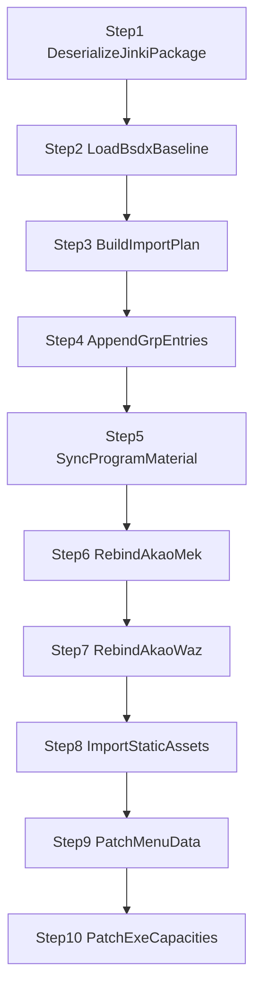

# JINKI -> BSDX 迁移

## 定位

这个包负责把 `AKAO / moribito_2` 从 `JINKI` 并入 `BSDX`。

它不是 `BHE -> BSDX` 的语义转译，而是同引擎资源 graft：

- 源包：`src/main/resources/game/jinki`
- 目标包：`src/main/resources/game/bsdx`
- 核心问题：资源闭包导入、`grp` 顶层追加、内部索引重绑、最终 exe 容量 patch

## 规范输入

当前 pipeline 只认包内资源：

- `src/main/resources/game/jinki/grp`
- `src/main/resources/game/jinki/dat`
- `src/main/resources/game/jinki/mek`
- `src/main/resources/game/jinki/spm`
- `src/main/resources/game/jinki/waz`

项目外目录：

- `D:\BDY\NeXAS_Resources\jinki_resources`

当前不作为 pipeline 主输入，只在后续补静态资源时作为补充源。

## 当前最小闭包

`mek`

- `Akao.mek`

`waz`

- `Akao.waz`
- `Bomb.waz`
- `Effect.waz`
- `Tama01.waz`
- `Tama02.waz`
- `Tama03.waz`
- `Tama04.waz`
- `Tama05.waz`

`spm`

- `moribito_2.spm`
- `C_moribito_2.spm`
- `G_moribito_2.spm`
- `M_moribito_2.spm`
- `Fire.spm`

`grp`

- `BatVoice.grp`
- `MekaGroup.grp`
- `SeGroup.grp`
- `SpriteGroup.grp`
- `WazaGroup.grp`

`dat`

- `Meka.dat`
- `MekaPilot.dat`

## 核心事实

### 1. AKAO 的主 SPM 不是 `AKAO.spm`

当前迁移主链使用的是：

- `SpriteGroup` 内的 `0001 -> moribito_2.spm`

因此迁移时不能追加 `AKAO -> akao.spm`，而是要把 `moribito_2.spm` 这条注册链挂进 BSDX。

### 2. `Akao.mek` 和 `Akao.waz` 都要重绑

`Akao.mek` 当前确认要改：

- `mekBasicInfo.wazFileSequence`
- `mekBasicInfo.spmFileSequence`

`Akao.waz` 当前确认要改：

- `CEventWazaSelect.wazFileNo`
- `CEventSprite.spmFileSequence`

说明：

- `CEventWazaSelect.wazSequenceNo` 仍然解释为目标 `waz` 文件内部的 skill 索引
- `MekWeaponInfo.wazSequence` 仍然解释为 `Akao.waz` 内部 skill 索引

### 3. `ProgramMaterial.grp` 必须同步

当前已经确认：

- `ProgramMaterial.array1` 对齐 `SpriteGroup`
- `ProgramMaterial.array2` 对齐 `SeGroup`
- `ProgramMaterial.array3` 对齐 `BatVoice`

因此这次追加 `SpriteGroup` 和 `BatVoice` 顶层条目之后，必须同步补外层长度。

## 当前主链



## 当前步骤说明

### Step 1. `DeserializeJinkiPackageStep`

反序列化包内 `JINKI` 资源，输出 `JinkiPackageBundle`。

### Step 2. `LoadBsdxBaselineStep`

加载 `BSDX` 基线资源，输出 `BsdxBaselineBundle`。

### Step 3. `BuildImportPlanStep`

不再做文件级 diff，而是直接生成 `JinkiImportPlan`。

当前会输出：

- `requiredMekFiles`
- `requiredWazFiles`
- `requiredSpmFiles`
- `grpAppendTargets`
- `programMaterialSyncTargets`
- `mekRebindTargets`
- `wazRebindTargets`
- `sourceSpriteIndexByFileName`
- `sourceWazIndexByFileName`
- `targetSpriteIndexByFileName`
- `targetWazIndexByFileName`

其中最后四组映射，是 `step7` 做 `waz` 内部重绑时的直接输入。

### Step 4. `AppendGrpEntriesStep`

当前策略：

- 同名就复用
- 否则尾插
- 不占 `existFlag=0` 空槽

当前 `AKAO` 这条线跑出的目标索引是：

- `MekaGroup = 103`
- `WazaGroup = 110`
- `SpriteGroup = 138`
- `BatVoice = 30`

### Step 5. `SyncProgramMaterialStep`

当前只同步外层长度：

- `array1 -> SpriteGroup.size()`
- `array2 -> SeGroup.size()`
- `array3 -> BatVoice.size()`

### Step 6. `RebindAkaoMekStep`

当前已经按 `Mek` 分片重建，并且真正回写了：

- `mekBasicInfo.wazFileSequence`
- `mekBasicInfo.spmFileSequence`

其余分片当前是“显式深拷贝，保留原语义”，没有贸然改绑。

### Step 7. `RebindAkaoWazStep`

当前已经按 `Waz -> Skill -> Phase -> Unit -> Object` 的层级重建。

已实现的关键点：

- 主装配器 + 上下文对象
- `Skill / Phase / Unit` 全量重建
- `SkillInfoUnknown` 重建
- `CEventWazaSelect.wazFileNo` 重绑到目标 `WazaGroup` 索引
- `CEventSprite.spmFileSequence` 重绑到目标 `SpriteGroup` 索引
- `CEventEffect`、`CEventEscape`、`CEventCamera` 这类带 `*UnitList` 的对象，内部 `data` 递归重建
- `CEventSe` / `CEventVoice` 的 `byte[]` 列表做数组级复制

当前设计原则：

- 不是只做一层深拷贝
- 会递归进入嵌套 unit 的 `data`
- 只对已经确认语义的外部编号做回写

### Step 8. `ImportStaticAssetsStep`

当前仍是占位。

### Step 9. `PatchMenuDataStep`

当前仍是占位。

### Step 10. `PatchExeCapacitiesStep`

当前采取固定绝对偏移 patch：

- 先把 exe 读成 `byte[]`
- 按固定偏移覆写
- 产出到 `src/main/resources/out`
- 文件名格式：`原名_时间戳.exe`

注意：

- 这个步骤现在已经后移到主链末尾
- 只有前置数据步骤都跑完之后，才会输出 patched exe

## 运行方式

主入口：

- `com.giga.nexas.transfer.jinki2bsdx.Jinki2BsdxSingleRunner`

直接运行：

```java
Jinki2BsdxSingleRunner.main(args);
```

Maven 运行：

```bash
mvn exec:java -Dexec.mainClass="com.giga.nexas.transfer.jinki2bsdx.Jinki2BsdxSingleRunner"
```

## 测试入口

- `src/test/java/com/giga/nexas/jinki/TestJinki2BsdxRunner.java`

## 当前状态

已完成：

- `step1`
- `step2`
- `step3`
- `step4`
- `step5`
- `step6`
- `step7` 的主装配骨架和关键索引重绑
- `runner`
- `test` 启动入口

未完成：

- `step8 ImportStaticAssets`
- `step9 PatchMenuData`
- `step10` 更通用的容量汇总策略

## 当前修正口径

`step3/4/7` 当前已经按下面这个模型对齐：

1. 先从 `JINKI` 抽出当前机体实际用到的资源链和索引链  
   当前已覆盖：
   - `CEventWazaSelect.wazFileNo`
   - `CEventSprite.spmFileSequence`
   - `CEventSe` 的 `group/item`

2. 再在 `step4` 对链上的每个资源做“复用还是尾插”的决策

3. 形成统一的 `JINKI源索引 -> BSDX目标索引` 结果表

4. `step6/7` 只按这张结果表做内部重定向  
   不再把“BSDX 基线旧索引表”直接当成最终目标表
