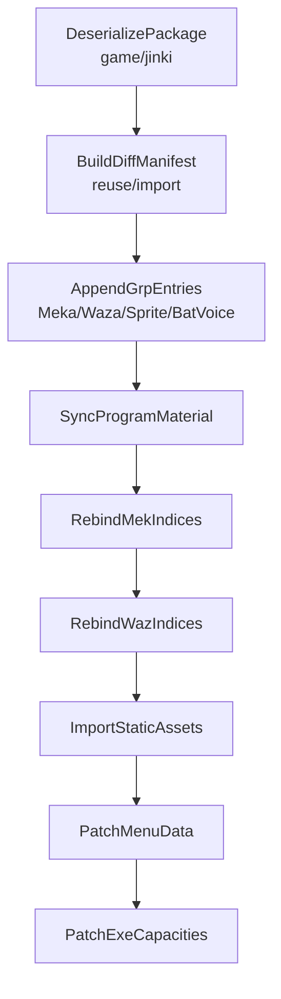

# JINKI -> BSDX 迁移

## 目标

这个包是 `AKAO / moribito_2` 并入 BSDX 的正式项目落点。

它不是 `BHE -> BSDX` 转译任务。
它的正确定位是同引擎资源 graft：

- 源包：`src/main/resources/game/jinki`
- 目标包：`src/main/resources/game/bsdx`
- 源和目标都属于 BSDX 系引擎资源
- 真正的问题是资源包追加、索引重绑、以及运行时容量 patch

## 为什么要独立于 `bhe2bsdx`

`bhe2bsdx` 解决的是 BHE 数据转成 BSDX 数据的跨游戏语义转译问题。

`jinki2bsdx` 解决的是另一类问题：

- 不做 BHE 语义转译
- 不依赖 BHE slot map
- 不默认“替换 Nanoha 槽位”
- 目标是把一个新角色真正追加进 BSDX

所以项目结构上应该明确拆成：

- `transfer/bhe2bsdx`：跨游戏语义转译 pipeline
- `transfer/jinki2bsdx`：同引擎资源 graft pipeline

## 规范输入源

这条 pipeline 的规范输入只能是项目包内的二进制资源：

- `src/main/resources/game/jinki/grp`
- `src/main/resources/game/jinki/dat`
- `src/main/resources/game/jinki/mek`
- `src/main/resources/game/jinki/spm`
- `src/main/resources/game/jinki/waz`

项目外目录：

- `D:\BDY\NeXAS_Resources\jinki_resources`

不是测试输入。
它只在真正移植时作为后续静态资源补充源使用。

## 当前最小资源闭包

当前已经从 `game/jinki` 确认出来的最小二进制闭包是：

### grp

- `BatVoice.grp`
- `MekaGroup.grp`
- `SeGroup.grp`
- `SpriteGroup.grp`
- `WazaGroup.grp`

### dat

- `Meka.dat`
- `MekaPilot.dat`

### mek

- `Akao.mek`

### spm

- `moribito_2.spm`
- `C_moribito_2.spm`
- `G_moribito_2.spm`
- `M_moribito_2.spm`
- `Fire.spm`

### waz

- `Akao.waz`
- `Bomb.waz`
- `Effect.waz`
- `Tama01.waz`
- `Tama02.waz`
- `Tama03.waz`
- `Tama04.waz`
- `Tama05.waz`

## 核心迁移事实

### 1. 不能直接拿主 BSDX 里同名的 Akao 散装资源当真源

即使主 BSDX 里已经有：

- `game/bsdx/mek/Akao.mek`
- `game/bsdx/waz/Akao.waz`

也不能把它们直接当成这次迁移的规范源。
当前权威源仍然是 `game/jinki`。

原因是：

- 包内 `jinki` 资源才是当前验证过的测试基线
- 同名文件不代表字节一致
- 就算名字相同，共享 grp 行里的参数也可能不同

所以面对同名资源时，规则应该是：

1. 先做字节级 diff
2. 一致才复用
3. 不一致就导入 `jinki` 版本，并重绑全部外部引用

### 2. AKAO 的主 SPM 不是 `AKAO.spm`

这是迁移里最关键的事实之一。

从包内数据可以确认：

- `Akao.mek.mekBasicInfo.spmFileSequence = 33`
- `jinki SpriteGroup[33] = 0001 -> moribito_2.spm`

也就是说，主机体精灵链其实是：

- `AKAO`
- `0001`
- `moribito_2.spm`

错误做法是：

- 追加 `AKAO -> akao.spm`

正确做法是：

- 追加 `0001 -> moribito_2.spm`

### 3. `Akao.mek` 和 `Akao.waz` 都必须重绑索引

迁移不是“拷文件”这么简单。

至少要处理：

- `Akao.mek.mekBasicInfo.wazFileSequence`
  - 重绑到 BSDX 新的 `WazaGroup` 索引
- `Akao.mek.mekBasicInfo.spmFileSequence`
  - 重绑到 BSDX 新的 `SpriteGroup` 索引
- `Akao.waz` 里全部外部 `spmFileSequence`
  - 从 JINKI 的 sprite 索引重绑到 BSDX 新索引
- `Akao.waz` 里全部外部 `wazFileNo`
  - 按最终的复用/导入 manifest 重绑

补充一条必须记清：

- `MekWeaponInfo.wazSequence` 指向的是 `Akao.waz` 内部 `skillList` 索引
- 它不是 `WazaGroup.grp` 的顶层索引

### 4. `ProgramMaterial.grp` 必须同步

顶层 grp 追加不是孤立动作。
当前已经确认的 BSDX 规则是：

- `ProgramMaterial.array1` 外层长度跟 `SpriteGroup` 一致
- `ProgramMaterial.array2` 外层长度跟 `SeGroup` 一致
- `ProgramMaterial.array3` 外层长度跟 `BatVoice` 一致

所以如果 AKAO 迁移要追加：

- 一个新的 `SpriteGroup` 条目
- 一个新的 `BatVoice` 条目

那就必须同步追加：

- 一个新的 `ProgramMaterial.array1` 槽位
- 一个新的 `ProgramMaterial.array3` 槽位

第一轮允许空槽位。
但绝不允许外层长度不一致。

## 迁移主链

## 阶段 A：先打通战斗可用版

第一阶段目标是：

- 让 AKAO 作为新机体进入 BSDX 的战斗加载链
- 菜单可见性可以先不要求完整

### Step 1. 反序列化包内输入

只使用：

- `game/jinki/grp`
- `game/jinki/dat`
- `game/jinki/mek`
- `game/jinki/spm`
- `game/jinki/waz`

### Step 2. 生成复用/导入 manifest

把 `jinki` 和主 BSDX 的共享依赖做 diff，至少包括：

- `Effect.waz`
- `Bomb.waz`
- `Tama01..05.waz`
- `Fire.spm`

输出形状应该稳定且明确，例如：

- `reuse: [...]`
- `import: [...]`
- `wazIndexMap: {...}`
- `spriteIndexMap: {...}`

后面所有步骤都按 manifest 走，不允许现场靠文件名临时猜。

### Step 3. 追加 grp 顶层条目

这里只追加 AKAO 分支真正需要的行：

- `MekaGroup`：追加 `AKAO`
- `WazaGroup`：追加 `AKAO`
- `SpriteGroup`：追加 `0001 -> moribito_2.spm`
- `BatVoice`：追加 `AKAO`

不要整批合并 JINKI 的 grp。
不要因为名字像就覆盖主 BSDX 现有共享行。

### Step 4. 同步 `ProgramMaterial.grp`

在 grp 顶层条目追加之后：

- `array1` 补一格给新的 `SpriteGroup`
- `array3` 补一格给新的 `BatVoice`

如果没有新增顶层 `SeGroup`，就先不要动 `array2`。

### Step 5. 重绑 `Akao.mek`

回写：

- `wazFileSequence`
- `spmFileSequence`

让它们指向 Step 3 追加后得到的最终 BSDX 索引。

### Step 6. 重绑 `Akao.waz`

回写：

- 外部 `spmFileSequence`
- 外部 `wazFileNo`

这些都必须基于 Step 2 生成的 manifest 来重绑。

当前已知一个简化条件：

- 包内 `Akao.waz` 的外部 `spmFileSequence` 只出现 `-1` 和 `33`

所以所有外部 `33` 都应该被改成：

- `0001 -> moribito_2.spm` 在 BSDX 中的新索引

### Step 7. 导入静态资源

把不能安全复用的静态资源补进输出集：

- `moribito_2.spm`
- `C_moribito_2.spm`
- `G_moribito_2.spm`
- `M_moribito_2.spm`
- 被判定为导入的依赖 `waz/spm`
- 后续需要时再补项目外音频、头像、UI 图

## 阶段 B：再补菜单可见版

等阶段 A 稳定后，再去补菜单层资源：

- `Meka.dat`
- `MekaPilot.dat`
- 菜单侧 `spm`
- 后续头像、语音、UI 资源

这个阶段要和“战斗可用版”严格分开，不要混在一轮里做。

## exe patch 预留

真正的“新角色追加”必须预留 exe patch。

不是因为每个 grp 文件读取都是写死长度。
很多 grp 的文件读取本身是动态的。
真正的阻塞点是 exe 里的运行时容量表。

当前已经确认的方向是：

- `153` 是武装页那一侧的硬上限，但不是 AKAO 当前第一优先阻塞
- 对 AKAO 这种“真追加新机体”，要优先盯住机体侧 `103` 这组容量链

所以这条分支的正式规则应该是：

- 先完成数据 graft
- 但最终方案必须始终预留 exe 容量 patch

## 这个包后续应当承载的内容

这个包后面应该逐步长成：

- `Jinki2BsdxTransfer`
- `AkaoGraftPipeline`
- 包级 README 和实现说明
- 共享资源 diff manifest 生成器
- grp 追加与 `ProgramMaterial` 同步逻辑
- `Akao.mek / Akao.waz` 重绑逻辑
- 可选的菜单 patch 层
- 可选的 exe patch 辅助资料
