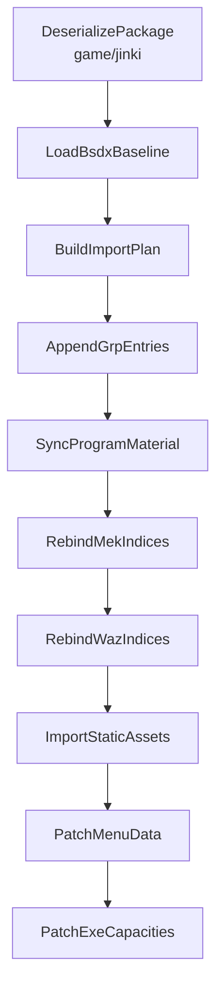

# JINKI -> BSDX 迁移

## 定位

这个包负责把 `AKAO / moribito_2` 这条 JINKI 资源链正式并入 BSDX。

它不是 `BHE -> BSDX` 转译。
它的正确定位是同引擎资源 graft：

- 源包：`src/main/resources/game/jinki`
- 目标包：`src/main/resources/game/bsdx`
- 核心问题：资源闭包导入、grp 追加、索引重绑、运行时容量 patch

## 为什么独立于 `bhe2bsdx`

`bhe2bsdx` 解决的是跨游戏语义转译。

`jinki2bsdx` 解决的是：

- 不做 BHE 语义转译
- 不使用 BHE slot map
- 不默认替换旧槽位
- 目标是把新机体真正追加进 BSDX

所以项目结构上必须独立：

- `transfer/bhe2bsdx`
- `transfer/jinki2bsdx`

## 规范输入

当前这条 pipeline 的规范输入只认项目包内资源：

- `src/main/resources/game/jinki/grp`
- `src/main/resources/game/jinki/dat`
- `src/main/resources/game/jinki/mek`
- `src/main/resources/game/jinki/spm`
- `src/main/resources/game/jinki/waz`

项目外目录：

- `D:\BDY\NeXAS_Resources\jinki_resources`

当前不作为 pipeline 输入，只在后续补静态资源时作为补充源。

## 当前最小资源闭包

### grp

- `BatVoice.grp`
- `MekaGroup.grp`
- `SeGroup.grp`
- `SpriteGroup.grp`
- `WazaGroup.grp`

### dat

- `Meka.dat`
- `MekaPilot.dat`

### mek

- `Akao.mek`

### spm

- `moribito_2.spm`
- `C_moribito_2.spm`
- `G_moribito_2.spm`
- `M_moribito_2.spm`
- `Fire.spm`

### waz

- `Akao.waz`
- `Bomb.waz`
- `Effect.waz`
- `Tama01.waz`
- `Tama02.waz`
- `Tama03.waz`
- `Tama04.waz`
- `Tama05.waz`

## 核心事实

### 1. `AKAO` 的主 SPM 不是 `AKAO.spm`

当前已经确认：

- `Akao.mek.mekBasicInfo.spmFileSequence = 133`
- JINKI 的 `SpriteGroup` 中，`moribito_2.spm` 才是 AKAO 的主机体精灵链入口

所以迁移时不能追加：

- `AKAO -> akao.spm`

正确做法是追加：

- `0001 -> moribito_2.spm`

### 2. `Akao.mek` 和 `Akao.waz` 都必须重绑

最少要处理：

- `Akao.mek.mekBasicInfo.wazFileSequence`
- `Akao.mek.mekBasicInfo.spmFileSequence`
- `Akao.waz` 外部 `spmFileSequence`
- `Akao.waz` 外部 `wazFileNo`

补充：

- `MekWeaponInfo.wazSequence` 指向的是 `Akao.waz` 内部 skill 索引
- 它不是 `WazaGroup.grp` 顶层索引

### 3. `ProgramMaterial.grp` 必须同步

当前已经确认：

- `ProgramMaterial.array1` 跟 `SpriteGroup` 顶层长度一致
- `ProgramMaterial.array2` 跟 `SeGroup` 顶层长度一致
- `ProgramMaterial.array3` 跟 `BatVoice` 顶层长度一致

所以只要 AKAO 迁移追加了：

- 新 `SpriteGroup` 条目
- 新 `BatVoice` 条目

就必须同步补：

- `ProgramMaterial.array1`
- `ProgramMaterial.array3`

## 当前主链



## Step 1

反序列化 JINKI 包内的：

- grp
- dat
- mek
- spm
- waz

输出到 `JinkiPackageBundle`。

## Step 2

加载 BSDX 基线容器：

- grp
- dat
- mek
- spm
- waz
- `ProgramMaterial.grp`

输出到 `BsdxBaselineBundle`。

## Step 3

不再做文件级 diff。

当前 step3 的职责已经改成：

- 生成 `JinkiImportPlan`
- 默认把 JINKI 闭包整体视为导入输入
- 明确后面有哪些 grp 追加目标
- 明确后面有哪些 mek/waz 重绑目标
- 记录 JINKI 侧当前的源索引，方便后面真正做重绑

当前这一步输出的重点是：

- `requiredMekFiles`
- `requiredWazFiles`
- `requiredSpmFiles`
- `grpAppendTargets`
- `programMaterialSyncTargets`
- `mekRebindTargets`
- `wazRebindTargets`

## 为什么不再做 diff

对 AKAO 这条线来说，文件级 diff 没有实际意义。

原因是：

- 当前迁移前提就是以 `jinki` 作为真源
- 目标是“真追加 graft”，不是最大化复用主 BSDX loose file
- 同名资源即使存在，也默认不能信任
- 实测结果也已经验证，当前这批资源实际上全部会走导入

所以 step3 继续保留成 `diff/reuse-import manifest` 只会误导流程。

## 当前运行方式

当前可以通过：

- `com.giga.nexas.transfer.jinki2bsdx.Jinki2BsdxSingleRunner`

直接启动。

### main 方式

```java
Jinki2BsdxSingleRunner.main(args);
```

### Maven 方式

```bash
mvn exec:java -Dexec.mainClass="com.giga.nexas.transfer.jinki2bsdx.Jinki2BsdxSingleRunner"
```

## 当前测试入口

当前测试侧可以通过：

- `src/test/java/com/giga/nexas/jinki/TestJinki2BsdxRunner.java`

直接拉起 runner。

## 当前状态

当前已完成：

- step1
- step2
- step3
- single runner
- test 启动入口

当前未完成：

- step4 `AppendGrpEntries`
- step5 `SyncProgramMaterial`
- step6 `RebindAkaoMek`
- step7 `RebindAkaoWaz`
- step8 以后所有真正写盘逻辑

## exe patch 预留

真正的新机体追加必须始终预留 exe patch。

当前已确认方向：

- `153` 是武装页那一侧的硬上限，但不是 AKAO 当前第一优先阻塞
- 对 AKAO 这种新机体 graft，更应优先关注机体侧 `103` 这组容量链
