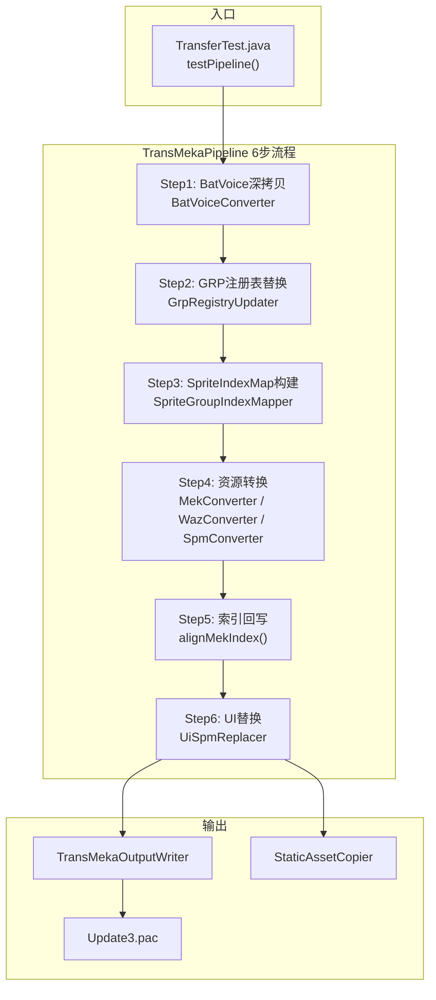
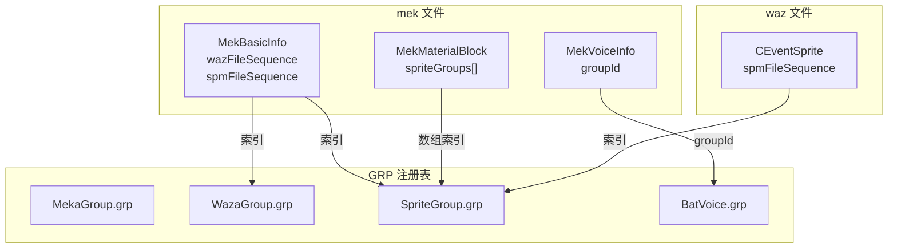
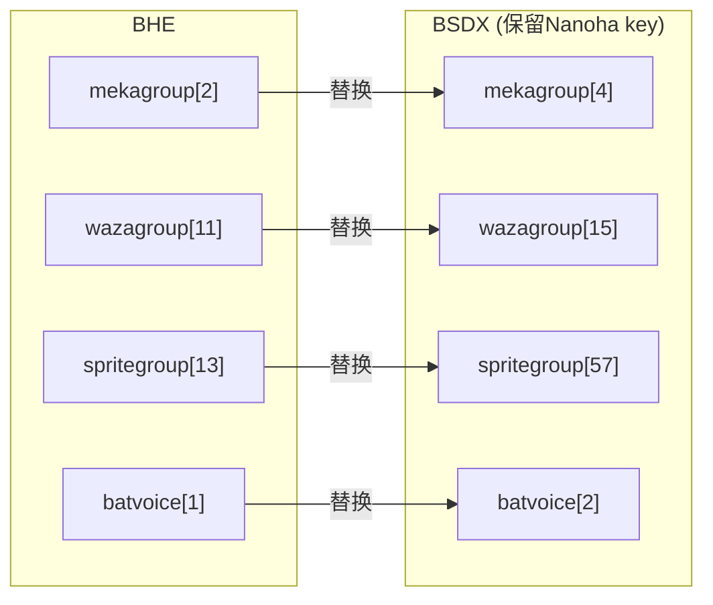
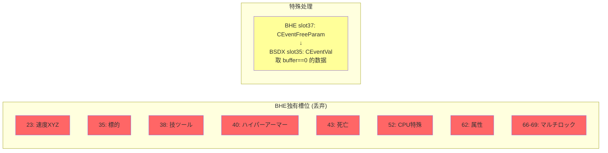
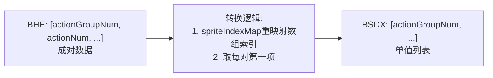
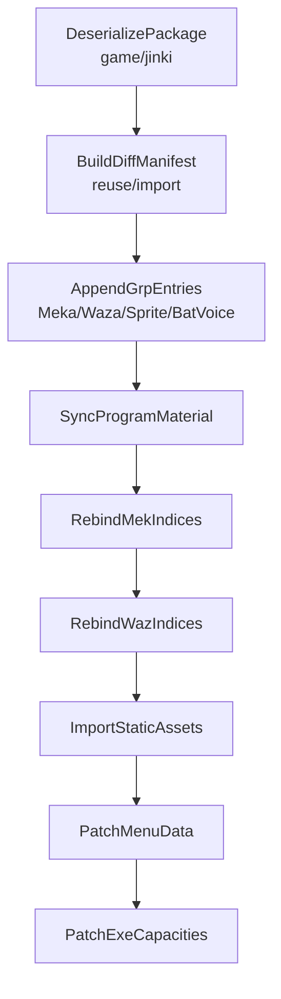

# BHE → BSDX 移植系统

将 Baldr Heart EXE (BHE) 角色资源移植到 Baldr Sky DiveX (BSDX)。

---

## 系统架构



---

## 文件关系



---

## 索引映射 (Tsukuyomi → Nanoha)



**输出文件名**: `nanoha.mek`, `nanoha.waz`, `zako_021a.spm` (沿用Nanoha槽位)

---

## WAZ 槽位映射 (83→72)



**代码**: `WazConverter.java:271-384` (bheToBsdxSlotMap)

---

## MekMaterialBlock.spriteGroups 转换



**代码**: `MekMaterialConverter.java:91-144`

---

## 代码位置

| 模块 | 文件 | 关键方法 |
|------|------|----------|
| 流程编排 | `TransMekaPipeline.java` | `execute()` |
| BatVoice | `BatVoiceConverter.java` | `convert()` |
| GRP更新 | `GrpRegistryUpdater.java` | `findXxxByCode()`, `replaceXxxAtIndex()` |
| Sprite映射 | `SpriteGroupIndexMapper.java` | `buildMapByName()` |
| Mek转换 | `MekConverter.java` | `convert()` |
| Mek AI | `MekAiConverter.java` | `convert()` |
| Mek Voice | `MekVoiceConverter.java` | `convert()` |
| Mek Material | `MekMaterialConverter.java` | `convert()`, `convertSpriteGroups()` |
| Waz转换 | `WazConverter.java` | `convert()`, `bheToBsdxSlotMap()` |
| Waz校验 | `WazSequenceSanitizer.java` | `sanitize()` |
| Spm转换 | `SpmConverter.java` | `convert()` |
| UI替换 | `UiSpmReplacer.java` | `replaceNanohaWithTsukuyomi()` |
| 输出 | `TransMekaOutputWriter.java` | `write()` |
| 资源复制 | `StaticAssetCopier.java` | `copy()` |

---

## AKAO 迁移分支

`AKAO / moribito_2` 不属于这套 README 上面描述的 `BHE -> BSDX` 转译主线。

它的正确口径是：

- `BSDX-compatible package graft`
- 也就是把同引擎、不同游戏的 BSDX 同构资源包，作为新角色 graft 到主 BSDX

因此它和 `Tsukuyomi -> Nanoha` 这种“覆盖目标槽位”的流程不同：

1. 它不是从 BHE 语义重编译过来
2. 它不是默认覆盖旧槽位
3. 它的目标是 **真追加一个新角色**

当前推荐把 `AKAO` 写成单独 pipeline：



关键区别：

- `AppendGrpEntries` 不是覆盖旧槽位，而是追加 `AKAO` 和 `0001 -> moribito_2.spm`
- `RebindMekIndices / RebindWazIndices` 不是走 BHE slot map，而是走目标 BSDX 新索引回写
- `PatchExeCapacities` 第一优先不是 `153`，而是先验证 `103` 这一侧的机体运行时容量

详细方案见：

- `src/main/resources/research/06-akao-bsdx-graft-plan.md`

后续如果要把 `AKAO` 真的写进现有 pipeline 代码，建议新开一条：

- `AkaoGraftPipeline`

而不是把它硬塞进现有 `TransMekaPipeline.execute()` 里混着走。

---

## 已修复问题

| Bug | 文件:行号 | 问题 | 修复 |
|-----|-----------|------|------|
| #1 | `WazConverter.java:122` | slot37 buffer条件写反 | `buffer == 0` + break |
| #2 | `MekMaterialConverter.java:22` | CLEAR_MATERIAL_GROUPS=true | 改为 false |
| #3 | `MekVoiceConverter.java:15` | CLEAR_VOICE_TABLES=true | 改为 false |
| #4 | `MekMaterialConverter.java:91-144` | spriteIndexMap误用于actionGroupNum | 改为重映射数组索引 |
| #5 | 12个trans*方法 | `BeanUtil.copyProperties`覆盖typeId | 在copyProperties后恢复`inner.typeId = XXX_TYPES[i].getType()` |
| #6 | `WazConverter.java:120-124` | slot37→35时CEventVal字段为null | 添加默认值初始化 `int1=0,int2=0,int3=0,int4=0` |

### #5 typeId恢复 - 涉及文件

| 文件 | 行号 |
|------|------|
| `CEventHit.java` | 403 |
| `CEventNokezori.java` | 207 |
| `CEventCharge.java` | 140 |
| `CEventCamera.java` | 146 |
| `CEventHeight.java` | 148 |
| `CEventEscape.java` | 183 |
| `CEventStatus.java` | 210 |
| `CEventEffect.java` | 245 |
| `CEventRadialLine.java` | 199 |
| `CEventScreenLine.java` | 187 |
| `CEventScreenEffect.java` | 160 |
| `CEventCpuButton.java` | 181 |

---

## 待解决

- `MekVoiceInfo.groupId`: BHE范围6-62 > BSDX组数30
- `wazagroup.param`: BHE/BSDX同名参数不一致
- `segroup`: 已纳入映射流程，按 `seFileName` 映射并自动补齐到 BSDX `segroup[11]`；`CEventSe.byteDataList` 的 `(group,seq)` 引用会重写
- `skillInfoUnknownList`: 部分槽位被丢弃

---

## 运行

```bash
mvn "-Dtest=com.giga.nexas.bhe2bsdx.TransferTest#testPipeline" test
```

输出: `src/main/resources/testBhe/` → `Update3.pac`
