# BHE → BSDX 移植流程详细报告

## 目录

1. [概述](#概述)
2. [主流程图](#主流程图)
3. [Step 1-2: BatVoice 与 GRP 注册表](#step-1-2-batvoice-与-grp-注册表)
4. [Step 3: SpriteIndexMap 构建](#step-3-spriteindexmap-构建)
5. [Step 4: 核心资源转换](#step-4-核心资源转换)
6. [Step 5-6: 索引回写与 UI 替换](#step-5-6-索引回写与-ui-替换)
7. [数据结构差异对照表](#数据结构差异对照表)
8. [已知问题与修复记录](#已知问题与修复记录)

---

## 概述

本模块实现将 **Baldr Heart EXE (BHE)** 的机体资源移植到 **Baldr Sky DiveX (BSDX)** 的功能。

### 涉及的文件类型

| 类型 | BHE 文件 | BSDX 文件 | 说明 |
|------|----------|-----------|------|
| 机体数据 | `tsukuyomi.mek` | `nanoha.mek` | 机体属性、武装、AI、语音 |
| 技能数据 | `tsukuyomi.waz` | `nanoha.waz` | 技能帧数据、事件 |
| 精灵数据 | `c_tsukuyomi.spm` | `c_nanoha.spm` | 动画、hitbox |
| 注册表 | `mekagroup.grp` | `MekaGroup.grp` | 机体索引注册 |
| 语音组 | `batvoice.grp` | `BatVoice.grp` | 战斗语音 |

---

## 主流程图

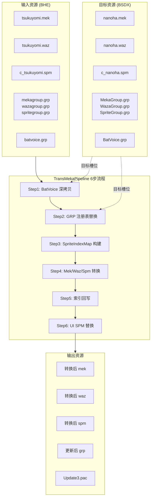

---

## Step 1-2: BatVoice 与 GRP 注册表

### Step 1: BatVoice 深拷贝

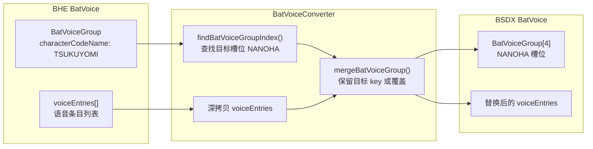

**代码位置**: `BatVoiceConverter.java`

**关键逻辑**:
```java
// 查找目标槽位
int batVoiceIndex = findBatVoiceGroupIndex(bsdxBatVoice, "NANOHA");
// 深拷贝并替换
BatVoiceGroup converted = batVoiceConverter.convert(bheBatVoiceGroup);
bsdxBatVoice.getVoiceList().set(batVoiceIndex, merged);
```

### Step 2: GRP 注册表替换

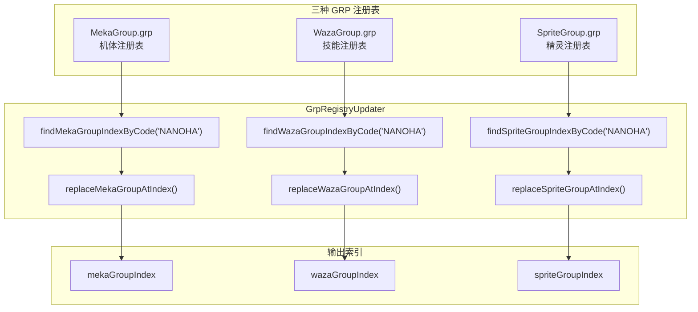

**代码位置**: `GrpRegistryUpdater.java`

**关键逻辑**:
```java
// 按 codeName 查找索引
int mekaIndex = findMekaGroupIndexByCode(bsdxMekaGroup, "NANOHA");
// 替换注册表条目
replaceMekaGroupAtIndex(bsdxMekaGroup, mekaIndex, bheMekaGroup, keepTargetKey);
```

---

## Step 3: SpriteIndexMap 构建

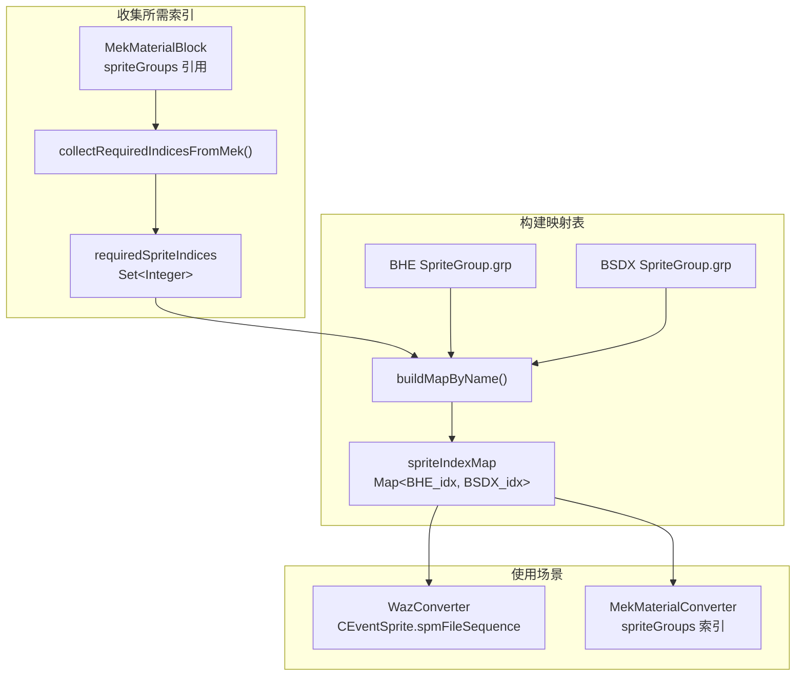

**代码位置**: `SpriteGroupIndexMapper.java`

**关键逻辑**:
```java
// 从 mek 的 materialBlock 收集需要的 sprite 索引
Set<Integer> required = collectRequiredIndicesFromMek(bheMek);
// 按名称匹配构建 BHE→BSDX 索引映射
Map<Integer, Integer> spriteIndexMap = buildMapByName(bheSpriteGroup, bsdxSpriteGroup, required);
```

---

## Step 4: 核心资源转换

### 4.1 MekConverter 总览

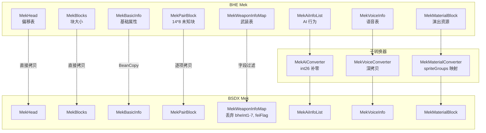

**代码位置**: `MekConverter.java`, `MekAiConverter.java`, `MekVoiceConverter.java`, `MekMaterialConverter.java`

### 4.2 WazConverter 详细流程

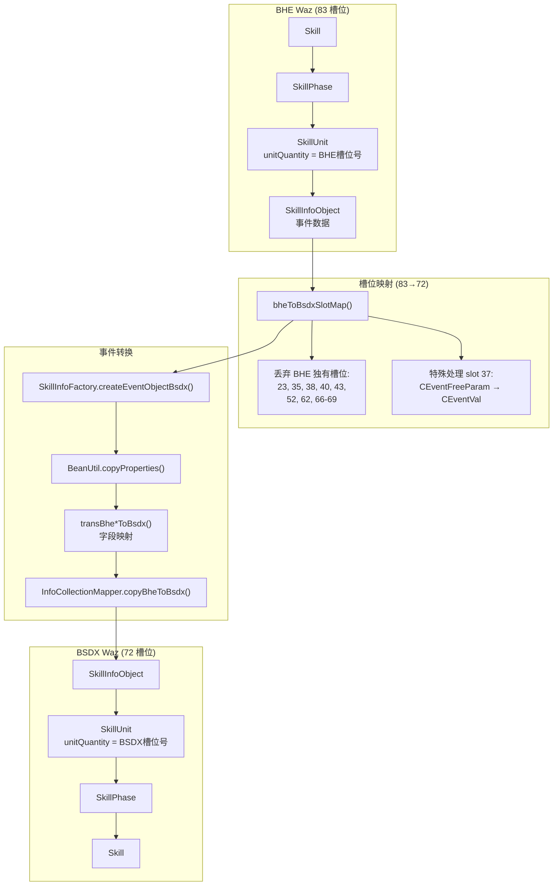

**代码位置**: `WazConverter.java`

### 4.3 WazConverter 槽位映射详表

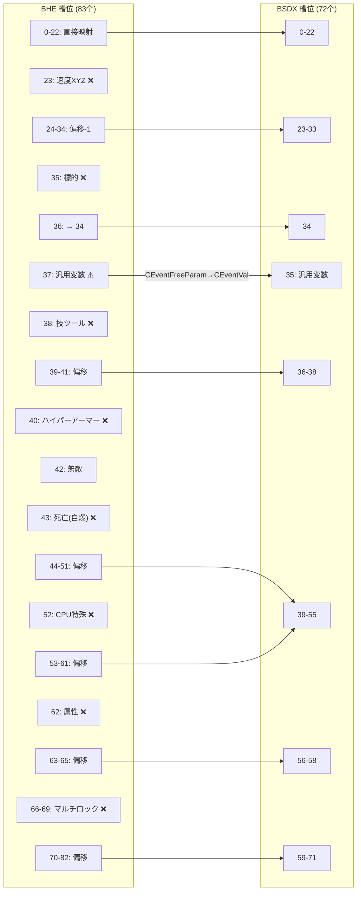

### 4.4 CEventHit 子槽位映射 (41→33)

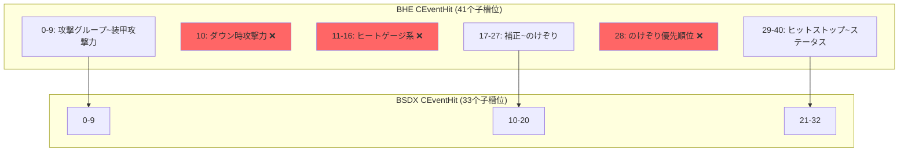

**代码位置**: `CEventHit.java:367-372`

```java
final int[] bheToBsdxIdx = {
    0, 1, 2, 3, 4, 5, 6, 7, 8, 9,  // 0-9 直接映射
    -1, -1, -1, -1, -1, -1, -1,    // 10-16 丢弃 (BHE独有)
    10, 11, 12, 13, 14, 15, 16, 17, 18, 19, 20,  // 17-27 → 10-20
    -1,                            // 28 丢弃 (のけぞり優先順位)
    21, 22, 23, 24, 25, 26, 27, 28, 29, 30, 31, 32  // 29-40 → 21-32
};
```

### 4.5 SpmConverter 流程

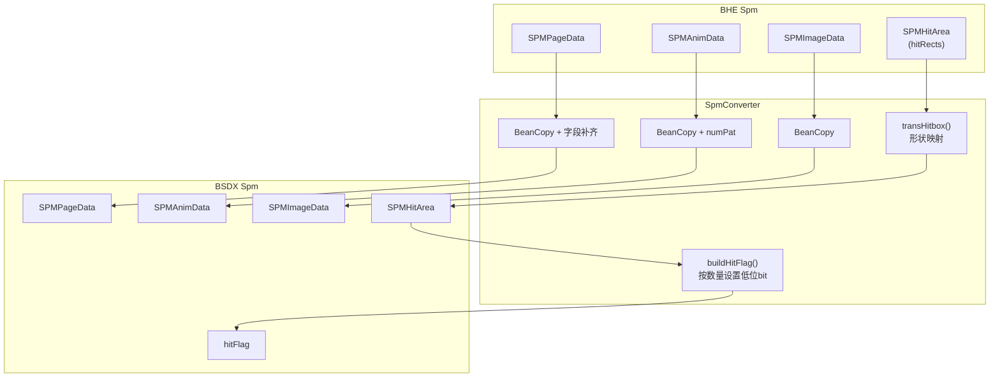

**代码位置**: `SpmConverter.java`

---

## Step 5-6: 索引回写与 UI 替换

### Step 5: 索引回写

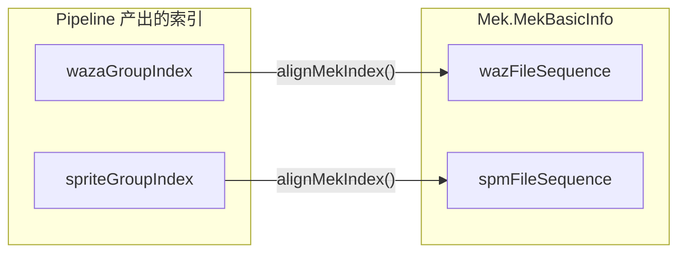

**代码位置**: `TransMekaPipeline.java:172-182`

```java
private void alignMekIndex(Mek mek, int wazaIndex, int spriteIndex) {
    if (wazaIndex >= 0) {
        mek.getMekBasicInfo().setWazFileSequence(wazaIndex);
    }
    if (spriteIndex >= 0) {
        mek.getMekBasicInfo().setSpmFileSequence(spriteIndex);
    }
}
```

### Step 6: UI SPM 替换

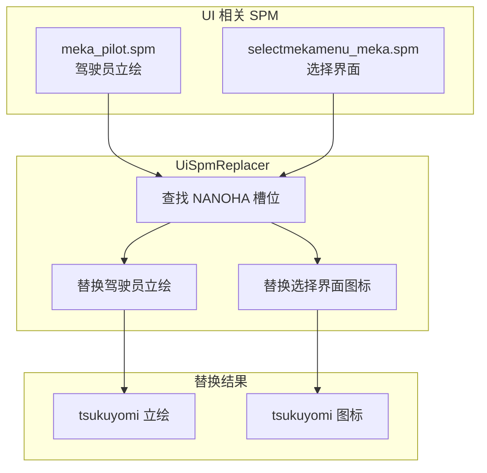

**代码位置**: `UiSpmReplacer.java`

---

## 数据结构差异对照表

### MekWeaponInfo 字段差异

| 字段位置 | BHE 字段 | BSDX 字段 | 处理方式 |
|----------|----------|-----------|----------|
| 6 | bheInt1 (炎熱発動) | upgradeExp | 丢弃 |
| 7 | bheInt2 (排熱発動) | startPointWhenDemonstrate | 丢弃 |
| 8 | upgradeExp | weaponCategory | 按名称映射 |
| 9 | startPointWhenDemonstrate | weaponType | 按名称映射 |
| 10-11 | bheInt3, bheInt4 | flags... | 丢弃 |
| 12 | weaponCategory | - | 按名称映射 |
| 13 | weaponType | - | 按名称映射 |
| 14-15 | bheInt5, bheInt6 | - | 丢弃 |
| 末尾 | bheInt7, feiFlag, feiList | - | 丢弃 |

### MekMaterialBlock.spriteGroups 差异

| 特性 | BHE | BSDX |
|------|-----|------|
| 数组结构 | `spriteGroups[spriteIndex]` | `spriteGroups[spriteIndex]` |
| 元素格式 | `[actionGroupNum, actionNum, ...]` 成对 | `[actionGroupNum, ...]` 单值 |
| 处理方式 | 取每对的第一项 (actionGroupNum) | 直接使用 |
| 索引映射 | 数组索引通过 spriteIndexMap 重映射 | - |

**重要**: `spriteIndexMap` 用于重映射数组索引（即 `spriteGroups[bheIndex]` → `spriteGroups[bsdxIndex]`），而不是重映射元素值（actionGroupNum）。

### InfoCollection 字段名差异

| 事件类型 | BHE 字段名 | BSDX 字段名 |
|----------|------------|-------------|
| CEventTerm | bheInfoCollectionList | bsdxInfoCollectionList |
| CEventMove | bheInfoCollectionList1/2 | bsdxInfoCollectionList1/2 |
| CEventChange | bheInfoCollectionList1/2 | bsdxInfoCollectionList1/2 |
| CEventBlur | bheInfoCollectionList | bsdxInfoCollectionList |
| CEventScreenYure | bheInfoCollectionList | bsdxInfoCollectionList |
| CEventSpriteYure | bheInfoCollectionList | bsdxInfoCollectionList |

---

## 已知问题与修复记录

### 已修复 (2026-01-12)

| # | 文件 | 问题 | 修复内容 |
|---|------|------|----------|
| 1 | `WazConverter.java:120` | slot 37 的 `buffer != 0` 条件写反 | 改为 `buffer == 0` 并添加 `break` |
| 2 | `MekMaterialConverter.java:21` | `CLEAR_MATERIAL_GROUPS=true` 清空演出资源 | 改为 `false` |
| 3 | `MekVoiceConverter.java:15` | `CLEAR_VOICE_TABLES=true` 清空语音表 | 改为 `false` |
| 4 | `MekMaterialConverter.java:82-144` | `convertSpriteGroups` 错误地用 spriteIndexMap 重映射 actionGroupNum | 改为重映射数组索引，actionGroupNum 保持不变 |

#### Bug #4 详细说明

**原问题**: `convertSpriteGroups` 方法将 BHE 的 `(actionGroupNum, actionNum)` 对中的 `actionGroupNum` 当作 spriteGroupIndex 进行重映射，这是错误的。

**修复后逻辑**:
```java
// 1. 用 spriteIndexMap 重映射数组索引 (bheIndex -> bsdxIndex)
int bsdxIndex = spriteIndexMap.getOrDefault(bheIndex, bheIndex);

// 2. 转换元素格式：取每对的第一项 (actionGroupNum)，不重映射
for (int i = 0; i < pairCount; i++) {
    dst[i] = group[i * 2]; // actionGroupNum 直接保留
}

// 3. 存入正确的数组位置
out.set(bsdxIndex, dst);
```

### 潜在风险点

| # | 模块 | 风险 | 建议 |
|---|------|------|------|
| 1 | SpriteIndexMap | 映射不完整时保留原值 | 检查日志警告 |
| 2 | GRP 索引 | BHE/BSDX 索引顺序不同 | 确认 targetCodeName 正确 |
| 3 | MekBlocks | 块大小从 BHE 拷贝 | 序列化时自动重计算 |
| 4 | CEvent 特殊类型 | 部分字段可能遗漏 | 逐个对比 JSON 输出 |

---

## 文件关联图

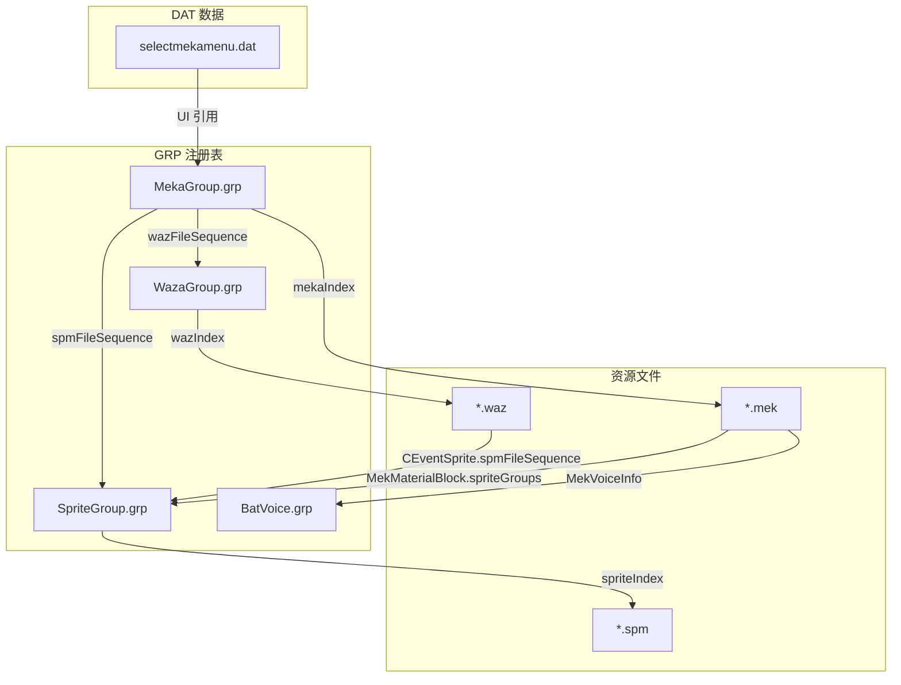

---

## 测试入口

```java
// TransferTest.java
@Test
public void testPipeline() throws Exception {
    TransMekaRequest request = buildRequest();
    TransMekaResult result = pipeline.execute(request);
    // 输出到 src/main/resources/testBhe
    // 打包为 Update3.pac
}
```

---

*文档生成时间: 2026-01-12*
